# Microsoft Fabric - Fabric Analyst in a Day - Labo 4

# Sommaire
- Introduction
- Dataflow Gen2
    - Tâche 1 : copier des requêtes SharePoint dans Dataflow
    - Tâche 2 : créer une connexion SharePoint
    - Tâche 3 : configurer la destination des données pour la requête People
    - Tâche 4 : publier et renommer le flux de données SharePoint
    - Tâche 5 : copier des requêtes Snowflake dans Dataflow
    - Tâche 6 : créer une connexion à Snowflake
    - Tâche 7 : configurer la destination des données pour les requêtes Supplier et PO
    - Tâche 8 : renommer et publier le flux de données Snowflake
- Raccourci vers ADLS Gen2
    - Tâche 9 : créer un raccourci vers Dataverse
    - Tâche 10 : créer un raccourci vers une lakehouse
- Références

# Introduction 

Dans notre scénario, les données fournisseur se trouvent dans Snowflake,
les données client dans Dataverse et les données collaborateur dans
SharePoint. Toutes ces sources de données sont mises à jour à des
moments différents. Pour réduire le nombre d'actualisations de données
des flux de données, nous allons créer des flux de données individuels
pour les sources de données Snowflake et SharePoint.

**Remarque :** plusieurs sources de données sont prises en charge dans
un seul flux de données.

L'équipe informatique a déjà établi un lien vers Dataverse et appliqué
les transformations de données  nécessaires, en miroir de celles du
fichier Power BI Desktop. Elle a ingéré ces données dans Lakehouse dans
l'espace de travail Administration et nous a donné accès à la table/aux
tables. Nous allons créer un raccourci pour la lakehouse que l'équipe
informatique a créée.

À la fin de ce labo, vous saurez :

- comment vous connecter à SharePoint à l'aide de Dataflow Gen2 et
    ingérer des données dans Lakehouse ;

- comment vous connecter à Snowflake à l'aide de Dataflow Gen2 et
    ingérer des données dans Lakehouse ;

- comment ingérer des données depuis une lakehouse partagée.

# Dataflow Gen2

### Tâche 1 : copier des requêtes SharePoint dans Dataflow

1.  Revenons à l'espace de travail Fabric **FAIAD\_\<username\>** que
    vous avez créé dans le labo 2, tâche 8.

2.  Cliquez sur l'**icône** du **sélecteur de l'expérience Fabric** en
    bas de votre écran à gauche. La boîte de dialogue Expérience Fabric
    s'ouvre alors.

3.  Cliquez sur **Data Factory** dans la boîte de dialogue. Vous êtes
    alors redirigé vers la **page d'accueil de Data Factory**.

    

4.  Sous Éléments recommandés, cliquez sur **Flux de données Gen2**.

    

Vous êtes alors redirigé vers la **page Dataflow**. L'interface
Dataflow Gen2 ressemble à celle de Power Query dans Power BI Desktop.
Nous pouvons copier des requêtes depuis Power BI Desktop dans
Dataflow Gen2. Essayons de le faire.

5.  Si vous ne l'avez pas encore ouvert, ouvrez le fichier
    **FAIAD.pbix** situé dans le dossier **Reports** sur le bureau de
    votre environnement de labo.

6.  Dans le ruban, cliquez sur **Accueil -\> Transformer les données**.
    Une fenêtre Power Query s'ouvre alors. Comme vous l'avez remarqué
    dans le labo précédent, les requêtes du volet gauche sont organisées
    par source de données.

7.  Dans le volet gauche, **sélectionnez** la requête **People** sous le
    dossier SharepointData.

8.  **Cliquez avec le bouton droit** et sélectionnez **Copier**.

    

9.  Revenez à l'**écran Dataflow** dans le navigateur.

10. Dans le **volet Dataflow**, utilisez le raccourci clavier **Ctrl +
    V**. (À l'heure actuelle, le clic droit sur Coller n'est pas pris en
    charge.) Si vous utilisez un appareil MAC, collez à l'aide du
    raccourci clavier Cmd + V.

**Remarque** : si vous travaillez dans un environnement de labo, cliquez
sur les points de suspension en haut de l'écran à droite. Utilisez le
curseur pour **activer** **le Presse-papiers natif de VM**. Cliquez
sur D'ACCORD dans la boîte de dialogue. Après avoir collé les requêtes,
vous pouvez désactiver cette option.

Notez que la requête est collée et disponible dans le volet gauche.
Comme nous n'avons pas de connexion créée pour SharePoint, un message
d'avertissement s'affiche pour vous demander de configurer la connexion.

### Tâche 2 : créer une connexion SharePoint

1.  Cliquez sur **Configurer la connexion**.

    

2.  La boîte de dialogue Connexion à une source de données s'ouvre
    alors. Dans la liste déroulante **Connexion**, assurez-vous que
    l'option **Créer une connexion** est sélectionnée.

3.  Le champ **Type d'authentification** devrait être défini sur
    **Compte professionnel**.

4.  Cliquez sur **Connexion**.

**Remarque :** vous êtes connecté à l'aide de vos informations
d'identification. Elles sont différentes de celles figurant dans la
capture d'écran ci-dessous.

 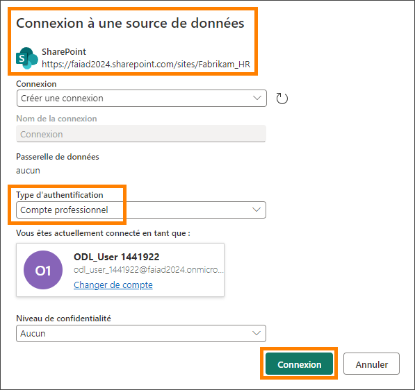

### Tâche 3 : configurer la destination des données pour la requête People

La connexion est établie et vous pouvez afficher les données dans le
volet d'aperçu. N'hésitez pas à parcourir les étapes appliquées des
requêtes. Nous devons maintenant ingérer les données People dans
Lakehouse.

1.  Sélectionnez la requête **People**.

2.  Dans le ruban, cliquez sur **Accueil -\> Ajouter une destination de
    données -\> Lakehouse**.

    

3.  La boîte de dialogue Se connecter à la destination des données
    s'ouvre alors. Nous devons créer une connexion à la lakehouse. Avec
    l'option **Créer une connexion** sélectionnée dans la liste
    déroulante **Connexion** et le champ **Type d'authentification**
    défini sur **Compte professionnel**, cliquez sur **Suivant**.

    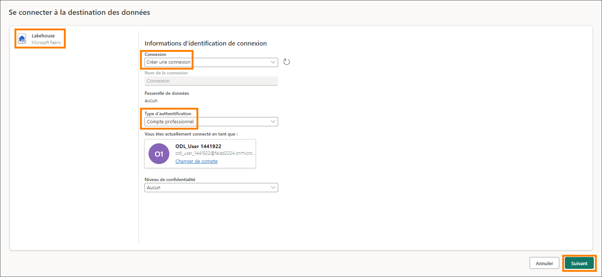

4.  La boîte de dialogue Choisir la cible de destination s'ouvre alors.
    Assurez-vous que le bouton radio **Nouvelle table** est coché, car
    nous créons une table.

5.  Nous souhaitons créer la table dans la lakehouse que nous avons
    créée plus tôt. Dans le volet gauche, accédez à **Lakehouse -\>
    FAIAD\_\<username\>**.

6.  Sélectionnez **lh_FAIAD**.

7.  Laissez le champ Nom de la table défini sur **People**.

8.  Cliquez sur **Suivant**.

    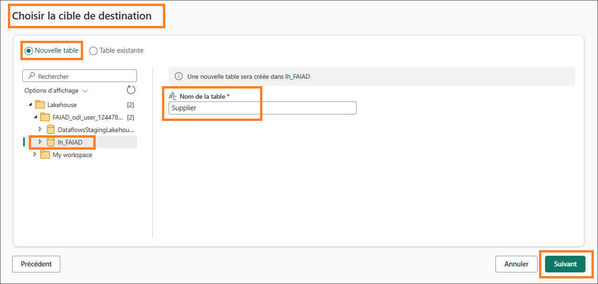

9.  La boîte de dialogue Choisir les paramètres de destination s'ouvre
    alors. Assurez-vous que l'option « **Utiliser les paramètres
    automatiques** » est **activée**.

**Remarque** : vous pouvez désactiver les paramètres automatiques et
notez que vous disposez d'options pour définir les options Méthode de
mise à jour et Schéma. Ensuite, assurez-vous que l'option « **Utiliser
les paramètres automatiques** » est **activée**.

10. Cliquez sur **Enregistrer les paramètres**.

    

### Tâche 4 : publier et renommer le flux de données SharePoint

1.  Vous êtes redirigé vers la **fenêtre Power Query**. Dans le **coin
    inférieur droit**, notez que la liste déroulante Destination des
    données est définie sur **Lakehouse**.

2.  Dans le coin inférieur droit, cliquez sur **Publier**.

    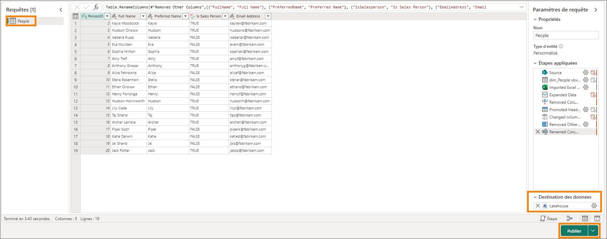

**Remarque :** vous êtes alors redirigé vers l'espace de travail
**FAIAD\_\<username\>**. La publication du flux de données peut prendre
quelques instants.

3.  Dataflow 1 est le flux de données dans lequel nous travaillions.
    Renommons-le avant de continuer. Cliquez sur les **points de
    suspension (...)** en regard de Dataflow 1.
    Sélectionnez **Propriétés**.

    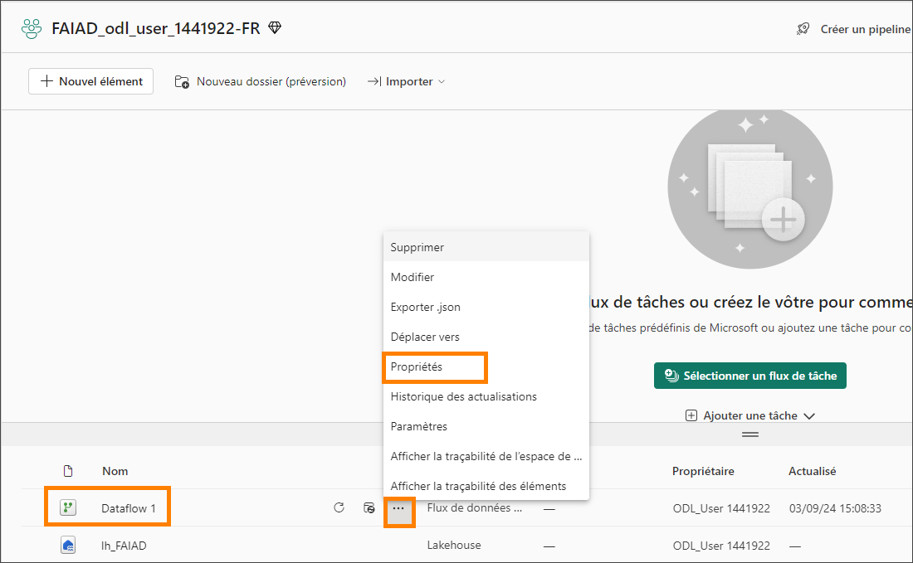

4.  La boîte de dialogue Propriétés du flux de données s'ouvre alors.
    Redéfinissez le champ **Nom** sur **df_People_SharePoint**.

5.  Dans la zone de texte **Description**, ajoutez **Dataflow to ingest
    People data from SharePoint to Lakehouse**.

6.  Cliquez sur **Enregistrer**.

    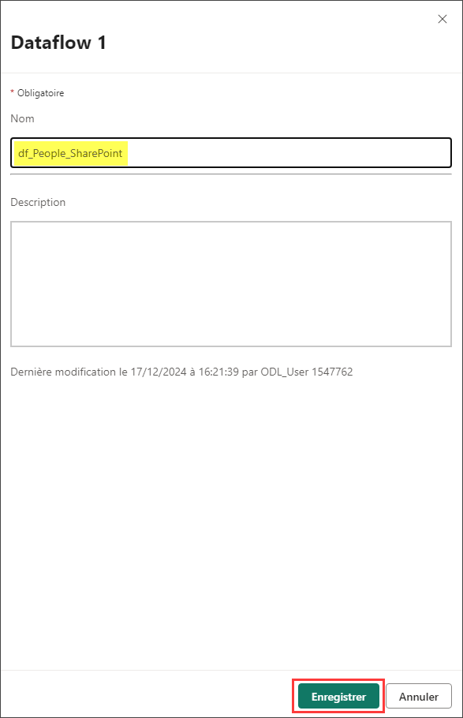

Vous êtes alors redirigé vers l'espace de travail
**FAIAD\_\<username\>**.

7.  Cliquez sur **lh_FAIAD** pour accéder à la lakehouse.

8.  Vérifiez que vous vous trouvez dans la vue Lakehouse (et non dans le
    point de terminaison analytique SQL).

9.  Notez que nous disposons maintenant d'une table **People** dans la
    lakehouse.

**Remarque :** si vous ne voyez pas les tables venant d'être créées,
cliquez sur les points de suspension en regard de Tables et sélectionnez
Actualiser pour actualiser les tables.

### Tâche 5 : copier des requêtes Snowflake dans Dataflow

1.  Revenons à l'espace de travail Fabric **FAIAD\_\<username\>**.

2.  Dans le menu supérieur, cliquez sur **Nouveau -\> Flux de
    données Gen2**.

    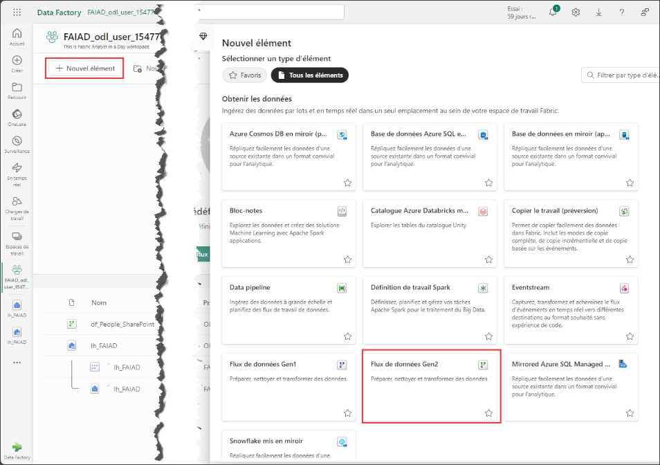

Vous êtes alors redirigé vers la **page Dataflow**. Maintenant que nous
connaissons Dataflow, copions les requêtes de Power BI Desktop dans
Dataflow.

3.  Si vous ne l'avez pas encore ouvert, ouvrez le fichier
    **FAIAD.pbix** situé dans le dossier **Reports** sur le bureau de
    votre environnement de labo.

4.  Dans le ruban, cliquez sur **Accueil -\> Transformer les données**.
    Une fenêtre Power Query s'ouvre alors. Comme vous l'avez remarqué
    dans le labo précédent, les requêtes du volet gauche sont organisées
    par source de données.

5.  Dans le volet gauche, sous le dossier SnowflakeData, appuyez sur la
    touche **Ctrl** ou Maj et sélectionnez les requêtes suivantes :

    a.  SupplierCategories

    b.  Suppliers

    c.  Supplier

    d.  PO

    e.  PO Line Items

6.  **Cliquez avec le bouton droit** et sélectionnez **Copier**.

    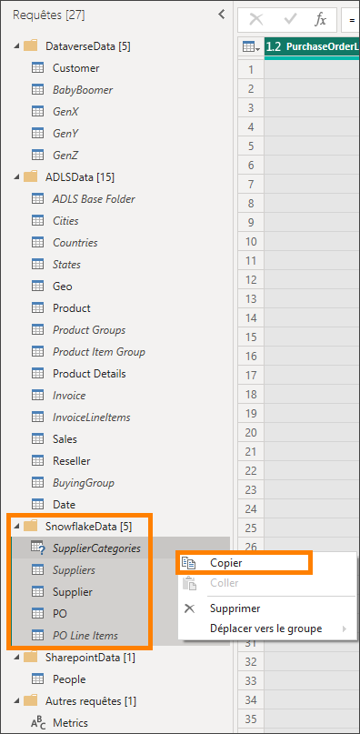

7.  Revenez au **navigateur**.

8.  Dans le **volet Dataflow**, cliquez sur le **volet central** et
    utilisez le raccourci clavier **Ctrl + V**. (À l'heure actuelle, le
    clic droit sur Coller n'est pas pris en charge.) Si vous utilisez un
    appareil MAC, collez à l'aide du raccourci clavier Cmd + V.

**Remarque :** si vous travaillez dans l'environnement de labo, cliquez
sur les **points de suspension (\...)** en haut de l'écran à droite.
Utilisez le curseur pour **activer** **le Presse-papiers natif de VM**.
Cliquez sur D'ACCORD dans la boîte de dialogue. Après avoir collé les
requêtes, vous pouvez désactiver cette option.

### Tâche 6 : créer une connexion à Snowflake

Notez que les cinq requêtes sont collées et que vous disposez désormais
du volet Requêtes à gauche. Comme nous n'avons pas de connexion créée
pour Snowflake, un message d'avertissement s'affiche pour vous demander
de configurer la connexion.

1.  Cliquez sur **Configurer la connexion**.

    

2.  La boîte de dialogue Connexion à une source de données s'ouvre
    alors. Dans la liste déroulante **Connexion**, assurez-vous que
    l'option **Créer une connexion** est sélectionnée.

3.  Le champ **Type d'authentification** doit être défini sur
    **Snowflake**.

4.  Saisissez le **Nom d'utilisateur et le Mot de passe Snowflake**
    disponibles dans l'onglet Variables d'environnement (en regard de
    l'onglet Guide du labo).

5.  Cliquez sur **Connexion**.

    

La connexion est alors établie et vous pouvez afficher les données dans
le volet d'aperçu. N'hésitez pas à parcourir les étapes appliquées des
requêtes. En substance, la requête Suppliers comporte les détails des
fournisseurs et la requête SupplierCategories, comme son nom l'indique,
comporte des catégories de fournisseurs. Ces deux tables sont jointes
pour créer la dimension Supplier, avec les colonnes dont nous avons
besoin. De même, nous avons fusionné la requête PO Line Items avec la
requête PO pour créer le fait PO. Nous devons maintenant ingérer les
données Supplier et PO dans Lakehouse.

### Tâche 7 : configurer la destination des données pour les requêtes Supplier et PO

1.  Sélectionnez la requête **Supplier**.

2.  Dans le ruban, cliquez sur **Accueil -\> Ajouter une destination de
    données -\> Lakehouse**.

    

3.  La boîte de dialogue Se connecter à la destination des données
    s'ouvre alors. Dans la liste déroulante **Connexion**, sélectionnez
    **Lakehouse (aucun)**.

4.  Cliquez sur **Suivant**.

    

5.  La boîte de dialogue Choisir la cible de destination s'ouvre alors.
    Assurez-vous que le **bouton radio Nouvelle table** est **coché**,
    car nous créons une table.

6.  Nous souhaitons créer la table dans la lakehouse que nous avons
    créée plus tôt. Dans le volet gauche, accédez à **Lakehouse -\>
    FAIAD\_\<username\>**.

7.  Sélectionnez **lh_FAIAD**.

8.  Laissez le champ Nom de la table défini sur **Supplier**.

9.  Cliquez sur **Suivant**.

    

10. La boîte de dialogue Choisir les paramètres de destination s'ouvre
    alors. Nous allons utiliser les paramètres automatiques pour
    permettre une mise à jour complète des données. De plus,
    les colonnes seront renommées si nécessaire. Cliquez sur
    **Enregistrer les paramètres**.

    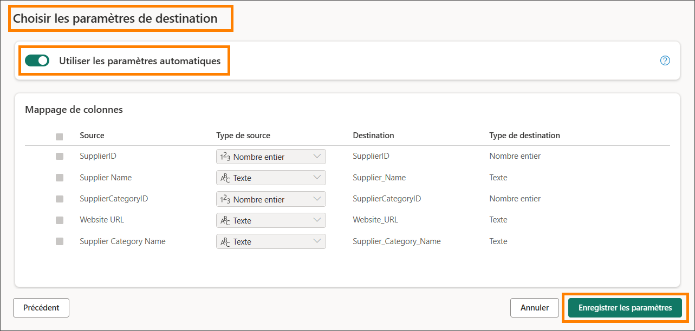

11. Vous êtes redirigé vers la **fenêtre Power Query**. Dans le **coin
    inférieur droit**, notez que la liste déroulante Destination des
    données est définie sur **Lakehouse**. De même, **configurez la
    destination des données pour la requête PO**. Ensuite, la liste
    déroulante **Destination des données** de votre requête **PO**
    devrait être définie sur **Lakehouse**, comme illustré dans la
    capture d'écran ci-dessous.

    

### Tâche 8 : renommer et publier le flux de données Snowflake

1.  En haut de l'écran, cliquez sur la **flèche en regard de
    Dataflow 1** pour le renommer.

2.  Dans la boîte de dialogue, redéfinissez le nom sur
    **df_Supplier_Snowflake**.

3.  Appuyez sur **Entrée** pour enregistrer le changement de nom.

    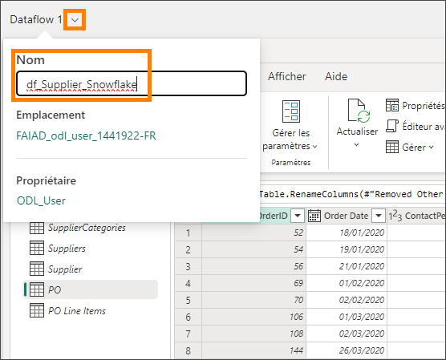

4.  Dans le coin inférieur droit, cliquez sur **Publier**.

    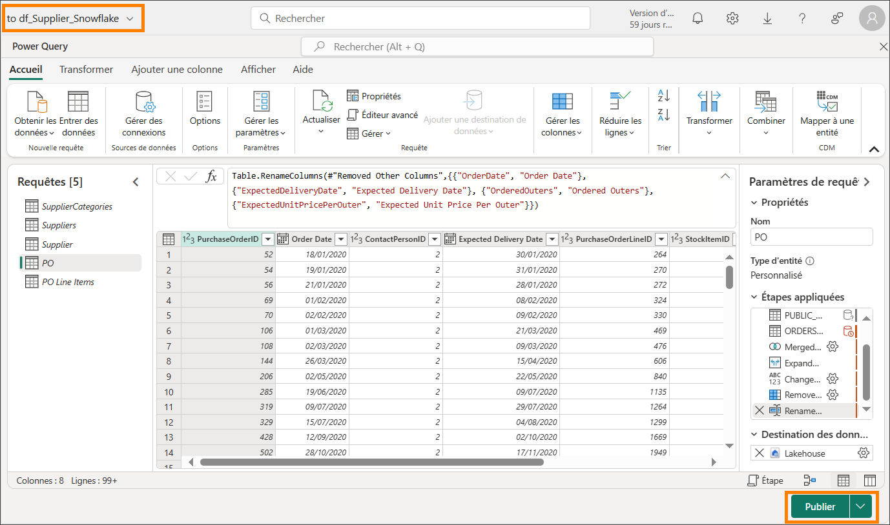

Vous êtes alors redirigé vers l'espace de travail
**FAIAD\_\<username\>**. La publication du flux de données peut prendre
quelques instants.

5.  Cliquez sur **lh_FAIAD** pour accéder à la lakehouse.

6.  Vérifiez que vous vous trouvez dans la vue Lakehouse (et non dans le
    point de terminaison analytique SQL).

7.  Notez que nous disposons maintenant de tables **PO** et **Supplier**
    dans la lakehouse.

**Remarque :** si vous ne voyez pas les tables venant d'être créées,
cliquez sur les points de suspension en regard de Tables et sélectionnez
Actualiser pour actualiser les tables.

Créons maintenant un raccourci permettant d'importer les données de
Dataverse.

# Raccourci vers ADLS Gen2

### Tâche 9 : créer un raccourci vers Dataverse

Vous devriez être dans la lakehouse **lh_FAIAD**. Vérifiez que vous vous
trouvez dans la vue Lakehouse (et non dans le point de terminaison
analytique SQL).

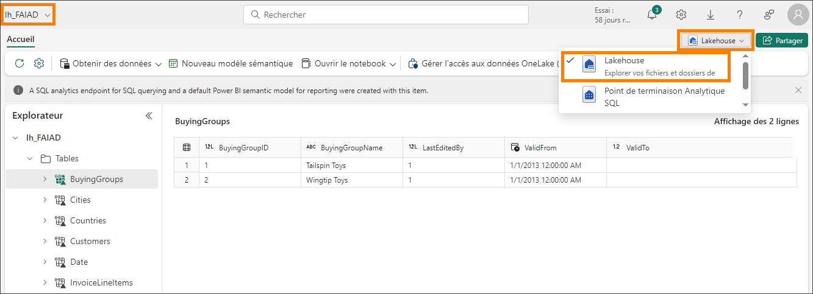

1.  Dans le volet **Explorateur**, cliquez sur les **points de
    suspension** en regard de **Tables**.

2.  Cliquez sur **Nouveau raccourci**.

    

3.  La boîte de dialogue Nouveau raccourci s'ouvre alors. Sous **Sources
    externes**, sélectionnez **Dataverse**.

**Remarque** : dans le labo précédent, nous avons procédé de même pour
créer un raccourci vers Azure Data Lake Storage Gen2.

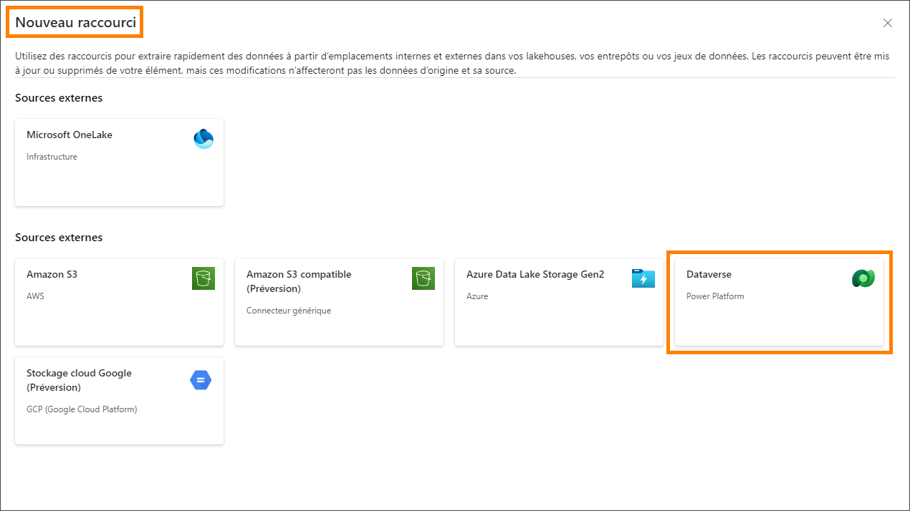

4.  La boîte de dialogue Paramètres de connexion s'ouvre alors.
    Saisissez **org6c18814a.crm.dynamics.com** dans le champ **Domaine
    de l'environnement**.

5.  Laissez le champ **Type d'authentification** défini sur **Compte
    professionnel**.

6.  Cliquez sur **Se connecter**.

    

7.  Dans la boîte de dialogue de connexion, sélectionnez le **compte
    d'utilisateur** que vous avez utilisé pour ces labos. La boîte de
    dialogue Connectez-vous à votre compte s'ouvre alors. **Choisissez
    votre compte** pour vous connecter.

**Remarque** : votre compte est différent de celui figurant dans la
capture d'écran ci-dessous.

8.  Cliquez sur **Suivant** dans la boîte de dialogue Paramètres de
    connexion.

Vous êtes alors redirigé vers une boîte de dialogue dans laquelle vous
pouvez sélectionner les différents compartiments/répertoires depuis
Dataverse. Notez que de nombreux compartiments différents sont
disponibles. Nous pouvons choisir le(s) compartiment(s) dont nous avons
besoin et procéder de même que dans le labo 3 (transformer les données
et créer des vues à l'aide d'une requête visuelle). Nous pouvons
également utiliser Dataflow Gen2 comme il nous a permis précédemment
dans ce labo de nous connecter à SharePoint. Cependant, nous n'avons pas
accès à ces **compartiments/répertoires**.

Dans notre scénario, l'équipe informatique a déjà établi un lien vers
Dataverse et appliqué les transformations de données nécessaires, en
miroir de celles du fichier Power BI Desktop. Elle a ingéré ces données
dans Lakehouse dans l'espace de travail Administration et nous a donné
accès à la table/aux tables. Puisque notre équipe informatique a déjà
fait le plus dur, nous pouvons créer un raccourci vers cette lakehouse
dans l'espace de travail Administration.

9.  Cliquez sur **Annuler** dans la boîte de dialogue Nouveau raccourci
    pour revenir à la lakehouse.

    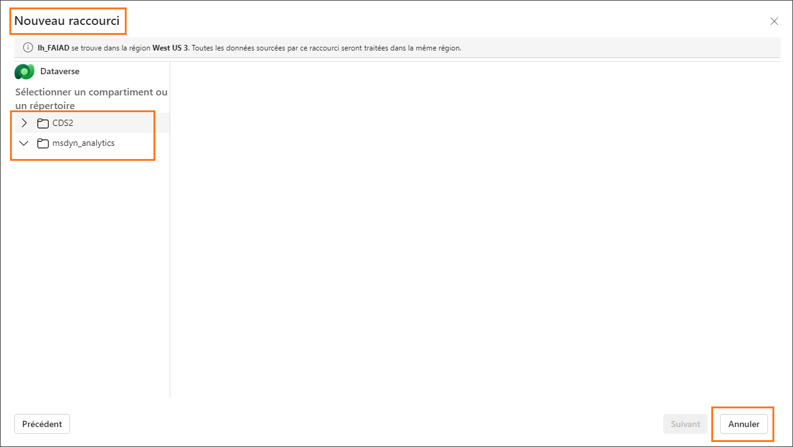

### Tâche 10 : créer un raccourci vers une lakehouse

1.  Dans le volet **Explorateur**, cliquez sur les **points de
    suspension** en regard de **Tables**.

2.  Cliquez sur **Nouveau raccourci**.

    

3.  La boîte de dialogue Nouveau raccourci s'ouvre alors. Sélectionnez
    l'option **Microsoft OneLake** sous Sources internes.

    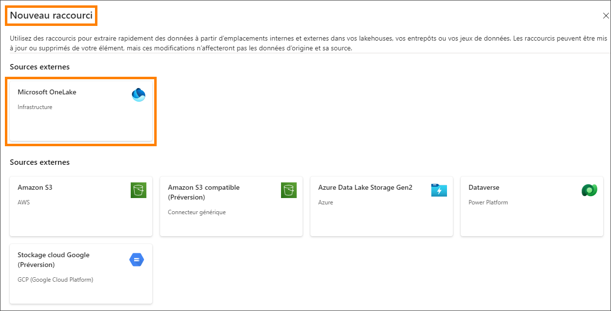

4.  La boîte de dialogue Sélectionner un type de source des données
    s'ouvre alors. Notez que vous disposez de deux sources de données.

    a.  lh_FAIAD : il s'agit de la lakehouse que vous avez créée.

    b.  lh_dataverse : il s'agit de la lakehouse créée par
        l'administrateur.

5.  Sélectionnez **lh_dataverse**.

6.  Cliquez sur **Suivant**.

    

7.  Dans le volet gauche, développez **lh_dataverse -\> Tables**. Notez
    que l'administrateur informatique a accordé un accès à la table
    Customer.

8.  Sélectionnez **Customer**.

9.  Cliquez sur **Suivant**.

    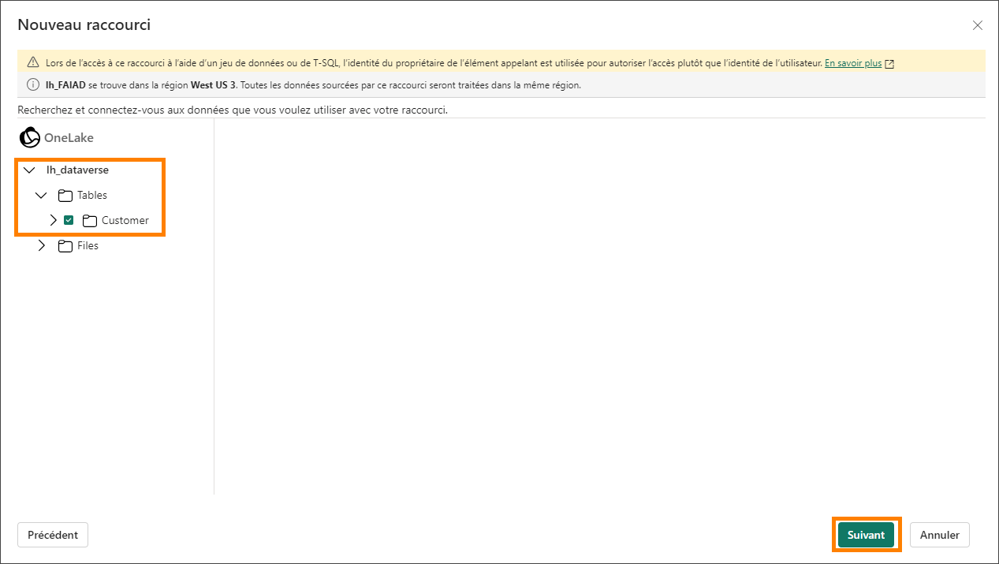

10. Cliquez sur **Créer** dans la boîte de dialogue suivante. Vous êtes
    alors redirigé vers la lakehouse lh_FAIAD.

    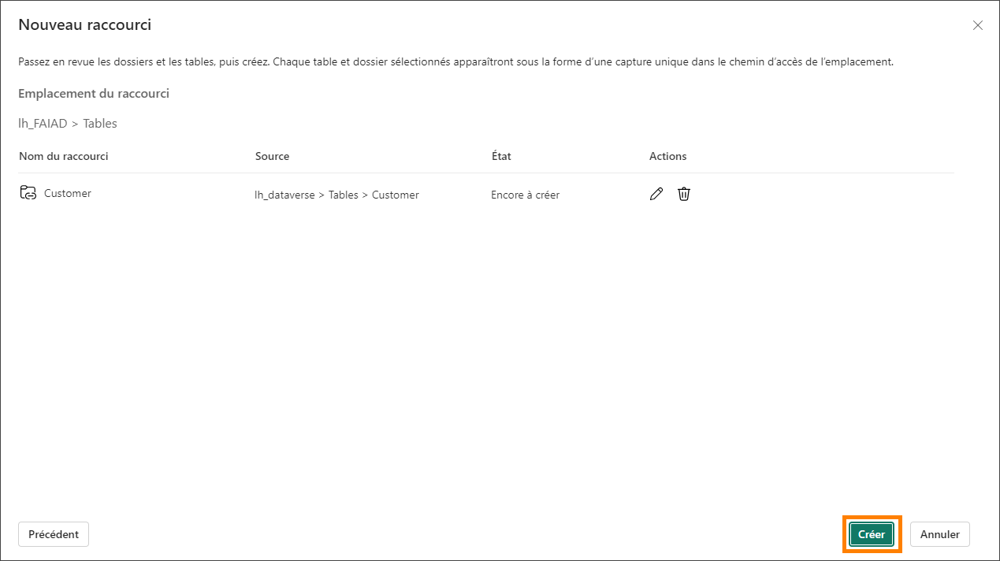

11. Dans le volet **Explorateur** à gauche, notez la création de la
    table **Customer**.

12. Cliquez sur la table **Customer** pour afficher les données dans le
    volet d'aperçu.

Nous avons réussi à créer un raccourci vers une autre lakehouse.

Nous avons maintenant ingéré toutes les données dans Lakehouse. Dans le
prochain labo, nous allons planifier l'actualisation de Dataflow.

Dans le prochain labo, nous allons configurer des actualisations
planifiées.

# Références

Fabric Analyst in a Day (FAIAD) vous présente certaines des fonctions
clés de Microsoft Fabric. Dans le menu du service, la section Aide (?)
comporte des liens vers d'excellentes ressources.

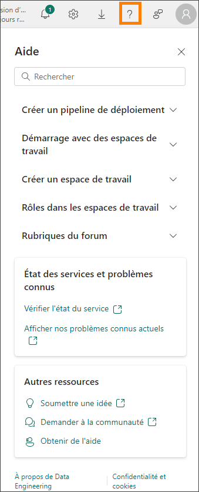

Voici quelques autres ressources qui vous aideront lors de vos
prochaines étapes avec Microsoft Fabric :

- Consultez le billet de blog pour lire l'intégralité de l'[annonce de
    la GA de Microsoft
    Fabric](https://aka.ms/Fabric-Hero-Blog-Ignite23).

- Explorez Fabric grâce à la [visite
    guidée](https://aka.ms/Fabric-GuidedTour).

- Inscrivez-vous pour bénéficier d'un [essai gratuit de Microsoft
    Fabric](https://aka.ms/try-fabric).

- Rendez-vous sur le [site web Microsoft
    Fabric](https://aka.ms/microsoft-fabric).

- Acquérez de nouvelles compétences en explorant les [modules
    d'apprentissage Fabric](https://aka.ms/learn-fabric).

- Explorez la [documentation technique
    Fabric](https://aka.ms/fabric-docs).

- Lisez le [livre électronique gratuit sur la prise en main de
    Fabric](https://aka.ms/fabric-get-started-ebook).

- Rejoignez la [communauté Fabric](https://aka.ms/fabric-community)
    pour publier vos questions, partager vos commentaires et apprendre
    des autres.

Lisez les blogs d'annonces plus détaillés sur l'expérience Fabric :

- [Blog Expérience Data Factory dans
    Fabric](https://aka.ms/Fabric-Data-Factory-Blog) 

- [Blog Expérience Synapse Data Engineering dans
    Fabric](https://aka.ms/Fabric-DE-Blog) 

- [Blog Expérience Synapse Data Science dans
    Fabric](https://aka.ms/Fabric-DS-Blog) 

- [Blog Expérience Synapse Data Warehousing dans
    Fabric](https://aka.ms/Fabric-DW-Blog) 

- [Blog Expérience Synapse Real-Time Analytics dans
    Fabric](https://aka.ms/Fabric-RTA-Blog)

- [Blog Annonce Power BI](https://aka.ms/Fabric-PBI-Blog)

- [Blog Expérience Data Activator dans
    Fabric](https://aka.ms/Fabric-DA-Blog) 

- [Blog Administration et gouvernance dans
    Fabric](https://aka.ms/Fabric-Admin-Gov-Blog)

- [Blog OneLake dans Fabric](https://aka.ms/Fabric-OneLake-Blog)

- [Blog Intégration de Dataverse et Microsoft
    Fabric](https://aka.ms/Dataverse-Fabric-Blog)

> © 2023 Microsoft Corporation. Tous droits réservés.
>
> En effectuant cette démonstration/ce labo, vous acceptez les
> conditions suivantes :
>
> La technologie/fonctionnalité décrite dans cette démonstration/ce labo
> est fournie par Microsoft Corporation en vue d'obtenir vos
> commentaires et de vous fournir une expérience d'apprentissage. Vous
> pouvez utiliser cette démonstration/ce labo uniquement pour évaluer
> ces technologies et fonctionnalités, et pour fournir des commentaires
> à Microsoft. Vous ne pouvez pas l'utiliser à d'autres fins. Vous ne
> pouvez pas modifier, copier, distribuer, transmettre, afficher,
> effectuer, reproduire, publier, accorder une licence, créer des œuvres
> dérivées, transférer ou vendre tout ou une partie de cette
> démonstration/ce labo.
>
> LA COPIE OU LA REPRODUCTION DE CETTE DÉMONSTRATION/CE LABO (OU DE
> TOUTE PARTIE DE CEUX-CI) SUR TOUT AUTRE SERVEUR OU AUTRE EMPLACEMENT
> EN VUE D'UNE AUTRE REPRODUCTION OU REDISTRIBUTION EST EXPRESSÉMENT
> INTERDITE.
>
> CETTE DÉMONSTRATION/CE LABO FOURNISSENT CERTAINES FONCTIONNALITÉS
> DE PRODUIT/TECHNOLOGIES LOGICIELLES, NOTAMMENT D'ÉVENTUELS NOUVEAUX
> CONCEPTS ET FONCTIONNALITÉS, DANS UN ENVIRONNEMENT SIMULÉ SANS
> INSTALLATION OU CONFIGURATION COMPLEXE AUX FINS DÉCRITES CI-DESSUS.
> LES TECHNOLOGIES/CONCEPTS REPRÉSENTÉS DANS CETTE DÉMONSTRATION/CE LABO
> PEUVENT NE PAS REPRÉSENTER LES FONCTIONNALITÉS COMPLÈTES ET PEUVENT NE
> PAS FONCTIONNER DE LA MÊME MANIÈRE QUE DANS UNE VERSION FINALE. IL EST
> ÉGALEMENT POSSIBLE QUE NOUS NE PUBLIIONS PAS DE VERSION FINALE DE CES
> FONCTIONNALITÉS OU CONCEPTS. VOTRE EXPÉRIENCE D'UTILISATION DE CES
> FONCTIONNALITÉS DANS UN ENVIRONNEMENT PHYSIQUE PEUT ÉGALEMENT ÊTRE
> DIFFÉRENTE.
>
> **COMMENTAIRES**. Si vous envoyez des commentaires sur les
> fonctionnalités, technologies et/ou concepts décrits dans cette
> démonstration/ce labo à Microsoft, vous accordez à Microsoft, sans
> frais, le droit d'utiliser, de partager et de commercialiser vos
> commentaires de quelque manière et à quelque fin que ce soit. Vous
> accordez également à des tiers, sans frais, les droits de brevet
> nécessaires pour leurs produits, technologies et services en vue de
> l'utilisation ou de l'interface avec des parties spécifiques d'un
> logiciel ou d'un service Microsoft incluant les commentaires. Vous
> n'enverrez pas de commentaires soumis à une licence exigeant que
> Microsoft accorde une licence pour son logiciel ou sa documentation à
> des tiers du fait que nous y incluons vos commentaires. Ces droits
> survivent à ce contrat.
>
> MICROSOFT CORPORATION DÉCLINE TOUTES LES GARANTIES ET CONDITIONS EN CE
> QUI CONCERNE CETTE DÉMONSTRATION/CE LABO, Y COMPRIS TOUTES LES
> GARANTIES ET CONDITIONS DE QUALITÉ MARCHANDE, QU'ELLES SOIENT
> EXPLICITES, IMPLICITES OU LÉGALES, D'ADÉQUATION À UN USAGE
> PARTICULIER, DE TITRE ET D'ABSENCE DE CONTREFAÇON. MICROSOFT N'OFFRE
> AUCUNE GARANTIE OU REPRÉSENTATION EN CE QUI CONCERNE LA PRÉCISION DES
> RÉSULTATS, LA CONSÉQUENCE QUI DÉCOULE DE L'UTILISATION DE CETTE
> DÉMONSTRATION/CE LABO, OU L'ADÉQUATION DES INFORMATIONS CONTENUES DANS
> CETTE DÉMONSTRATION/CE LABO À QUELQUE FIN QUE CE SOIT.
>
> **CLAUSE D'EXCLUSION DE RESPONSABILITÉ**
>
> Cette démonstration/Ce labo comporte seulement une partie des
> nouvelles fonctionnalités et améliorations disponibles dans Microsoft
> Power BI. Certaines fonctionnalités sont susceptibles de changer dans
> les versions ultérieures du produit. Dans cette démonstration/ce labo,
> vous allez découvrir comment utiliser certaines nouvelles
> fonctionnalités, mais pas toutes.