# **Microsoft Fabric - Fabric Analyst in a Day - Labo 6**

# Sommaire
- Introduction
- Lakehouse : analyse des données
    - Tâche 1 : interroger des données à l’aide de SQL
    - Tâche 2 : visualiser le résultat T-SQL
- Lakehouse : modélisation sémantique
    - Tâche 3 : créer un modèle sémantique
    - Tâche 4 : créer des relations
    - Tâche 5 : créer des mesures
    - Tâche 6 : section facultative - Créer des relations
    - Tâche 7 : section facultative - Créer des mesures
- Références

# Introduction 

Nous avons des données provenant de différentes sources ingérées dans la
lakehouse. Dans ce labo, vous allez utiliser le modèle sémantique. Nous
avons généralement effectué des activités de modélisation telles que la
création de relations, l'ajout de mesures, etc. dans Power BI Desktop.
Ici, nous allons découvrir comment effectuer ces activités de
modélisation dans le service.

À la fin de ce labo, vous saurez :

- comment utiliser la vue SQL dans le point de terminaison analytique
    SQL ;

- Comment créer un modèle sémantique

# Lakehouse : analyse des données

### Tâche 1 : interroger des données à l'aide de SQL

1.  Revenons à l'espace de travail Fabric **FAIAD\_\<username\>** que
    vous avez créé dans le labo 2, tâche 9.

2.  Si vous le souhaitez, **réduisez le flux de tâches** pour afficher
    la liste complète des éléments.

3.  Vous voyez trois types d'lh_FAIAD : Lakehouse, Modèle sémantique et
    Point de terminaison SQL. Nous avons exploré Lakehouse et créé des
    requêtes visuelles à l'aide du point de terminaison analytique SQL
    dans un labo précédent. Sélectionnez l'option **Point de terminaison
    Analytique SQL lh_FAIAD** pour continuer à explorer cette option.
    Vous êtes alors redirigé vers la **vue SQL** de l'explorateur.

    

    Vous pouvez explorer les données avant de créer un modèle de données à
    l'aide de SQL. Deux options permettent d'utiliser SQL. La première
    option est une requête visuelle, que nous avons utilisée dans le labo
    précédent. L'option 2 consiste à écrire du code TSQL. Il s'agit d'une
    option conviviale pour les développeurs. Explorons cela.

    Supposons que vous souhaitiez connaître rapidement les unités (Units)
    vendues par fournisseur (Supplier) à l'aide de SQL.

    Dans le point de terminaison analytique SQL de la lakehouse, notez que
    vous pouvez afficher les tables dans le volet gauche. Si vous développez
    les tables, vous pouvez afficher les colonnes qui composent la table. En
    outre, des options permettent de créer des vues, fonctions et procédures
    stockées SQL. Si vous avez une expérience SQL, n'hésitez pas à explorer
    ces options. Essayons d'écrire une requête SQL simple.

4.  Dans le **menu supérieur**, sélectionnez **Nouvelle requête SQL** ou
    cliquez sur **Nouvelle requête SQL** au centre de l'écran. Vous êtes
    alors redirigé vers la vue Requête SQL.

    

5.  Collez la **requête SQL ci-dessous** dans la **fenêtre Requête**.
    Cette requête renvoie les unités par nom de fournisseur. Pour y
    parvenir, elle joint la table Sales avec les tables Product et
    Supplier.

        SELECT su.SupplierName, SUM(Quantity) as Units
        FROM dbo.Sales s
        JOIN dbo.Product p on p.StockItemID = s.StockItemID
        JOIN dbo.Supplier su on su.SupplierID = p.SupplierID
        GROUP BY su.SupplierName

6.  Cliquez sur **Run** dans le menu de l'éditeur SQL pour afficher les
    résultats.

7.  Notez qu'une option permet d'enregistrer cette requête en tant que
    vue en cliquant sur **Enregistrer en tant que vue**.

8.  Dans le **volet** **gauche** Explorateur, sous la section
    **Queries**, cette requête est enregistrée sous **Mes requêtes**
    comme **SQL query 1**. Cela permet de renommer la requête et de
    l'enregistrer pour une utilisation ultérieure. En outre, une option
    permet d'afficher les requêtes partagées avec vous à l'aide du
    dossier **Requêtes partagées**.

    **Remarque** : les requêtes visuelles que vous avez créées dans les
labos précédents sont également disponibles sous le dossier Mes
requêtes.

    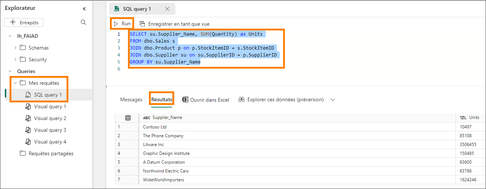

###  Tâche 2 : visualiser le résultat T-SQL

1.  Nous pouvons également visualiser le résultat de cette requête.
    **Mettez en surbrillance la requête** dans le volet de requête.

2.  Dans le menu du volet Résultats, cliquez sur **Explorer ces données
    (préversion) -\> Visualiser les résultats**.

    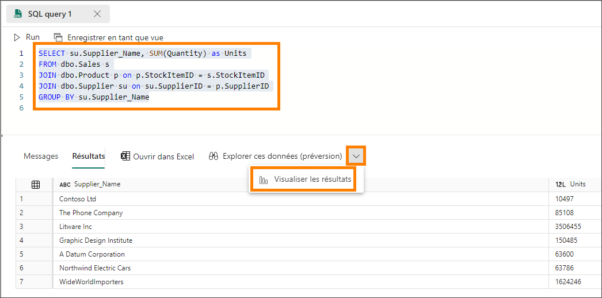

3.  La boîte de dialogue **Visualiser les résultats** s'ouvre alors.
    Cliquez sur **Continuer**.

    La boîte de dialogue **Visualiser les résultats** s'ouvre alors et
    ressemble à la vue d'état Power BI Desktop. Elle affiche toutes les
    fonctionnalités disponibles dans la vue d'état Power BI Desktop : vous
    pouvez mettre en forme la page, sélectionner différents visuels, mettre
    en forme des visuels, ajouter des filtres, etc. Nous n'allons pas
    explorer ces options dans ce cours.

4.  Développez le volet **Données**, puis **SQL query 1**.

5.  Sélectionnez les **champs** **Supplier_Name** et **Units**. Un
    visuel de table est créé.

    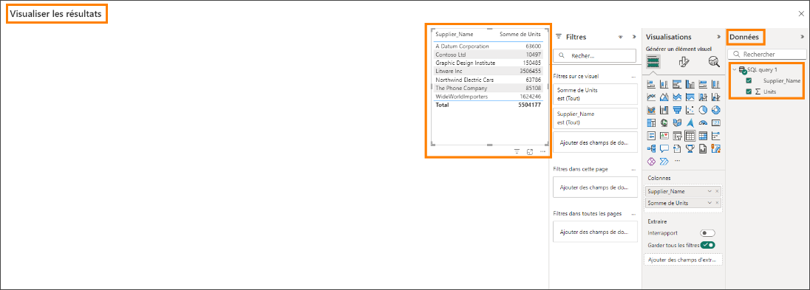

6.  Dans la section **Visualisations**, changez le type de visuel en
    sélectionnant l'**Histogramme empilé**.

7.  Cliquez sur **Enregistrer en tant que rapport** en bas de l'écran à
    droite.

    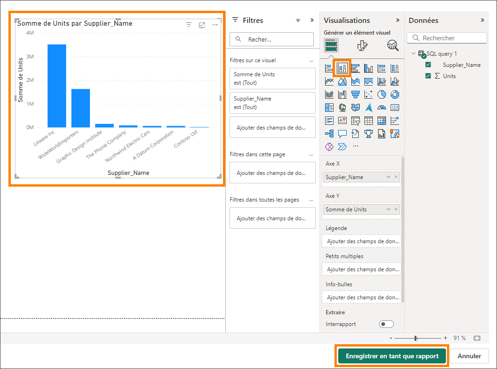

8.  La boîte de dialogue Enregistrer votre rapport s'ouvre alors. Tapez
    **Units by Supplier** dans la zone de texte **Entrez un nom pour
    votre rapport**.

9.  Assurez-vous que l'espace de travail de destination est votre espace
    de travail Fabric **FAIAD\<username\>**.

10. Cliquez sur **Enregistrer**.

    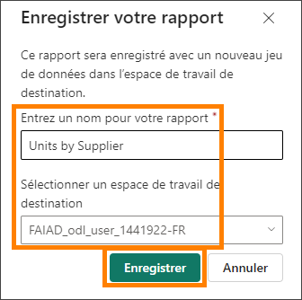

    Vous êtes alors redirigé vers l'écran de requête SQL.

# Lakehouse : modélisation sémantique

### Tâche 3 : créer un modèle sémantique

1.  Ouvrez le **point de terminaison analytique SQL** depuis votre
    lakehouse.

2.  Dans le volet Explorateur, faites défiler vers le bas et
    sélectionnez **Dispositions de modèle**. Notez que le volet central
    ressemble à la vue de modèle qui sera affichée dans Power BI
    Desktop.

    

    Il s'agit du modèle par défaut créé par la lakehouse. Cependant, le
    modèle par défaut présente certaines limitations (comme la possibilité
    de mettre en forme les mesures, etc.). De plus, nous n'avons besoin que
    d'un sous-ensemble des tables de notre modèle. Nous allons donc créer un
    modèle sémantique.

3.  Dans le menu**,** en haut à droite, **cliquez sur la flèche en
    regard de Point de terminaison Analytique SQL**.

4.  Sélectionnez **Lakehouse** pour accéder à la vue Lakehouse.

    

5.  Dans le menu, cliquez sur **Accueil -\> Nouveau modèle sémantique**.

6.  La boîte de dialogue Nouveau modèle sémantique s'ouvre alors.
    Saisissez **sm_FAIAD** comme nom du modèle sémantique Direct Lake.

7.  Nous pouvons sélectionner un sous-ensemble des tables par défaut.
    N'oubliez pas que nous avons créé des vues dans le labo précédent.
    Nous souhaitons inclure ces vues dans le modèle. Développez le
    schéma **dbo**, ce qui permet d'afficher toutes les tables et vues
    dans votre lakehouse.

    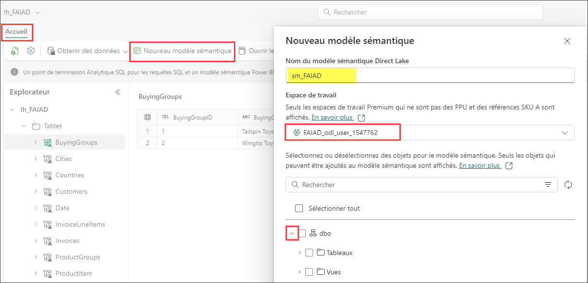

8.  **Sélectionnez** les tables/vues suivantes :

    a.  **Date**

    b.  **People**

    c.  **Customer**

    d.  **PO**

    e.  **Supplier**

    f.  **Geo**

    g.  **Reseller**

    h.  **Sales**

    i.  **Product**

9.  Cliquez sur **Confirmer**.

    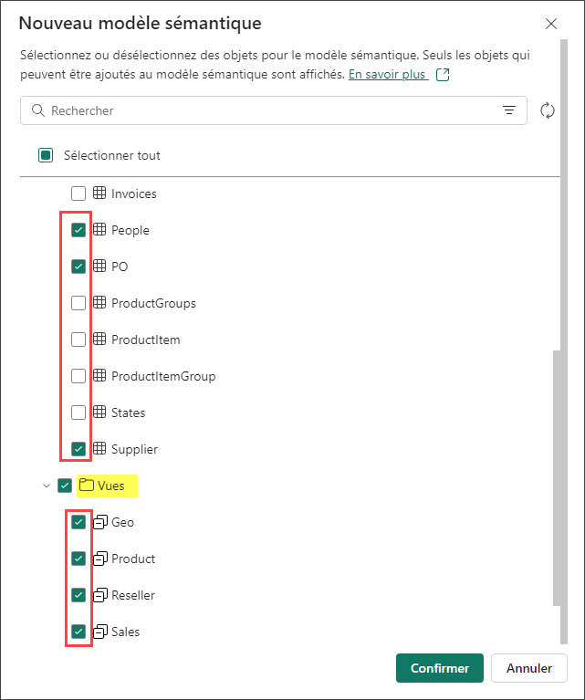

### Tâche 4 : créer des relations

Vous allez accéder au nouveau modèle sémantique avec les tables
sélectionnées. N'hésitez pas à **réorganiser** les tables si nécessaire.
Notez que certaines tables (Geo, Reseller, Sales et Product) comportent
un symbole d'avertissement en haut de la table à droite. En effet, il
s'agit de vues. Tous les visuels créés avec des champs provenant de ces
vues sont en mode DirectQuery et non en mode Direct Lake.

**Remarque** : le mode Direct Lake est plus rapide que le mode
DirectQuery.

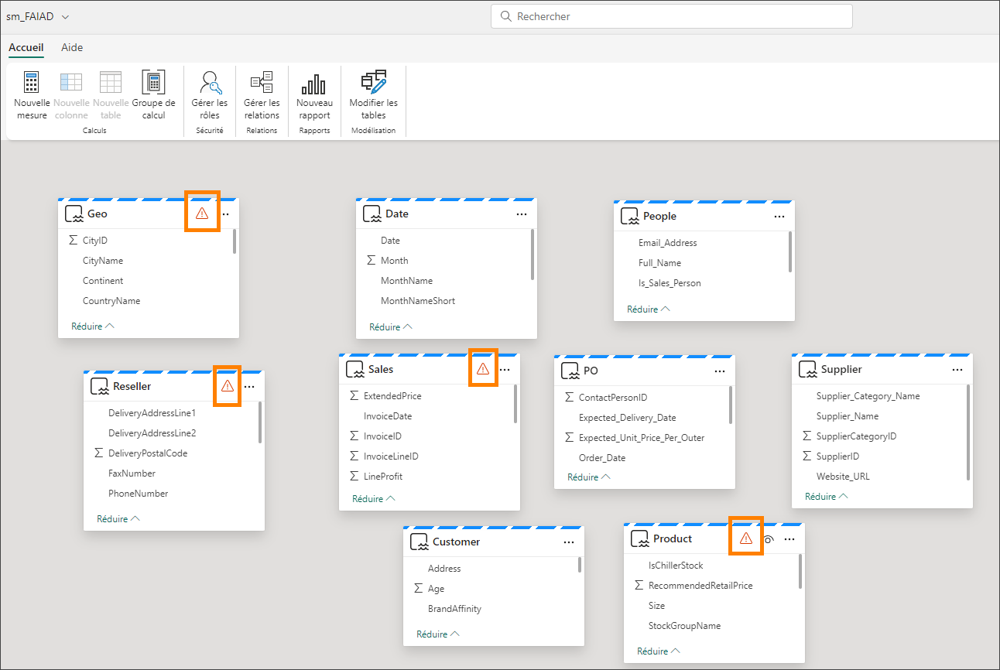

La première étape consiste à créer des relations entre ces tables.

1.  Créons une relation entre les tables Sales et Reseller. Sélectionnez
    la valeur **ResellerID** dans la table **Sales** et faites-la
    glisser vers la valeur **ResellerID** dans la table **Reseller**.

    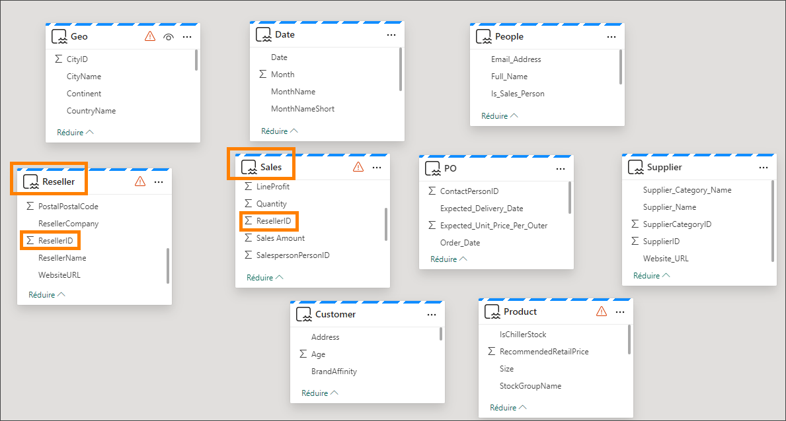

2.  La boîte de dialogue Nouvelle relation s'ouvre alors. Assurez-vous
    que le champ **À partir de la table** est défini sur **Sales** et le
    paramètre **Colonne** sur **ResellerID**.

3.  Assurez-vous que le champ **Vers la table** est défini sur
    **Reseller** et le paramètre **Colonne** sur **ResellerID**.

4.  Assurez-vous que le champ **Cardinalité** est défini sur **Plusieurs
    à un (\*:1)**.

5.  Assurez-vous que le champ **Direction du filtre croisé** est défini
    sur **À sens unique**.

6.  Cliquez sur **Enregistrer**.

    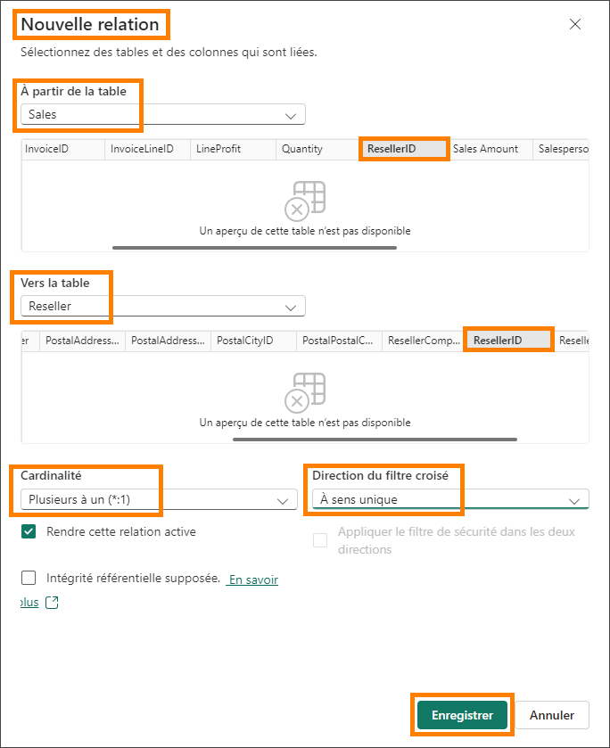

7.  De même, créez une relation entre les tables Sales et Date.
    Sélectionnez la valeur **InvoiceDate** dans la table **Sales** et
    faites-la glisser vers la valeur **Date** dans la table **Date**.

8.  La boîte de dialogue Nouvelle relation s'ouvre alors. Assurez-vous
    que le champ **À partir de la table** est défini sur **Sales** et le
    paramètre **Colonne** sur **InvoiceDate**.

9.  Assurez-vous que le champ **Table de destination** est défini sur
    **Date** et le paramètre **Colonne** sur **Date**.

10. Assurez-vous que le champ **Cardinalité** est défini sur **Plusieurs
    à un (\*:1)**.

11. Assurez-vous que le champ **Direction du filtre croisé** est défini
    sur **À sens unique**.

12. Cliquez sur **Enregistrer**.

    

13. De même, créez une relation **plusieurs-à-un** entre les tables
    **Sales** et **Product**. Sélectionnez la valeur **StockItemID**
    dans la table **Sales** et la valeur **StockItemID** dans la table
    **Product**.

**Remarque :** toutes nos mises à jour sont enregistrées
automatiquement.

**Point de contrôle :** votre modèle devrait comporter les trois
relations entre les tables Sales et Reseller, les tables Sales et Date,
et les tables Sales et Product, comme illustré dans la capture d'écran
ci-dessous :

Pour gagner du temps, nous n'allons pas créer toutes les relations. Si
le temps le permet, vous pouvez suivre la section facultative à la fin
du labo. La section facultative passe en revue les étapes permettant de
créer les relations restantes.

### Tâche 5 : créer des mesures

Ajoutons quelques mesures dont nous avons besoin pour créer le tableau
de bord Sales.

1.  Cliquez sur la table **Sales** dans la vue de modèle. Nous
    souhaitons ajouter les mesures à la table Sales.

2.  Dans le menu supérieur, cliquez sur **Accueil -\> Nouvelle mesure**.
    Notez que la barre de formule s'affiche.

3.  Saisissez **Sales = SUM(Sales\[Sales Amount\])** dans la **barre de
    formule**.

4.  Cliquez sur la **coche** à gauche de la barre de formule ou appuyez
    sur la touche **Entrée**.

5.  Développez le volet Propriétés à droite.

6.  Développez la section **Mise en forme**.

7.  Dans la liste déroulante **Format**, sélectionnez **Devise**.

8.  Définissez le champ Nombre de décimales sur **0**.

    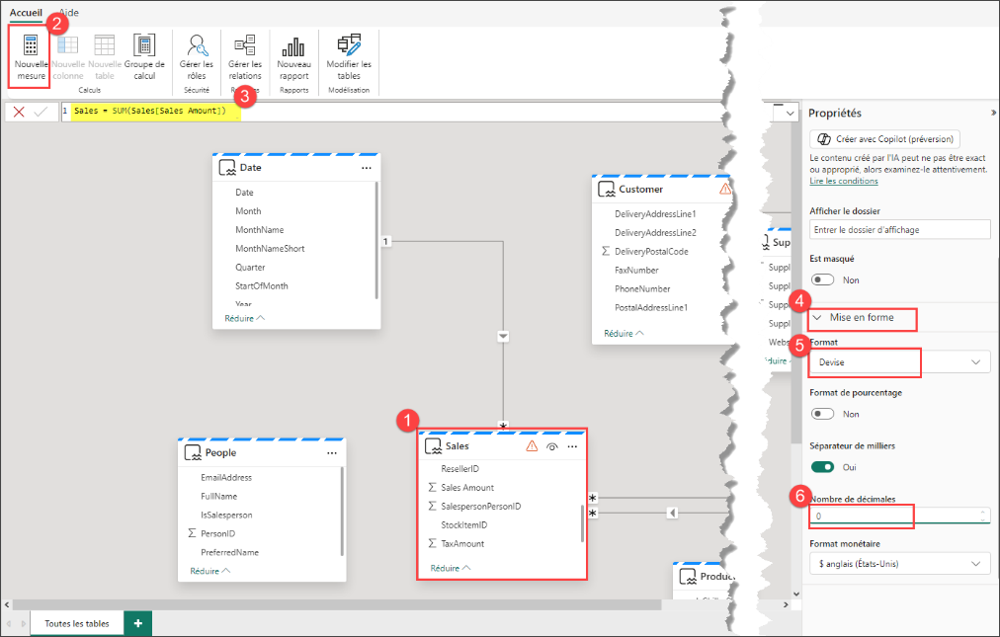

9.  Une fois la table **Sales** sélectionnée dans le menu supérieur,
    cliquez sur **Accueil -\> Nouvelle mesure**. Notez que la barre de
    formule s'affiche.

10. Saisissez **Units = SUM(Sales\[Quantity\])** dans la **barre de
    formule**.

11. Cliquez sur la **coche** à gauche de la barre de formule ou appuyez
    sur la touche **Entrée**.

12. Dans le volet Propriétés à droite, développez la section **Mise en
    forme**. (Le chargement du volet Propriétés peut prendre quelques
    instants.)

13. Dans la liste déroulante **Format**, sélectionnez **Nombre entier**.

14. Réglez le curseur **Séparateur de milliers** sur **Oui**.

    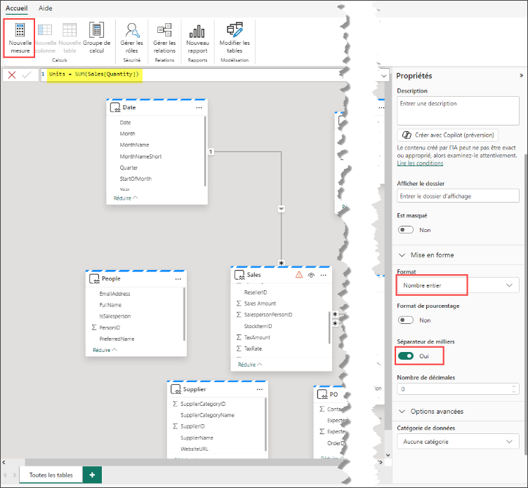

15. Une fois la table **Sales** sélectionnée dans le menu supérieur,
    cliquez sur **Accueil -\> Nouvelle mesure**. Notez que la barre de
    formule s'affiche.

16. Saisissez **Sales Orders = DISTINCTCOUNT(Sales\[InvoiceID\])** dans
    la **barre de formule**.

17. Cliquez sur la **coche** à gauche de la barre de formule ou appuyez
    sur la touche **Entrée**.

18. Dans le volet Propriétés à droite, développez la section **Mise en
    forme**.

19. Dans la liste déroulante **Format**, sélectionnez **Nombre entier**.

20. Réglez le curseur **Séparateur de milliers** sur **Oui**.

    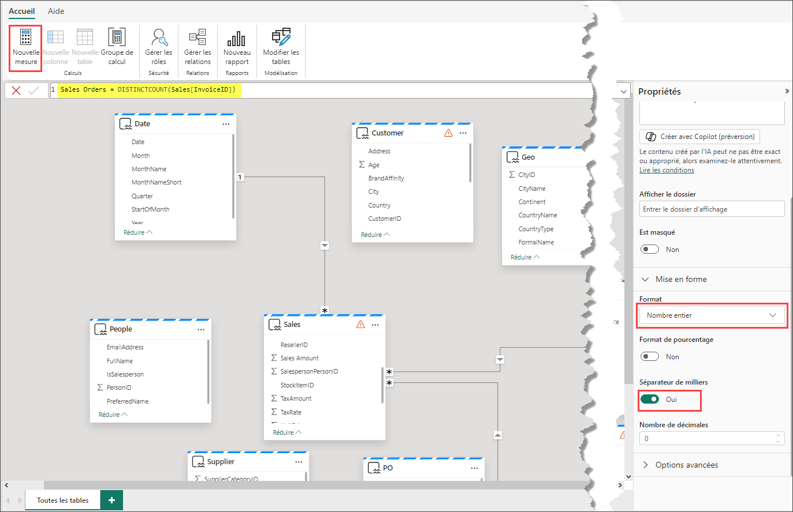

21. Dans le volet **Données** (à droite), cliquez sur **Modèle**. Notez
    que cela fournit une vue qui aide à organiser tous les éléments du
    modèle sémantique.

22. Développez **Modèle sémantique -\> Mesures** pour afficher toutes
    les mesures que vous venez de créer.

23. Vous pouvez également **développer des tables individuelles** pour
    afficher les colonnes, hiérarchies et mesures dans chacune d'elles.

    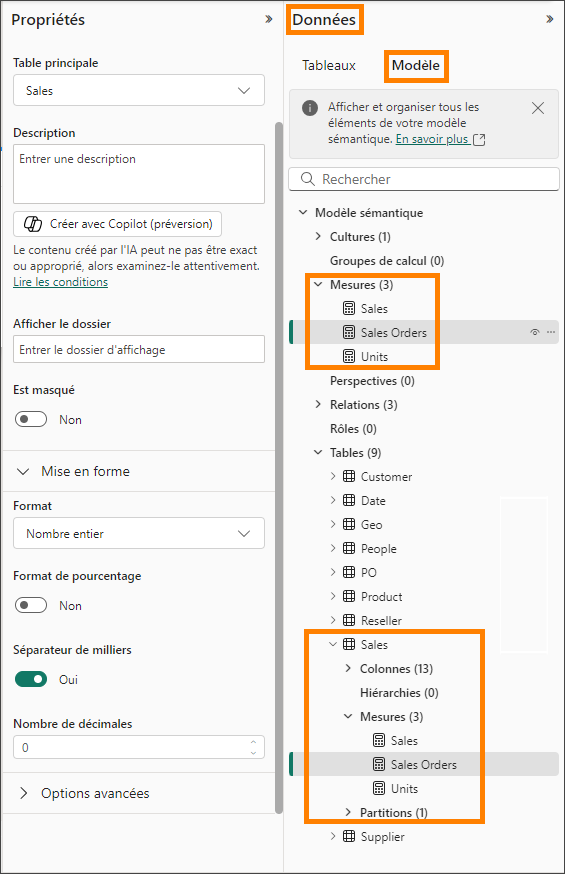

    Encore une fois, pour gagner du temps, nous n'allons pas créer toutes
    les mesures. Si le temps le permet, vous pouvez suivre la section
    facultative à la fin du labo. La section facultative passe en revue les
    étapes permettant de créer les mesures restantes.

    Nous avons créé un modèle sémantique et l'étape suivante consiste à
    créer un état. Nous allons le faire dans le prochain labo.

### Tâche 6 : section facultative - Créer des relations

Ajoutons les relations restantes.

1.  Dans le menu, cliquez sur Accueil -\> Gérer les relations.

2.  La boîte de dialogue Gérer les relations s'ouvre alors. Cliquez sur
    Nouvelle relation.

    

3.  La boîte de dialogue Nouvelle relation s'ouvre alors. Assurez-vous
    que le champ **À partir de la table** est défini sur **Sales** et le
    paramètre **Colonne** sur **SalespersonPersonID**.

4.  Assurez-vous que le champ **Vers la table** est défini sur
    **People** et le paramètre **Colonne** sur **PersonID**.

5.  Assurez-vous que le champ **Cardinalité** est défini sur **Plusieurs
    à un (\*:1)**.

6.  Assurez-vous que le champ **Direction du filtre croisé** est défini
    sur **À sens unique**.

7.  Cliquez sur **Enregistrer**. La boîte de dialogue Gérer les
    relations s'ouvre alors avec la nouvelle relation ajoutée.

    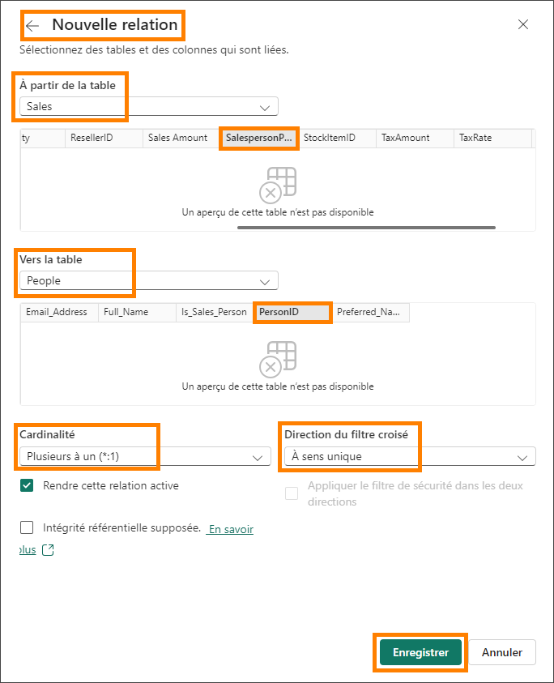

8.  Créons maintenant une relation entre les tables Product et Supplier.
    Cliquez sur **Nouvelle relation**.

9.  Assurez-vous que le champ **À partir de la table** est défini sur
    **Product** et le paramètre **Colonne** sur **SupplierID**.

10. Assurez-vous que le champ **Vers la table** est défini sur
    **Supplier** et le paramètre **Colonne** sur **SupplierID**.

11. Assurez-vous que le champ **Cardinalité** est défini sur **Plusieurs
    à un (\*:1)**.

12. Assurez-vous que le champ **Direction du filtre croisé** est défini
    sur **À double sens**.

13. Cliquez sur **Enregistrer**.

    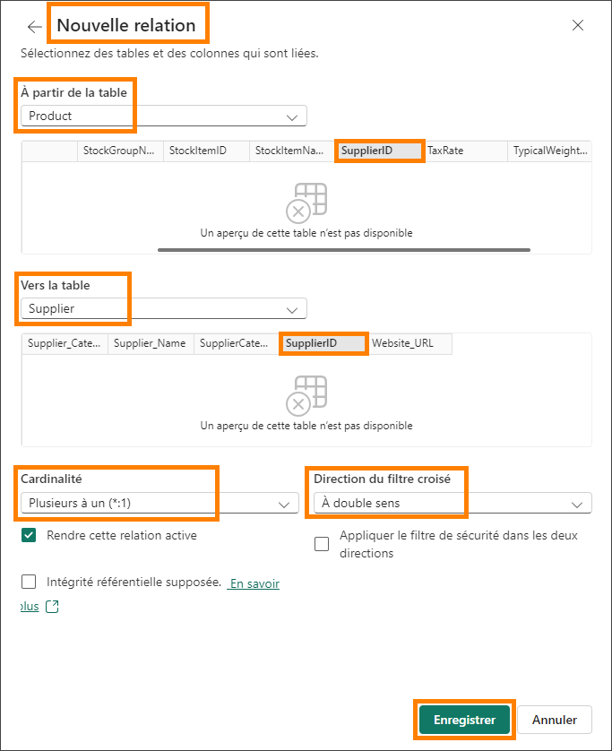

14. Créons maintenant une relation entre les tables Reseller et Geo.
    Cliquez sur **Nouvelle relation**.

15. La boîte de dialogue Nouvelle relation s'ouvre alors. Assurez-vous
    que le champ **À partir de la table** est défini sur **Reseller** et
    le paramètre **Colonne** sur **PostalCityID**.

16. Assurez-vous que le champ **Vers la table** est défini sur **Geo**
    et le paramètre **Colonne** sur **CityID**.

17. Assurez-vous que le champ **Cardinalité** est défini sur **Plusieurs
    à un (\*:1)**.

18. Assurez-vous que le champ **Direction du filtre croisé** est défini
    sur **À double sens**.

19. Cliquez sur **Enregistrer**.

    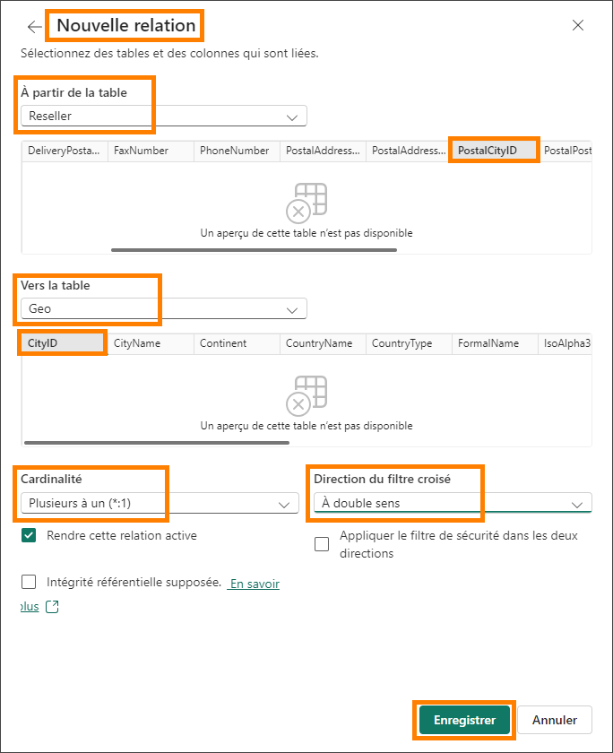

20. De même, créez une relation entre les tables Customer et Reseller.
    Cliquez sur **Nouvelle relation**.

21. La boîte de dialogue Nouvelle relation s'ouvre alors. Assurez-vous
    que le champ **À partir de la table** est défini sur **Customer** et
    le paramètre **Colonne** sur **ResellerID**.

22. Assurez-vous que le champ **Vers la table** est défini sur
    **Reseller** et le paramètre **Colonne** sur **ResellerID**.

23. Assurez-vous que le champ **Cardinalité** est défini sur **Plusieurs
    à un (\*:1)**.

24. Assurez-vous que le champ **Direction du filtre croisé** est défini
    sur **À sens unique**.

25. Cliquez sur **Enregistrer**.

**Point de contrôle :** la boîte de dialogue Gérer les relations devrait
ressembler à la capture d'écran ci-dessous.

26. De même, créez une relation **plusieurs-à-un** entre les tables
    **PO** et **Date**. Sélectionnez la valeur **Order_Date** dans la
    table **PO** et la valeur **Date** dans la table **Date**.

27. De même, créez une relation **plusieurs-à-un** entre les tables
    **PO** et **Product**. Sélectionnez la valeur **StockItemID** dans
    la table **PO** et la valeur **StockItemID** dans la table
    **Product**.

28. De même, créez une relation **plusieurs-à-un** entre les tables
    **PO** et **People**. Sélectionnez la valeur **ContactPersonID**
    dans la table **PO** et la valeur **PersonID** dans la table
    **People**.

29. Cliquez sur **Fermer** pour fermer la boîte de dialogue Gérer les
    relations.

Nous avons fini de créer toutes les relations.

**Point de contrôle :** votre modèle devrait ressembler à la capture
d'écran ci-dessous.

### Tâche 7 : section facultative - Créer des mesures

Ajoutons les mesures restantes.

1.  Sélectionnez la table **Sales**, puis cliquez sur **Accueil -\>
    Nouvelle mesure** dans le menu supérieur.

2.  Entrez **Avg Order = DIVIDE(\[Sales\], \[Sales Orders\])** dans la
    barre de formule.

3.  Cliquez sur la **coche** dans la barre de formule ou appuyez sur la
    touche Entrée.

4.  Développez le volet Propriétés à droite.

5.  Développez la section **Mise en forme**.

6.  Dans la liste déroulante **Format**, sélectionnez **Devise**.

7.  Définissez le champ Nombre de décimales sur 0.

    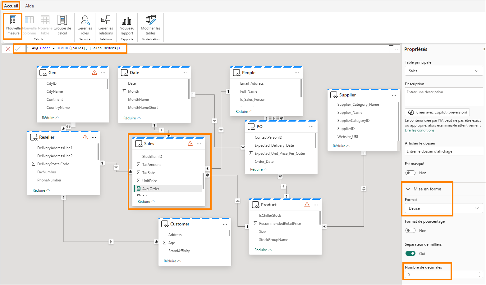

8.  Procédez de même pour ajouter les mesures suivantes :

    a.  Dans la table **Sales**, **GM = SUM(Sales\[LineProfit\])** au
        format **Devise avec 0 décimale**.

    b.  Dans la table **Sales**, **GM% = DIVIDE(\[GM\], \[Sales\])** au
        format **Pourcentage avec 0 décimale**.

    c.  Dans la table **Customer, No of Customers =
        COUNTROWS(Customer)** au format **Nombre entier avec l'option
        Séparateur de milliers activée**.

# Références

Fabric Analyst in a Day (FAIAD) vous présente certaines des fonctions
clés de Microsoft Fabric. Dans le menu du service, la section Aide (?)
comporte des liens vers d'excellentes ressources.

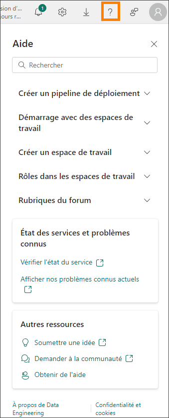

Voici quelques autres ressources qui vous aideront lors de vos
prochaines étapes avec Microsoft Fabric :

- Consultez le billet de blog pour lire l'intégralité de l'[annonce de
    la GA de Microsoft
    Fabric](https://aka.ms/Fabric-Hero-Blog-Ignite23).

- Explorez Fabric grâce à la [visite
    guidée](https://aka.ms/Fabric-GuidedTour).

- Inscrivez-vous pour bénéficier d'un [essai gratuit de Microsoft
    Fabric](https://aka.ms/try-fabric).

- Rendez-vous sur le [site web Microsoft
    Fabric](https://aka.ms/microsoft-fabric).

- Acquérez de nouvelles compétences en explorant les [modules
    d'apprentissage Fabric](https://aka.ms/learn-fabric).

- Explorez la [documentation technique
    Fabric](https://aka.ms/fabric-docs).

- Lisez le [livre électronique gratuit sur la prise en main de
    Fabric](https://aka.ms/fabric-get-started-ebook).

- Rejoignez la [communauté Fabric](https://aka.ms/fabric-community)
    pour publier vos questions, partager vos commentaires et apprendre
    des autres.

Lisez les blogs d'annonces plus détaillés sur l'expérience Fabric :

- [Blog Expérience Data Factory dans
    Fabric](https://aka.ms/Fabric-Data-Factory-Blog) 

- [Blog Expérience Synapse Data Engineering dans
    Fabric](https://aka.ms/Fabric-DE-Blog) 

- [Blog Expérience Synapse Data Science dans
    Fabric](https://aka.ms/Fabric-DS-Blog) 

- [Blog Expérience Synapse Data Warehousing dans
    Fabric](https://aka.ms/Fabric-DW-Blog) 

- [Blog Expérience Synapse Real-Time Analytics dans
    Fabric](https://aka.ms/Fabric-RTA-Blog)

- [Blog Annonce Power BI](https://aka.ms/Fabric-PBI-Blog)

- [Blog Expérience Data Activator dans
    Fabric](https://aka.ms/Fabric-DA-Blog) 

- [Blog Administration et gouvernance dans
    Fabric](https://aka.ms/Fabric-Admin-Gov-Blog)

- [Blog OneLake dans Fabric](https://aka.ms/Fabric-OneLake-Blog)

- [Blog Intégration de Dataverse et Microsoft
    Fabric](https://aka.ms/Dataverse-Fabric-Blog)

> © 2023 Microsoft Corporation. Tous droits réservés.
>
> En effectuant cette démonstration/ce labo, vous acceptez les
> conditions suivantes :
>
> La technologie/fonctionnalité décrite dans cette démonstration/ce labo
> est fournie par Microsoft Corporation en vue d'obtenir vos
> commentaires et de vous fournir une expérience d'apprentissage. Vous
> pouvez utiliser cette démonstration/ce labo uniquement pour évaluer
> ces technologies et fonctionnalités, et pour fournir des commentaires
> à Microsoft. Vous ne pouvez pas l'utiliser à d'autres fins. Vous ne
> pouvez pas modifier, copier, distribuer, transmettre, afficher,
> effectuer, reproduire, publier, accorder une licence, créer des œuvres
> dérivées, transférer ou vendre tout ou une partie de cette
> démonstration/ce labo.
>
> LA COPIE OU LA REPRODUCTION DE CETTE DÉMONSTRATION/CE LABO (OU DE
> TOUTE PARTIE DE CEUX-CI) SUR TOUT AUTRE SERVEUR OU AUTRE EMPLACEMENT
> EN VUE D'UNE AUTRE REPRODUCTION OU REDISTRIBUTION EST EXPRESSÉMENT
> INTERDITE.
>
> CETTE DÉMONSTRATION/CE LABO FOURNISSENT CERTAINES FONCTIONNALITÉS
> DE PRODUIT/TECHNOLOGIES LOGICIELLES, NOTAMMENT D'ÉVENTUELS NOUVEAUX
> CONCEPTS ET FONCTIONNALITÉS, DANS UN ENVIRONNEMENT SIMULÉ SANS
> INSTALLATION OU CONFIGURATION COMPLEXE AUX FINS DÉCRITES CI-DESSUS.
> LES TECHNOLOGIES/CONCEPTS REPRÉSENTÉS DANS CETTE DÉMONSTRATION/CE LABO
> PEUVENT NE PAS REPRÉSENTER LES FONCTIONNALITÉS COMPLÈTES ET PEUVENT NE
> PAS FONCTIONNER DE LA MÊME MANIÈRE QUE DANS UNE VERSION FINALE. IL EST
> ÉGALEMENT POSSIBLE QUE NOUS NE PUBLIIONS PAS DE VERSION FINALE DE CES
> FONCTIONNALITÉS OU CONCEPTS. VOTRE EXPÉRIENCE D'UTILISATION DE CES
> FONCTIONNALITÉS DANS UN ENVIRONNEMENT PHYSIQUE PEUT ÉGALEMENT ÊTRE
> DIFFÉRENTE.
>
> **COMMENTAIRES**. Si vous envoyez des commentaires sur les
> fonctionnalités, technologies et/ou concepts décrits dans cette
> démonstration/ce labo à Microsoft, vous accordez à Microsoft, sans
> frais, le droit d'utiliser, de partager et de commercialiser vos
> commentaires de quelque manière et à quelque fin que ce soit. Vous
> accordez également à des tiers, sans frais, les droits de brevet
> nécessaires pour leurs produits, technologies et services en vue de
> l'utilisation ou de l'interface avec des parties spécifiques d'un
> logiciel ou d'un service Microsoft incluant les commentaires. Vous
> n'enverrez pas de commentaires soumis à une licence exigeant que
> Microsoft accorde une licence pour son logiciel ou sa documentation à
> des tiers du fait que nous y incluons vos commentaires. Ces droits
> survivent à ce contrat.
>
> MICROSOFT CORPORATION DÉCLINE TOUTES LES GARANTIES ET CONDITIONS EN CE
> QUI CONCERNE CETTE DÉMONSTRATION/CE LABO, Y COMPRIS TOUTES LES
> GARANTIES ET CONDITIONS DE QUALITÉ MARCHANDE, QU'ELLES SOIENT
> EXPLICITES, IMPLICITES OU LÉGALES, D'ADÉQUATION À UN USAGE
> PARTICULIER, DE TITRE ET D'ABSENCE DE CONTREFAÇON. MICROSOFT N'OFFRE
> AUCUNE GARANTIE OU REPRÉSENTATION EN CE QUI CONCERNE LA PRÉCISION DES
> RÉSULTATS, LA CONSÉQUENCE QUI DÉCOULE DE L'UTILISATION DE CETTE
> DÉMONSTRATION/CE LABO, OU L'ADÉQUATION DES INFORMATIONS CONTENUES DANS
> CETTE DÉMONSTRATION/CE LABO À QUELQUE FIN QUE CE SOIT.
>
> **CLAUSE D'EXCLUSION DE RESPONSABILITÉ**
>
> Cette démonstration/Ce labo comporte seulement une partie des
> nouvelles fonctionnalités et améliorations disponibles dans Microsoft
> Power BI. Certaines fonctionnalités sont susceptibles de changer dans
> les versions ultérieures du produit. Dans cette démonstration/ce labo,
> vous allez découvrir comment utiliser certaines nouvelles
> fonctionnalités, mais pas toutes.
