# Microsoft Fabric - Fabric Analyst in a Day - Übung 2

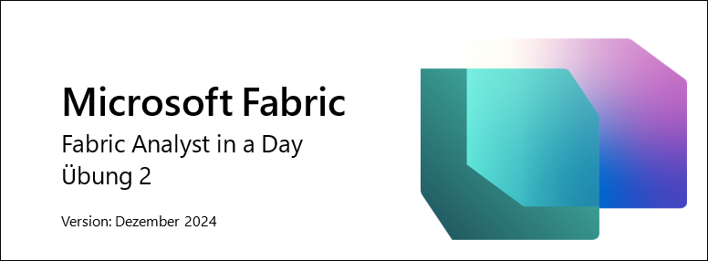

# Inhalt

- Einführung
- Fabric-Lizenz
    - Aufgabe 1: Lizenz für Testversion von Microsoft Fabric aktivieren
- Übersicht über die Funktionsbereiche in Fabric
    - Aufgabe 2: Data Factory-Funktionsbereich
    - Aufgabe 3: Industry Solutions-Funktionsbereich
    - Aufgabe 4: Real-Time Intelligence-Funktionsbereich
    - Aufgabe 5: Data Engineering-Funktionsbereich
    - Aufgabe 6: Data Science-Funktionsbereich
    - Aufgabe 7: Data Warehouse-Funktionsbereich
- Fabric-Arbeitsbereich
    - Aufgabe 8: Fabric-Arbeitsbereich erstellen
    - Aufgabe 9: Lakehouse erstellen
- Referenzen

# Einführung 

Heute geht es um die verschiedenen Hauptfunktionen von Microsoft Fabric.
In diesem Einführungsworkshop werden die verschiedenen Funktionsbereiche
und Bestandteile von Fabric vorgestellt. Am Ende des Workshops erfahren
Sie zudem, wie Sie Lakehouse, Dataflow Gen2, Data Pipeline, DirectLake
und mehr verwenden.

Inhalt dieser Übung:

- So erstellen Sie einen Fabric-Arbeitsbereich

- So erstellen Sie ein Lakehouse

# Fabric-Lizenz

### Aufgabe 1: Lizenz für Testversion von Microsoft Fabric aktivieren

1. Öffnen Sie den **Browser**, und rufen Sie https://app.powerbi.com/
 auf. Die Anmeldeseite wird angezeigt.

    **Hinweis:** Sie werden möglicherweise direkt angemeldet, wenn Sie die Übungsumgebung verwenden.

    **Hinweis:** Wenn Sie nicht die Übungsumgebung nutzen und bereits ein Power BI-Konto haben, können Sie den Browser im privaten Modus/Inkognito-Modus verwenden.

2. Geben Sie den **Benutzernamen**, den Sie auf der Registerkarte **Umgebungsvariablen** (neben der der Übungsanleitung) finden, sowie die **E-Mail** ein und klicken Sie auf **Senden**.

     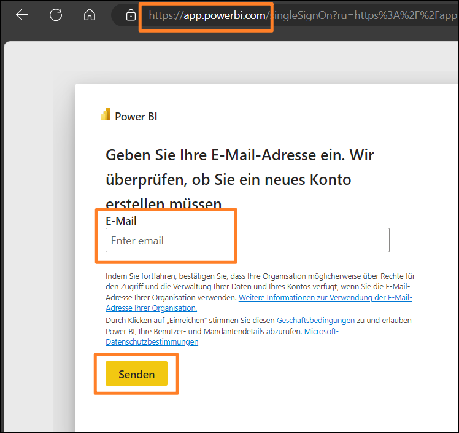

3. Die Seite **Kennwort** wird angezeigt. Geben Sie das **Kennwort** ein, das Sie auf der Registerkarte **Umgebungsvariablen** (neben der Übungsanleitung) finden und Ihnen von Ihrem Kursleiter mitgeteilt wurde.

4. Klicken Sie auf **Anmelden**, und folgen Sie den Anweisungen, um sich bei Fabric anzumelden.

     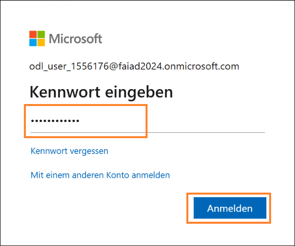

5. Sie werden zur bereits bekannten **Startseite des Power BI-Dienstes** geleitet.

6. Es wird angenommen, dass Ihnen der Aufbau des Power BI-Dienstes bekannt ist. Bei Fragen wenden Sie sich einfach an den Kursleiter. Derzeit sind Sie in **Mein Arbeitsbereich**. Wenn Sie mit Fabric-Elementen arbeiten möchten, benötigen Sie eine Testlizenz und einen Arbeitsbereich mit zugewiesener Fabric-Lizenz. Lassen Sie uns das einrichten.

7. Klicken Sie oben rechts auf dem Bildschirm auf das **Benutzersymbol**.

8. Wählen Sie **Kostenlose Testversion** aus.

     

9. Das Dialogfeld „Upgrade auf eine kostenlose Testversion auf
 Microsoft Fabric" wird geöffnet. Wählen Sie **Test starten** aus.

     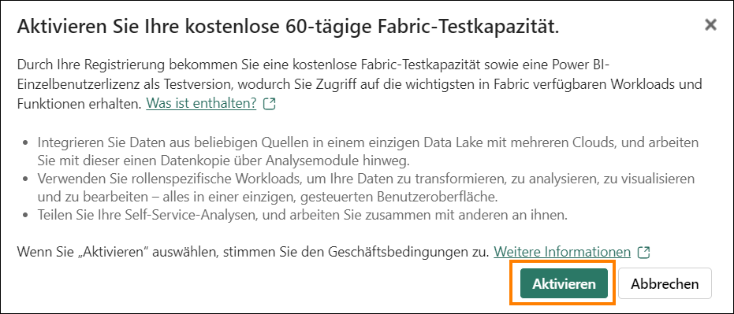

10. Das Dialogfeld „Erfolgreiches Upgrade auf Microsoft Fabric" wird
 geöffnet. Wählen Sie **Fabric Home Page** aus.

     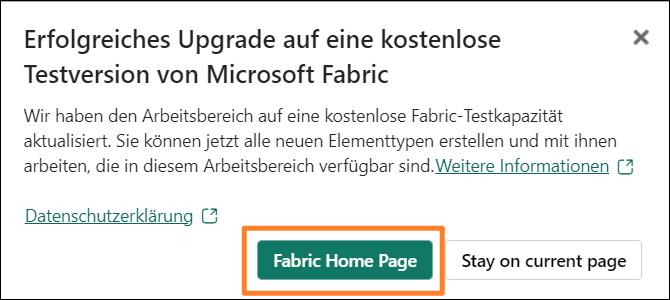

11. Sie werden zur **Startseite von Microsoft** **Fabric** geleitet.

     

# Übersicht über die Funktionsbereiche in Fabric

### Aufgabe 2: Data Factory-Funktionsbereich

1. Wählen Sie unten links auf Ihrem Bildschirm das Symbol **Microsoft Fabric** (Fabric-Funktionsbereichs-Auswahl) aus. Ein Dialogfeld mit einer Liste der Funktionsbereiche von Fabric wird geöffnet.Die Liste der Erfahrungen umfasst Power BI, Data Factory,Industry Solutions, Real-Time Intelligence, Data Engineering, Data Science und Data Warehouse. Sehen wir uns die Funktionsbereiche nun gesondert an.

2. Wählen Sie **Data Factory** aus.

    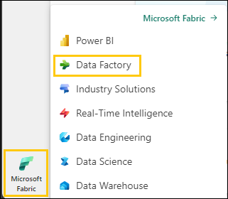

3. Sie werden zur **Startseite von Data Factory** weitergeleitet. Die
 Seite ist in vier Hauptbereiche unterteilt.

    a. **Einen Arbeitsbereich erstellen:** In diesem Abschnitt wird
    erklärt, wie Sie mit einer vorgefertigten Vorlage „Aufgabenflow"
    einen Arbeitsbereich erstellen, der Sie dabei unterstützt, Ihre
    Elemente in Microsoft Fabric zu organisieren.

    b. **Empfohlen:** Hier werden die Bestandteile von Data Factory
    angezeigt -- Dataflow Gen2, Datenpipeline, Datenworkflow und API
    für GraphQL.

    i. Dataflow Gen2 ist die nächste Generation von Dataflow.

    ii. Data Pipeline dient zur Datenorchestrierung.

    iii. Der Datenworkflow ist der Workflow Orchestration Manager.

    iv. API für GraphQL ist eine API zum Abfragen mehrerer Datenquellen.

    c. **Learn:** In diesem Abschnitt können Sie die
    Schnellstart-Lerndokumentation aufrufen.

    d. **Schnellzugriff:** Hier finden Sie die zuletzt verwendeten oder
    bevorzugten Elemente.

    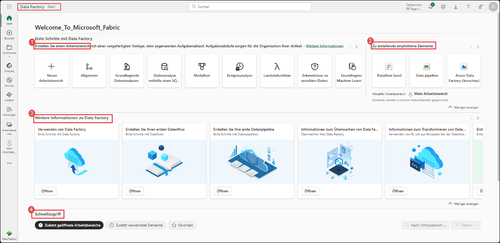

### Aufgabe 3: Industry Solutions-Funktionsbereich

1. Wählen Sie unten links auf Ihrem Bildschirm das **Fabric-Funktionsbereichs-Auswahl Symbol** (aktuell auf Data Factory eingestellt) aus. Das Dialogfeld „Fabric-Funktionsbereich" wird geöffnet.

2. Wählen Sie aus dem Dialogfeld **Industry Solutions** aus. Sie
 navigieren zur **Startseite von Industry Solutions**. Microsoft
 Fabric bietet branchenspezifische Datenlösungen, die eine robuste
 Plattform für Datenmanagement, Analyse und Entscheidungsfindung
 bereitstellen. Diese Datenlösungen gehen auf die einzigartigen
 Herausforderungen ein, mit denen verschiedene Branchen konfrontiert
 sind, und ermöglichen es Unternehmen, Abläufe zu optimieren, Daten
 aus verschiedenen Quellen zu integrieren und umfassende Analysen zu
 nutzen. Beachten Sie, dass die vier Abschnitte vorangegangenen
 Funktionsbereichen ähneln. Beachten Sie im Abschnitt „Empfohlen" die
 folgenden Elemente:

    a. **Nachhaltigkeitslösungen:** unterstützen die Erfassung,
    Standardisierung und Analyse von Umwelt-, Sozial- und
    Governance-Daten (ESG).

    b. **Einzelhandelslösungen:** helfen bei der Verwaltung großer
    Datenmengen, der Integration von Daten aus verschiedenen Quellen
    und der Bereitstellung von Echtzeitanalysen für eine schnelle
    Entscheidungsfindung. Einzelhändler können diese Lösungen zur
    Bestandsoptimierung, Kundensegmentierung, Umsatzprognose,
    dynamischen Preisgestaltung und Betrugserkennung nutzen.

    c. **Healthcare-Datenlösungen** sind strategisch darauf ausgelegt,
    die Zeit bis zur Wertschöpfung für die Kunden zu verkürzen,
    indem die kritische Notwendigkeit der effizienten Umwandlung von
    Daten aus dem Gesundheitswesen in ein geeignetes Format für die
    Analyse erfüllt wird.

    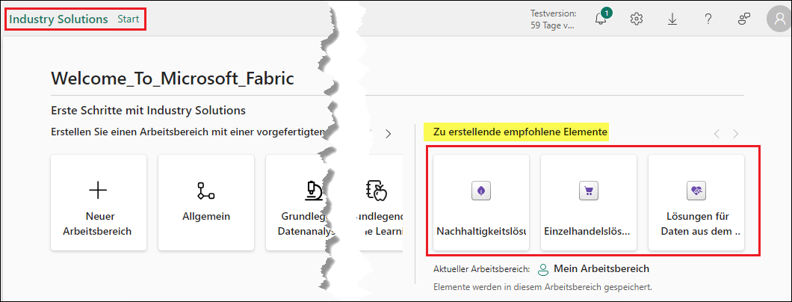

### Aufgabe 4: Real-Time Intelligence-Funktionsbereich

1. Wählen Sie unten links auf Ihrem Bildschirm das Symbol **Fabric-Funktionsbereichs-Auswahl** (aktuell auf Industry Solutions
 eingestellt) aus. Das Dialogfeld „Fabric-Funktionsbereich" wird
 geöffnet.

2. Wählen Sie **Real-Time Intelligence** aus. Sie navigieren zur **Real-Time Intelligence-Startseite**. Auch hier sind vier Abschnitte verfügbar. Beachten Sie im Abschnitt „Empfohlen" die folgenden Elemente:

    a. **Eventhouse:** Wird verwendet, um einen Arbeitsbereich der Datenbank zu erstellen, der projektübergreifend freigegeben
    werden kann.

    b. **KQL Abfragesatz:** Wird verwendet, um Abfragen für die Daten auszuführen, um freigabefähige Tabellen und Visuals zu
    erstellen.

    c. **Echtzeitdashboard:** Wird verwendet, um Echtzeit-Dashboards innerhalb von Sekunden nach der Datenerfassung zu visualisieren.

    d. **Eventstream:** Hiermit werden Ereignisströme in Echtzeit erfasst, umgewandelt und weitergeleitet.

    e. **Activator:** Dient zur Überwachung von Datensätzen, Abfragen und Ereignisströmen auf Muster.

    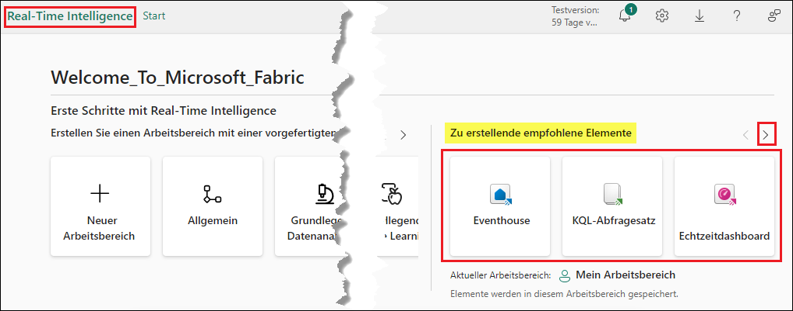

### Aufgabe 5: Data Engineering-Funktionsbereich

1. Wählen Sie unten links auf Ihrem Bildschirm das Symbol
**Fabric-Funktionsbereichs-Auswahl** (aktuell auf Real-Time
 Intelligence eingestellt) aus. Das Dialogfeld
 „Fabric-Funktionsbereich" wird geöffnet.

2. Klicken Sie auf **Data Engineering**. Sie werden zur **Startseite
 von Data Engineering** weitergeleitet. Auch diese Seite ist in vier
 Hauptabschnitte unterteilt. Beachten Sie im Abschnitt „Empfohlen"
 die folgenden Elemente:

    a. **Lakehouse:** Dient zum Speichern großer Datenmengen, die
    bereinigt, abgefragt, in Berichten verwendet und freigegeben werden
    können.

    b. **Notizbuch:** Dient zur Datenerfassung, -aufbereitung, -analyse und
    anderen datenbezogenen Aufgaben mithilfe verschiedener Sprachen wie
    Python, R und Scala.

    c. **Umgebung:** Dient dem Einrichten gemeinsam genutzter Bibliotheken,
    Spark-Compute-Einstellungen und Ressourcen für Notebooks und
    Spark-Auftragsdefinitionen.

    d. **Spark-Auftragsdefinition:** Dient zum Definieren, Planen und
    Verwalten von Apache-Aufträgen.

    e. **Data pipeline:** Hiermit wird die Datenlösung orchestriert.

    f. **API für GraphQL**: Ist eine API zum Abfragen mehrerer
    Datenquellen.

    g. **Notebook importieren:** Hiermit werden Notizbücher vom lokalen
    Computer importiert.

    

### Aufgabe 6: Data Science-Funktionsbereich

1. Wählen Sie unten links auf Ihrem Bildschirm das Symbol
 **Fabric-Funktionsbereichs-Auswahl** (aktuell auf Data Engineering
 eingestellt) aus. Das Dialogfeld „Fabric-Funktionsbereich" wird
 geöffnet.

2. Wählen Sie **Data Science** aus. Sie werden zur **Startseite von
 Data Science** weitergeleitet. Auch hier sind vier Abschnitte
 verfügbar. Beachten Sie im Abschnitt „Empfohlen" die folgenden
 Elemente:

    a. **ML-Modell:** Hiermit werden Machine-Learning-Modelle erstellt.

    b. **Experiment:** Dies dient zum Entwickeln und Ausführen von
    Modellen und zur Nachverfolgung der Modellentwicklung.

    c. **Notizbuch:** Hiermit werden Daten ausgewertet und
    Machine-Learning-Lösungen entwickelt.

    d. **Umgebung:** Dient dem Einrichten gemeinsam genutzter
    Bibliotheken, Spark-Compute-Einstellungen und Ressourcen für
    Notebooks und Spark-Auftragsdefinitionen.

    e. **KI Fertigkeit**: Wird verwendet, um Ihre eigene generative
    KI-Erfahrung zu erstellen.

    f. **Notebook importieren:** Hiermit werden Notizbücher vom lokalen
    Computer importiert.

    **Hinweis:** Elemente wie Notebook, Umgebung, Datenpipeline usw. sind in
mehreren Funktionsbereichen verfügbar, da sie in jedem dieser Bereiche
relevant sind.

    

### Aufgabe 7: Data Warehouse-Funktionsbereich

1. Wählen Sie unten links auf Ihrem Bildschirm das Symbol
 **Fabric-Funktionsbereichs-Auswahl** (aktuell auf Data Science
 eingestellt) aus. Das Dialogfeld „Fabric-Funktionsbereich" wird
 geöffnet.

2. Klicken Sie auf **Data Warehouse**. Sie werden zur **Startseite von
 Data Warehouse** weitergeleitet. Auch hier gibt es drei Abschnitte:
 Unter „Neu" sehen Sie diese Elemente:

    a. **Warehouse:** Dient dem Erstellen eines Data Warehouse.

    b. **Beispiellager:** Wird verwendet, um Data
    Warehousing-Funktionen mit vorkonfigurierten Datensätzen und
    Modellen zu erkunden und zu testen.

    c. **Data pipeline:** Hiermit wird die Datenlösung orchestriert.

    d. **Notizbuch:** Wird für das Erstellen und Teilen interaktiver
    Datenanalyse‑ und Visualisierungsaufgaben verwendet

    e. **Gespiegelte Azure SQL-Datenbank:** Wird verwendet, um die
    Azure SQL-Datenbank zu spiegeln.

    f. **Gespiegelter Azure Databricks-Katalog:** Wird zum Spiegeln von
    Daten von Azure Databricks für verbesserte Integration und
    Analyse verwendet.

    g. **Gespiegeltes Snowflake**: Wird verwendet, um die
    Snowflake-Datenbank zu spiegeln.

    h. **Gespiegeltes Azure Cosmos DB**: Wird verwendet, um Azure
    Cosmos DB zu spiegeln.

    i. **Gespiegelte verwalte Azure SQL-Datenbank:** Wird zum Spiegeln
    verwalteter Azure SQL-Datenbanken für hohe Verfügbarkeit und
    Notfallwiederherstellung verwendet.

    j. **Gespiegelte Datenbank:** Wird für das Replizieren von
    Datenbanken für hohe Verfügbarkeit und Notfallwiederherstellung
    verwendet.

    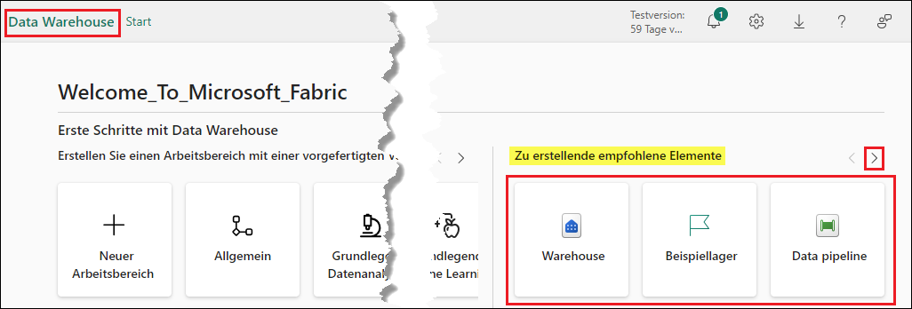

# Fabric-Arbeitsbereich

### Aufgabe 8: Fabric-Arbeitsbereich erstellen

1. Erstellen wir jetzt einen Arbeitsbereich mit Fabric-Lizenz. Wählen
 Sie in der Navigationsleiste links die Option **Arbeitsbereiche**
 aus. Ein Dialogfeld wird geöffnet.

2. Klicken Sie auf **+ Neuer Arbeitsbereich** unten im Popup-Menü

    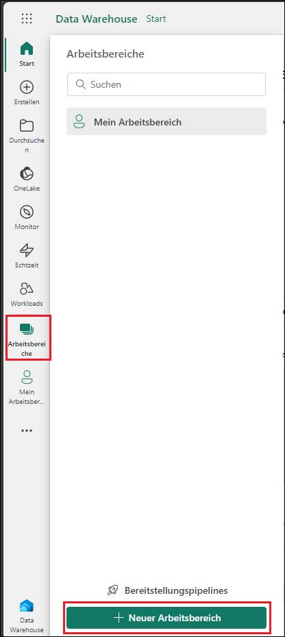

3. Rechts im Browser wird das Dialogfeld **Arbeitsbereich erstellen**
 geöffnet.

4. Geben Sie im Feld **Name** den Text **FAIAD\_\<username\>** ein.

    **Hinweis:** Der Name des Arbeitsbereichs muss eindeutig sein. Der Name Ihres Arbeitsbereichs lautet jedoch anders. Achten Sie darauf, dass unter dem Feld für den Namen ein grünes Häkchen mit dem Text **Dieser Name ist verfügbar** zu sehen ist.

5. Wenn Sie möchten, können Sie eine **Beschreibung** des
 Arbeitsbereichs eingeben. Dieses Feld ist optional.

6. Erweitern Sie den Abschnitt mit **Erweitert**.

    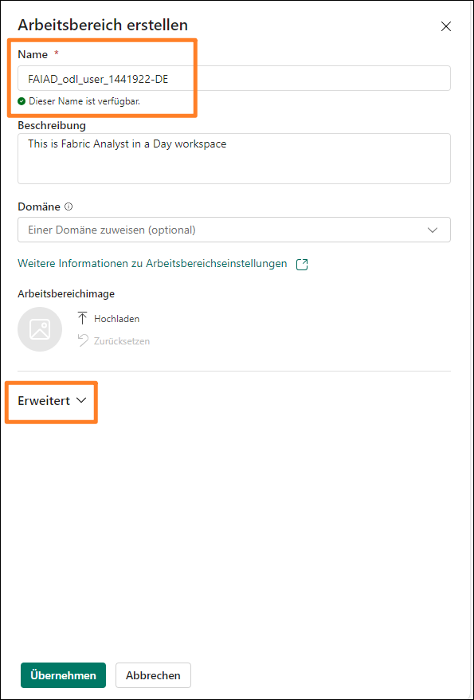

7. Überprüfen Sie unter **Lizenzmodus**, dass die Option
 **Testversion** ausgewählt ist. (Standardmäßig ist dies der Fall.)

8. Erstellen Sie den neuen Arbeitsbereich durch Klicken auf
 **Übernehmen**.

    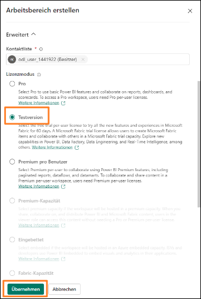

Ein neuer Arbeitsbereich wird erstellt, und Sie werden zu diesem
weitergeleitet. Als Nächstes importieren wir Daten aus verschiedenen
Quellen in das Lakehouse, entwickeln damit ein Modell und nutzen die
Daten für Berichte. Erstellen wir zunächst ein Lakehouse.

### Aufgabe 9: Lakehouse erstellen

1. Wählen Sie unten links auf Ihrem Bildschirm das Symbol
 **Fabric-Funktionsbereichs-Auswahl** (aktuell auf Data Warehouse
 eingestellt) aus. Das Dialogfeld „Fabric-Funktionsbereich"
 wird geöffnet.

2. Klicken Sie auf **Data Engineering**, um die Startseite von Data
 Engineering zu öffnen.

     

3. Wählen Sie **Lakehouse** aus.

     

4. Das Dialogfeld „Neues Lakehouse" wird geöffnet. Geben Sie im
 Textfeld für den Namen die Bezeichnung **lh_FAIAD** ein.

    **Hinweis:** „lh" bezieht sich hier auf Lakehouse. Die Buchstaben „lh" werden vorangestellt, damit das Lakehouse leichter erkannt und gefunden werden kann.

5. Wählen Sie **Erstellen** aus.

     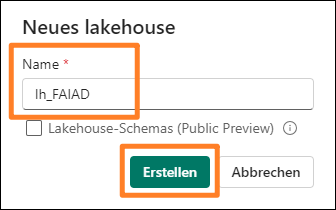

Das Lakehouse wird in kurzer Zeit erstellt, und Sie werden zur
Lakehouse-Oberfläche weitergeleitet.

Beachten Sie, dass **links** unter dem Arbeitsbereich jetzt das
Lakehouse-Symbol zu sehen ist. In den folgenden Übungen werden einige
dieser Möglichkeiten vorgestellt.

Im Lakehouse-Explorer werden **Tables** und **Files** angezeigt. In
einem Lakehouse können im Abschnitt mit den Dateien auch Dateien von
Azure Data Lake Storage Gen2 stehen, oder mit einem Dataflow können
Daten in Lakehouse-Tabellen geladen werden. Es stehen mehrere
Möglichkeiten zur Auswahl. In den folgenden Übungen werden einige dieser
Möglichkeiten vorgestellt.

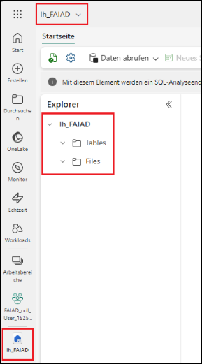

In dieser Übung haben wir die Fabric-Oberfläche kennengelernt sowie einen Fabric-Arbeitsbereich und ein Lakehouse erstellt. In der nächsten Übung lernen Sie, wie Sie mit Verknüpfungen in Lakehouse eine Verbindung zu ADLS Gen2-Daten herstellen und diese Daten anhand von Ansichten transformieren.

# Referenzen

Bei Fabric Analyst in a Day (FAIAD) lernen Sie einige der wichtigsten
Funktionen von Microsoft Fabric kennen. Im Menü des Dienstes finden Sie
in der Hilfe (?) Links zu praktischen Informationen.

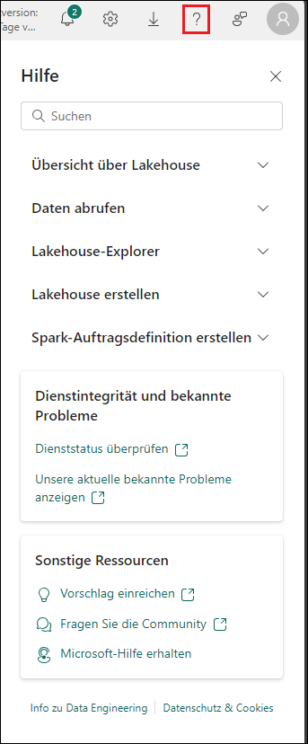

Nachfolgend finden Sie weitere Angebote zur weiteren Arbeit mit
Microsoft Fabric.

- Die vollständige [Ankündigung der allgemeinen Verfügbarkeit von
 Microsoft Fabric](https://aka.ms/Fabric-Hero-Blog-Ignite23) finden
 Sie im Blogbeitrag.

- Fabric bei einer [interaktiven
 Vorstellung](https://aka.ms/Fabric-GuidedTour) kennenlernen

- Zur [kostenlosen Testversion von Microsoft
 Fabric](https://aka.ms/try-fabric) anmelden

- [Website von Microsoft Fabric](https://aka.ms/microsoft-fabric)
 besuchen

- Mit Modulen von [Fabric Learning](https://aka.ms/learn-fabric) neue
 Qualifikationen erwerben

- [Technische Dokumentation zu Fabric](https://aka.ms/fabric-docs)
 lesen

- [Kostenloses E-Book zum Einstieg in
 Fabric](https://aka.ms/fabric-get-started-ebook) lesen

- Mitglied der [Fabric-Community](https://aka.ms/fabric-community)
 werden, um Fragen zu stellen, Feedback zu geben und sich mit anderen
 auszutauschen

Lesen Sie die detaillierteren Blogs zur Ankündigung der Fabric-Umgebung:

- [Blog zum Data Factory-Funktionsbereich in
 Fabric](https://aka.ms/Fabric-Data-Factory-Blog) 

- [Blog zum Data Engineering-Funktionsbereich von Synapse in
 Fabric](https://aka.ms/Fabric-DE-Blog) 

- [Blog zum Data Science-Funktionsbereich von Synapse in
 Fabric](https://aka.ms/Fabric-DS-Blog) 

- [Blog zum Data Warehousing-Funktionsbereich von Synapse in
 Fabric](https://aka.ms/Fabric-DW-Blog) 

- [Blog zum Real-Time Analytics-Funktionsbereich von Synapse in
 Fabric](https://aka.ms/Fabric-RTA-Blog)

- [Blog mit Ankündigungen zu Power BI](https://aka.ms/Fabric-PBI-Blog)

- [Blog zum Data Activator-Funktionsbereich in
 Fabric](https://aka.ms/Fabric-DA-Blog) 

- [Blog zu Verwaltung und Governance in
 Fabric](https://aka.ms/Fabric-Admin-Gov-Blog)

- [Blog zu OneLake in Fabric](https://aka.ms/Fabric-OneLake-Blog)

- [Blog zur Dataverse- und Microsoft
 Fabric-Integration](https://aka.ms/Dataverse-Fabric-Blog)

© 2023 Microsoft Corporation. Alle Rechte vorbehalten.

Durch die Verwendung der vorliegenden Demo/Übung stimmen Sie den
folgenden Bedingungen zu:

Die in dieser Demo/Übung beschriebene Technologie/Funktionalität wird
von der Microsoft Corporation bereitgestellt, um Feedback von Ihnen zu
erhalten und Ihnen Wissen zu vermitteln. Sie dürfen die Demo/Übung nur
verwenden, um derartige Technologiefeatures und Funktionen zu bewerten
und Microsoft Feedback zu geben. Es ist Ihnen nicht erlaubt, sie für
andere Zwecke zu verwenden. Es ist Ihnen nicht gestattet, diese
Demo/Übung oder einen Teil derselben zu ändern, zu kopieren, zu
verbreiten, zu übertragen, anzuzeigen, auszuführen, zu
vervielfältigen, zu veröffentlichen, zu lizenzieren, zu transferieren
oder zu verkaufen oder aus ihr abgeleitete Werke zu erstellen.

DAS KOPIEREN ODER VERVIELFÄLTIGEN DER DEMO/ÜBUNG (ODER EINES TEILS
DERSELBEN) AUF EINEN/EINEM ANDEREN SERVER ODER SPEICHERORT FÜR DIE
WEITERE VERVIELFÄLTIGUNG ODER VERBREITUNG IST AUSDRÜCKLICH UNTERSAGT.

DIESE DEMO/ÜBUNG STELLT BESTIMMTE
SOFTWARE-TECHNOLOGIE-/PRODUKTFEATURES UND FUNKTIONEN, EINSCHLIESSLICH
POTENZIELLER NEUER FEATURES UND KONZEPTE, IN EINER SIMULIERTEN
UMGEBUNG OHNE KOMPLEXE EINRICHTUNG ODER INSTALLATION FÜR DEN OBEN
BESCHRIEBENEN ZWECK BEREIT. DIE TECHNOLOGIE/KONZEPTE IN DIESER
DEMO/ÜBUNG ZEIGEN MÖGLICHERWEISE NICHT DAS VOLLSTÄNDIGE
FUNKTIONSSPEKTRUM UND FUNKTIONIEREN MÖGLICHERWEISE NICHT WIE DIE
ENDGÜLTIGE VERSION. UNTER UMSTÄNDEN VERÖFFENTLICHEN WIR AUCH KEINE
ENDGÜLTIGE VERSION DERARTIGER FEATURES ODER KONZEPTE. IHRE ERFAHRUNG
BEI DER VERWENDUNG DERARTIGER FEATURES UND FUNKTIONEN IN EINER
PHYSISCHEN UMGEBUNG KANN FERNER ABWEICHEND SEIN.

**FEEDBACK**. Wenn Sie Feedback zu den Technologiefeatures, Funktionen
und/oder Konzepten geben, die in dieser Demo/Übung beschrieben werden,
gewähren Sie Microsoft das Recht, Ihr Feedback in jeglicher Weise und
für jeglichen Zweck kostenlos zu verwenden, zu veröffentlichen und
gewerblich zu nutzen. Außerdem treten Sie Dritten kostenlos sämtliche
Patentrechte ab, die erforderlich sind, damit deren Produkte,
Technologien und Dienste bestimmte Teile einer Software oder eines
Dienstes von Microsoft, welche/welcher das Feedback enthält, verwenden
oder eine Verbindung zu dieser/diesem herstellen können. Sie geben
kein Feedback, das einem Lizenzvertrag unterliegt, aufgrund dessen
Microsoft Drittparteien eine Lizenz für seine Software oder
Dokumentation gewähren muss, weil wir Ihr Feedback in diese aufnehmen.
Diese Rechte bestehen nach Ablauf dieser Vereinbarung fort.

DIE MICROSOFT CORPORATION LEHNT HIERMIT JEGLICHE GEWÄHRLEISTUNGEN UND
GARANTIEN IN BEZUG AUF DIE DEMO/ÜBUNG AB, EINSCHLIESSLICH ALLER
AUSDRÜCKLICHEN, KONKLUDENTEN ODER GESETZLICHEN GEWÄHRLEISTUNGEN UND
GARANTIEN DER HANDELSÜBLICHKEIT, DER EIGNUNG FÜR EINEN BESTIMMTEN
ZWECK, DES RECHTSANSPRUCHS UND DER NICHTVERLETZUNG VON RECHTEN
DRITTER. MICROSOFT MACHT KEINERLEI ZUSICHERUNGEN BZW. ERHEBT KEINERLEI
ANSPRÜCHE IM HINBLICK AUF DIE RICHTIGKEIT DER ERGEBNISSE UND DES AUS
DER VERWENDUNG DER DEMO/ÜBUNG RESULTIERENDEN ARBEITSERGEBNISSES BZW.
BEZÜGLICH DER EIGNUNG DER IN DER DEMO/ÜBUNG ENTHALTENEN INFORMATIONEN
FÜR EINEN BESTIMMTEN ZWECK.

**HAFTUNGSAUSSCHLUSS**

Diese Demo/Übung enthält nur einen Teil der neuen Features und
Verbesserungen in Microsoft Power BI. Einige Features können sich
unter Umständen in zukünftigen Versionen des Produkts ändern. In
dieser Demo/Übung erhalten Sie Informationen über einige, aber nicht über alle neuen Features.
