# Microsoft Fabric - Fabric Analyst in a Day - Übung 4

# Inahlt

- Einführung
- Dataflow Gen2
    - Aufgabe 1: SharePoint-Abfragen in Dataflow kopieren
    - Aufgabe 2: Verbindung zu SharePoint erstellen
    - Aufgabe 3: Datenziel für die Abfrage „People“ konfigurieren
    - Aufgabe 4: SharePoint-Dataflow veröffentlichen und umbenennen
    - Aufgabe 5: Snowflake-Abfragen in Dataflow kopieren
    - Aufgabe 6: Verbindung zu Snowflake erstellen
    - Aufgabe 7: Datenziel für die Abfragen „Supplier“ und „PO“ konfigurieren
    - Aufgabe 8: Snowflake-Dataflow umbenennen und veröffentlichen
    Verknüpfung zu ADLS Gen2
    - Aufgabe 9: Eine Verknüpfung zu Dataverse erstellen
    - Aufgabe 10: Eine Verknüpfung zu einem Lakehouse erstellen
- Referenzen

# Einführung 

Bei unserem Anwendungsfall befinden sich die Lieferantendaten in
Snowflake, die Kundendaten in Dataverse und die Mitarbeiterdaten in
SharePoint. Alle diese Datenquellen werden zu verschiedenen Zeiten
aktualisiert. Um die Anzahl der Datenaktualisierungen von Dataflows zu
verringern, erstellen wir für Snowflake und SharePoint-Datenquellen
individuelle Dataflows.

**Hinweis**: Ein einziger Dataflow berücksichtigt dabei mehrere
Datenquellen.

Das IT-Team hat bereits eine Verknüpfung zu Dataverse erstellt und die
erforderlichen Datentransformationen angewendet, die diese in der Power
BI Desktop-Datei spiegeln. Sie haben diese Daten in Lakehouse im
Arbeitsbereich „Administrator" erfasst und uns Zugriff auf die
Tabelle(n) gewährt. Wir erstellen eine Verknüpfung für das vom IT-Team
erstellte Lakehouse.

Am Ende dieser Übung haben Sie Folgendes gelernt:

- Mit Dataflow Gen2 eine Verbindung zu SharePoint herstellen und Daten
    im Lakehouse erfassen

- Mit Dataflow Gen2 eine Verbindung zu Snowflake herstellen und Daten
    im Lakehouse erfassen

- Daten aus einem freigegebenen Lakehouse erfassen

# Dataflow Gen2

## Aufgabe 1: SharePoint-Abfragen in Dataflow kopieren

1. Navigieren wir nun zurück zum Fabric-Arbeitsbereich,
    **FAIAD\_\<username\>**, den Sie in Übung 2, Aufgabe 8, erstellt
    haben.

2. Wählen Sie unten links auf dem Bildschirm das **Symbol** für die
    **Fabric-Funktionsbereichs-Auswahl** aus. Das Dialogfeld
    „Fabric-Funktionsbereich" wird geöffnet.

3. Wählen Sie dort die Option **Data Factory** aus. Sie navigieren zur
    **Data Factory-Startseite**.

    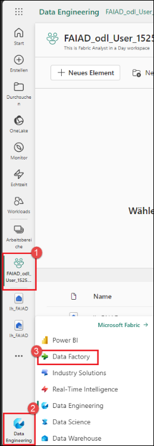

4. Wählen Sie unter „Empfohlene Elemente" die Option **Dataflow Gen2**
    aus.

    

    Sie werden zur **Dataflow-Seite** weitergeleitet. Die Dataflow
    Gen2-Schnittstelle ähnelt der von Power Query in Power BI Desktop. Wir
    können Abfragen von Power BI Desktop nach Dataflow Gen2 kopieren. Lassen
    Sie uns dies ausprobieren.

5. Öffnen Sie **FAIAD.pbix** im Ordner **Reports** auf dem Desktop
    Ihrer Übungsumgebung, falls dies noch nicht erfolgt ist.

6. Wählen Sie im Menüband **Start \> Daten transformieren** aus. Das
    Power Query-Fenster wird geöffnet. Wie Sie in der vorherigen Übung
    festgestellt haben, sind die Abfragen im linken Bereich nach
    Datenquelle organisiert.

7. Wählen Sie links unter dem Ordner **SharepointData** die Abfrage
    **People** aus.

8. **Klicken Sie mit der rechten Maustaste**, und wählen Sie
    **Kopieren** aus.

    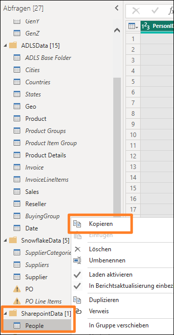

9. Rufen Sie im Browser wieder das Fenster **Dataflow** auf.

10. Drücken Sie im Bereich **Dataflow** auf **STRG+V** (das Einfügen
    mittels Rechtsklick ist derzeit nicht möglich). Wenn Sie ein
    MAC-Gerät verwenden, drücken Sie zum Einfügen bitte Cmd+V.

    **Hinweis**: Wenn Sie in der Übungsumgebung arbeiten, wählen Sie die
    Auslassungspunkte oben rechts auf dem Bildschirm aus. Verwenden Sie den
    Schieberegler, um das **VM Native Clipboard** **zu aktivieren**. Wählen
    Sie im Dialogfeld OK aus. Nachdem Sie die Abfragen eingefügt haben,
    können Sie diese Option deaktivieren.

    

    Beachten Sie, dass die Abfrage links eingefügt wurde. Weil für
    SharePoint keine Verbindung erstellt wurde, wird eine Warnmeldung
    angezeigt, in der Sie aufgefordert werden, eine Verbindung zu
    konfigurieren.

## Aufgabe 2: Verbindung zu SharePoint erstellen

1. Wählen Sie **Verbindung konfigurieren** aus.

    

2. Das Dialogfeld „Mit Datenquelle verbinden" wird geöffnet. Überprüfen
    Sie, dass im Dropdown-Menü **Verbindung** die Option **Neue
    Verbindung erstellen** ausgewählt ist.

3. Die **Authentifizierungsart** muss **Organisationskonto** lauten.

4. Wählen Sie **Verbinden** aus.

    **Hinweis**: Sie werden mit Ihren Anmeldeinformationen angemeldet. Sie
    werden von denen auf dem Screenshot unten abweichen.

    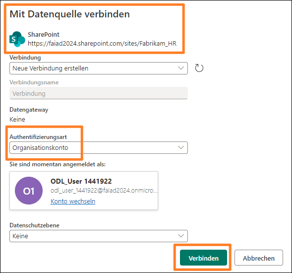

## Aufgabe 3: Datenziel für die Abfrage „People" konfigurieren

Die Verbindung wird hergestellt, und Sie können die Daten im
Vorschaubereich ansehen. Wenn Sie möchten, sehen Sie sich die
angewandten Schritte der Abfragen an. Nun müssen die „People"-Daten
im Lakehouse erfasst werden.

1. Wählen Sie die Abfrage **People** aus.

2. Klicken Sie im Menüband auf **Start \> Datenziel hinzufügen -\>
    Lakehouse**.

    

3. Das Dialogfeld „Herstellen einer Verbindung mit dem Datenziel" wird
    geöffnet. Wir müssen eine neue Verbindung zu Lakehouse herstellen.
    Wenn **Neue Verbindung erstellen** im **Dropdown-Menü „Verbindung"**
    ausgewählt und **Authentifizierungsart** auf **Organisationskonto**
    festgelegt ist, wählen Sie **Weiter** aus.

    

4. Das Dialogfeld „Zielort auswählen" wird geöffnet. Stellen Sie
    sicher, dass das **Optionsfeld „Neue Tabelle"** ausgewählt ist, da
    wir eine neue Tabelle erstellen.

5. Wir möchten die zuvor erstellte Tabelle in Lakehouse erstellen.
    Navigieren Sie im linken Bereich zu **Lakehouse -\>
    FAIAD\_\<username\>.**

6. Wählen Sie **lh_FAIAD** aus.

7. Behalten Sie den Tabellennamen **People** bei.

8. Wählen Sie **Weiter** aus.

    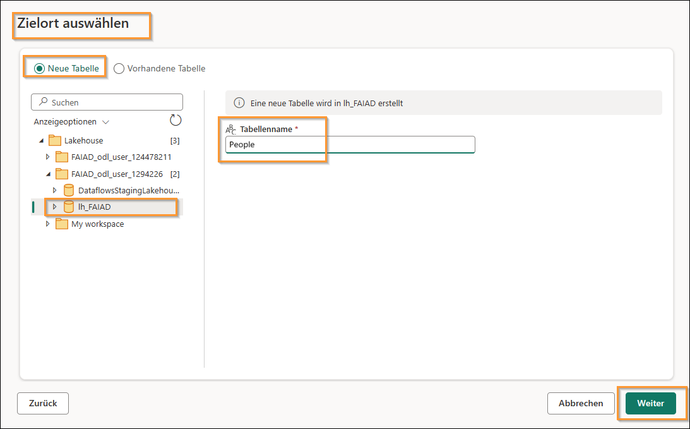

9. Das Dialogfeld „Zieleinstellungen auswählen" wird geöffnet. Stellen
    Sie sicher, dass „**Automatische Einstellungen verwenden**"
    **aktiviert** ist.

    **Hinweis**: Sie können die automatischen Einstellungen deaktivieren und
    haben die Möglichkeit, die Aktualisierungsmethode und die Schemaoptionen
    festzulegen. Vergewissern Sie sich nach der Erkundung, dass
    „**Automatische Einstellungen verwenden**" **aktiviert** ist.

10. Wählen Sie **Einstellungen speichern** aus.

    

## Aufgabe 4: SharePoint-Dataflow veröffentlichen und umbenennen

1. Sie werden zum **Power Query-Fenster** weitergeleitet. Beachten Sie,
    dass **unten rechts** das Datenziel auf **Lakehouse** festgelegt
    ist.

2. Wählen Sie unten rechts **Veröffentlichen** aus.

    

    **Hinweis**: Sie werden zum Arbeitsbereich **FAIAD\_\<username\>**
    weitergeleitet. Es kann einige Momente dauern, bis der Dataflow
    veröffentlicht wird.

3. Wir arbeiten mit Dataflow 1. Benennen wir ihn um, bevor wir
    fortfahren. Klicken Sie auf die **Auslassungspunkte (...)** neben
    Dataflow 1. Wählen Sie **Eigenschaften** aus.

    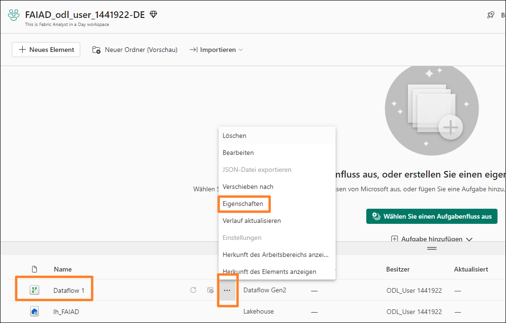

4. Das Dialogfeld „Dataflow-Eigenschaften" wird geöffnet. Ändern Sie
    den **Namen** in **df_People_SharePoint**.

5. Ergänzen Sie im Textfeld **Beschreibung** den Text **Dataflow to
    ingest People data from SharePoint to Lakehouse**.

6. Wählen Sie **Speichern** aus.

    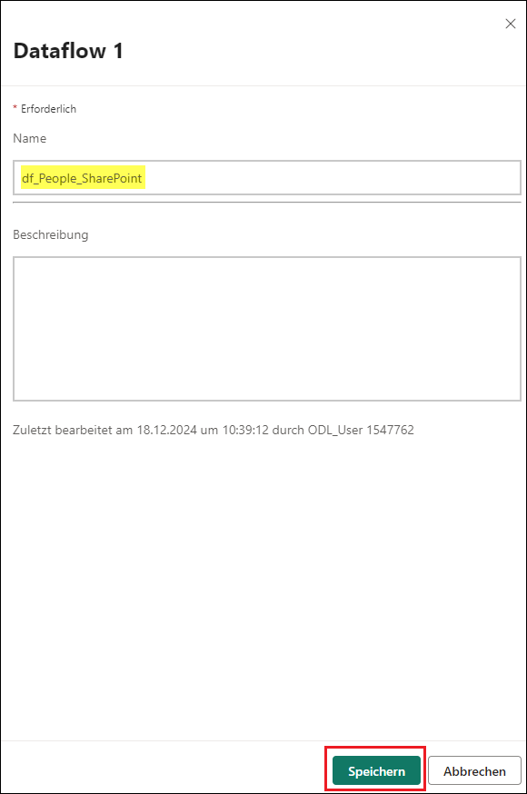

    Sie werden zum Arbeitsbereich **FAIAD\_\<username\>** weitergeleitet.

7. Wählen Sie **lh_FAIAD** aus, um zum Lakehouse zu navigieren.

8. Stellen Sie sicher, dass Sie sich in der Lakehouse-Ansicht (nicht im
    SQL-Analyseendpunkt) befinden.

9. Beachten Sie, dass die Tabelle **People** jetzt im Lakehouse
    verfügbar ist.

    **Hinweis**: Wenn die neu erstellten Tabellen nicht angezeigt werden,
    wählen Sie die Auslassungspunkte neben „Tabellen" und „Aktualisieren"
    aus, um die Tabellen zu aktualisieren.

## Aufgabe 5: Snowflake-Abfragen in Dataflow kopieren

1. Wir navigieren zurück zum Fabric-Arbeitsbereich
    **FAIAD\_\<username\>**.

2. Wählen Sie im Menü oben die Option **Neu -\> Dataflow Gen2** aus.

    

    Sie werden zur **Dataflow-Seite** weitergeleitet. Nachdem Sie Dataflow
    nun kennen, kopieren Sie die Abfragen aus Power BI Desktop in Dataflow.

3. Öffnen Sie **FAIAD.pbix** im Ordner **Reports** auf dem Desktop
    Ihrer Übungsumgebung, falls dies noch nicht erfolgt ist.

4. Wählen Sie im Menüband **Start \> Daten transformieren** aus. Das
    Power Query-Fenster wird geöffnet. Wie Sie in der vorherigen Übung
    festgestellt haben, sind die Abfragen im linken Bereich nach
    Datenquelle organisiert.

5. Wählen Sie links unter dem Ordner „SnowflakeData" mit
    **STRG+Auswahl** oder „Umschalt+Auswahl" die folgenden Abfragen aus:

    a. SupplierCategories

    b. Suppliers

    c. Supplier

    d. PO

    e. PO Line Items

6. **Klicken Sie mit der rechten Maustaste**, und wählen Sie
    **Kopieren** aus.

    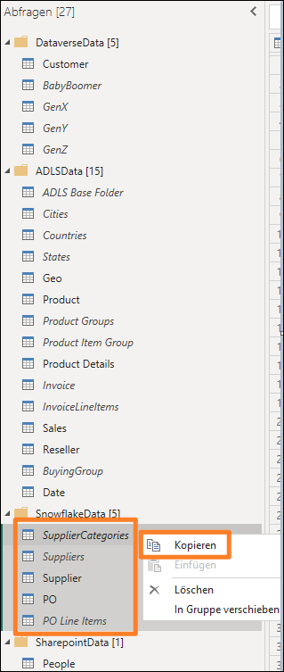

7. Navigieren Sie zurück zum **Browser**.

8. Wählen Sie im Bereich **Dataflow** den **mittleren Bereich** aus,
    und drücken Sie **STRG+V** (das Einfügen mittels Rechtklick ist
    derzeit nicht möglich). Wenn Sie ein MAC-Gerät verwenden, drücken
    Sie zum Einfügen bitte Cmd+V.

    **Hinweis:** Wenn Sie in der Übungsumgebung arbeiten, wählen Sie die
    **Auslassungspunkte (...)** oben rechts auf dem Bildschirm aus.
    Verwenden Sie den Schieberegler, um das VM Native Clipboard zu
    aktivieren. Wählen Sie im Dialogfeld OK aus. Nachdem Sie die Abfragen
    eingefügt haben, können Sie diese Option deaktivieren.

    

## Aufgabe 6: Verbindung zu Snowflake erstellen

Beachten Sie, dass die fünf Abfragen eingefügt wurden und dass der
Bereich „Abfragen" jetzt links ist. Weil für Snowflake keine Verbindung
erstellt wurde, wird eine Warnmeldung angezeigt, in der Sie aufgefordert
werden, eine Verbindung zu konfigurieren.

1. Wählen Sie **Verbindung konfigurieren** aus.

    

2. Das Dialogfeld „Mit Datenquelle verbinden" wird geöffnet. Überprüfen
    Sie, dass im Dropdown-Menü **Verbindung** die Option **Neue
    Verbindung erstellen** ausgewählt ist.

3. Die **Authentifizierungsart** sollte **Snowflake** lauten.

4. Geben Sie den **Benutzernamen und das Kennwort für Snowflake** ein.
    Beides finden Sie auf der Registerkarte mit den Environment
    Variables (neben der Registerkarte mit der Übungsanleitung).

5. Wählen Sie **Verbinden** aus.

    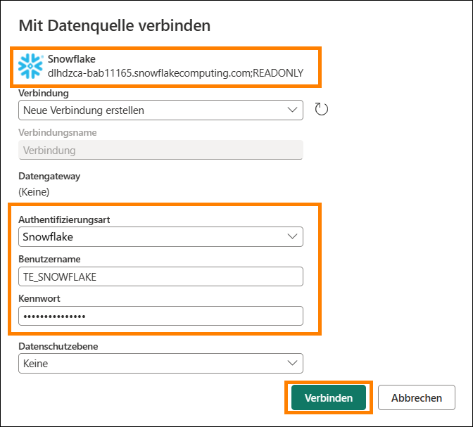

    >**Hinweis:** Wenn Sie Probleme beim Herstellen einer Verbindung zu Snowflake mit den Anmeldeinformationen aus den Umgebungsdetails haben, verwenden Sie bitte die unten angegebenen Anmeldeinformationen.

    - **Benutzername:** SNOWFLAKE_BACKUP
    - **Kennwort:** 8UpfRpExVDXv2AC1

Die Verbindung wird hergestellt, und Sie können die Daten im
Vorschaubereich ansehen. Wenn Sie möchten, sehen Sie sich die
angewandten Schritte der Abfragen an. Grundsätzlich enthält die
Suppliers-Abfrage Lieferanteninformationen und „SupplierCategories", wie
der Name schon sagt, Lieferantenkategorien. Diese beiden Tabellen werden
zusammengeführt, um die Dimension „Supplier" mit den erforderlichen
Spalten zu erstellen. Auf ähnliche Weise wird „PO Line Items" mit „PO"
zusammengeführt, um den Fakt „PO" zu erstellen. Nun müssen die Daten von
„Supplier" und „PO" im Lakehouse erfasst werden.

## Aufgabe 7: Datenziel für die Abfragen „Supplier" und „PO" konfigurieren

1. Wählen Sie die Abfrage **Supplier** aus.

2. Klicken Sie im Menüband auf **Start \> Datenziel hinzufügen -\>
    Lakehouse**.

    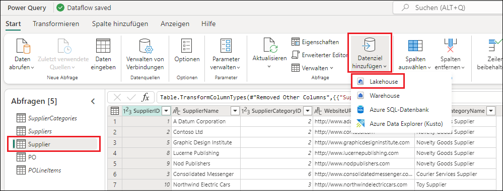

3. Das Dialogfeld „Herstellen einer Verbindung mit dem Datenziel" wird
    geöffnet. Wählen Sie im **Dropdown-Menü „Verbindung"** die Option
    **Lakehouse (keine)** aus.

4. Wählen Sie **Weiter** aus.

    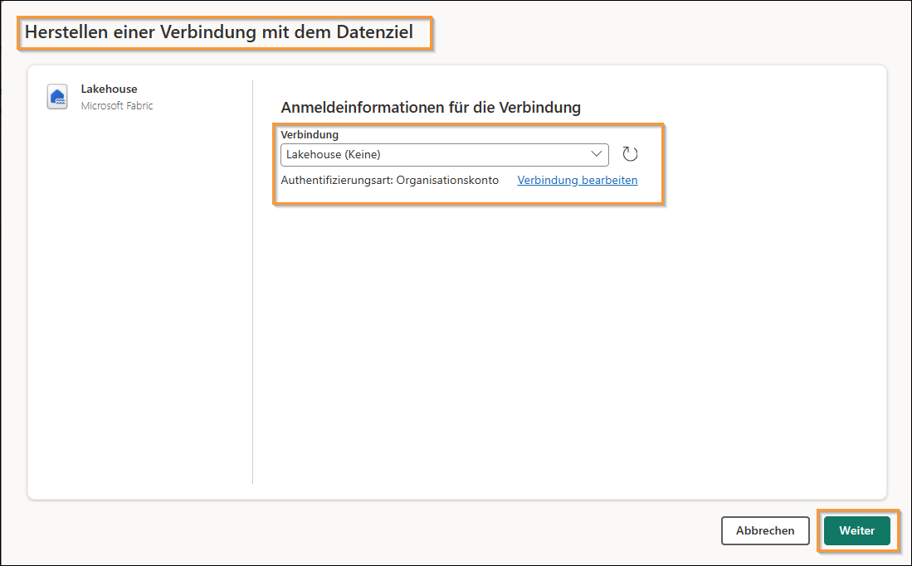

5. Das Dialogfeld „Zielort auswählen" wird geöffnet. Stellen Sie
    sicher, dass das Optionsfeld **Neue Tabelle** **ausgewählt** ist,
    weil wir eine neue Tabelle erstellen.

6. Wir möchten die zuvor erstellte Tabelle in Lakehouse erstellen.
    Navigieren Sie im linken Bereich zu **Lakehouse -\> FAIAD\_\<username\>.**

7. Wählen Sie **lh_FAIAD** aus.

8. Behalten Sie den Tabellennamen **Supplier** bei.

9. Wählen Sie **Weiter** aus.

    

10. Das Dialogfeld „Zieleinstellungen auswählen" wird geöffnet. Wir
    verwenden die automatischen Einstellungen, da hierdurch eine
    vollständige Aktualisierung der Daten erfolgt. Außerdem werden
    die Spalten nach Bedarf umbenannt. Wählen Sie **Einstellungen
    speichern** aus.

    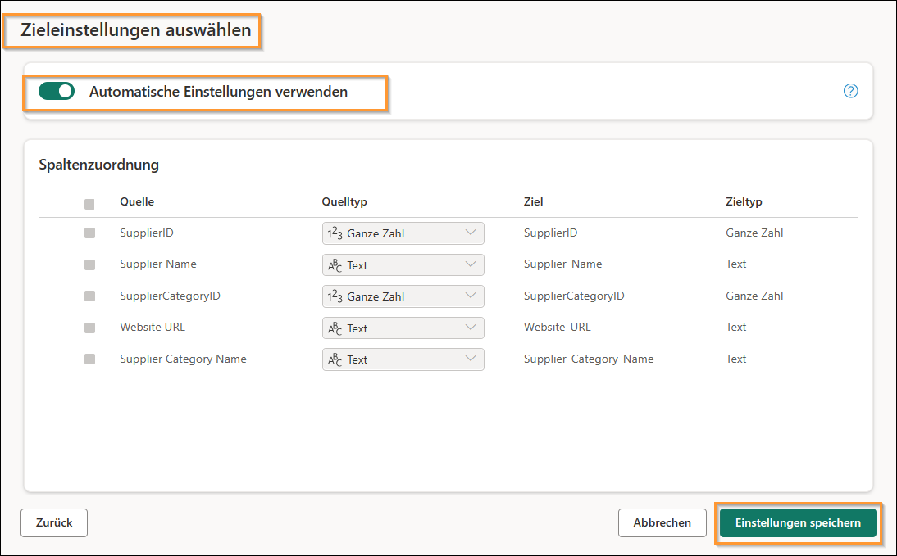

11. Sie werden zum **Power Query-Fenster** weitergeleitet. Beachten Sie
    unten rechts, dass das **Datenziel** auf **Lakehouse** festgelegt
    ist. Legen Sie ebenso das **Datenziel für die Abfrage „PO"** fest.
    Sobald das erledigt ist, sollte bei der Abfrage „**PO**" das
    **Datenziel**, wie im Screenshot unten zu sehen, **Lakehouse**
    lauten.

    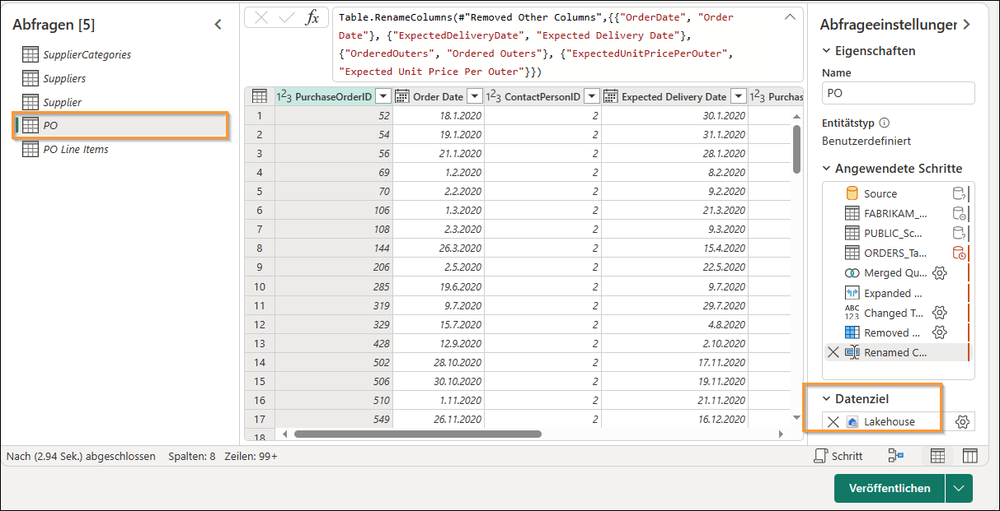

## Aufgabe 8: Snowflake-Dataflow umbenennen und veröffentlichen

1. Wählen Sie oben auf dem Bildschirm den **Pfeil neben Dataflow 1**
    aus.

2. Ändern Sie im Dialogfeld den Namen in **df_Supplier_Snowflake**.

3. Speichern Sie die Namensänderung durch Drücken der **Eingabetaste**.

    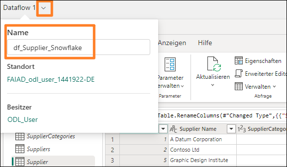

4. Wählen Sie unten rechts **Veröffentlichen** aus.

    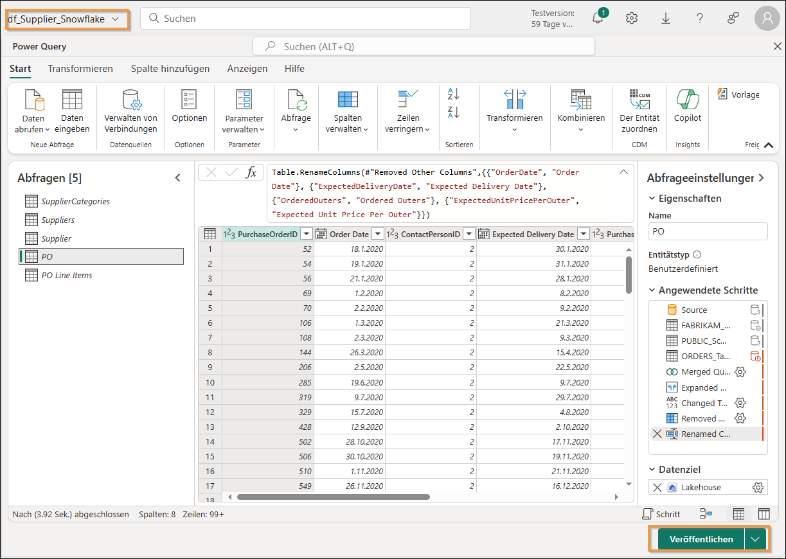

    Sie werden zum Arbeitsbereich **FAIAD\_\<username\>** weitergeleitet. Es
    kann einige Momente dauern, bis der Dataflow veröffentlicht wird.

5. Wählen Sie **lh_FAIAD** aus, um zum Lakehouse zu navigieren.

6. Stellen Sie sicher, dass Sie sich in der Lakehouse-Ansicht (nicht im
    SQL-Analyseendpunkt) befinden.

7. Beachten Sie, dass die Tabelle **PO** und **Supplier** jetzt im
    Lakehouse verfügbar ist.

    **Hinweis**: Wenn die neu erstellten Tabellen nicht angezeigt werden,
    wählen Sie die Auslassungspunkte neben „Tabellen" und „Aktualisieren"
    aus, um die Tabellen zu aktualisieren.

Nun erstellen wir eine Verknüpfung, um Daten aus Dataverse zu erfassen.

# Verknüpfung zu ADLS Gen2

## Aufgabe 9: Eine Verknüpfung zu Dataverse erstellen

Sie sollten sich im Lakehouse **lh_FAIAD** befinden. Stellen Sie sicher,
dass Sie sich in der Lakehouse-Ansicht (nicht im SQL-Analyseendpunkt)
befinden.

1. Wählen Sie im Bereich **Explorer** die **Auslassungspunkte** neben
    **Tables** aus.

2. Wählen Sie **Neue Verknüpfung** aus.

    

3. Das Dialogfeld „Neue Verknüpfung" wird geöffnet. Wählen Sie unter
    **Externe Quellen** die Option **Dataverse** aus.

    **Hinweis**: In der vorherigen Übung haben wir ähnliche Schritte zum
    Erstellen einer Verknüpfung zu Azure Data Lake Storage Gen2 ausgeführt.

    

4. Das Dialogfeld „Verbindungseinstellungen" wird geöffnet. Geben Sie **org6c18814a.crm.dynamics.com** als **Umgebungsdomäne** ein.

5. Behalten Sie **Authentifizierungsart** als **Organisationskonto**
    bei.

6. Wählen Sie **Anmelden** aus.

    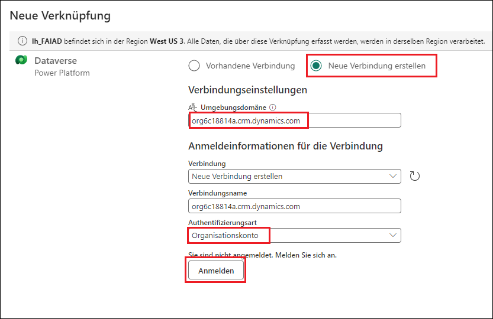

7. Wählen Sie im Anmeldedialogfeld **Benutzerkonto** aus, das Sie für
    diese Übungen verwendet haben.

    **Hinweis**: Ihr Konto wird von dem auf dem Screenshot unten abweichen.

    

8. Wählen Sie im Dialogfeld „Verbindungseinstellungen" die Option
    **Weiter** aus.

    Sie werden zu einem Dialogfeld weitergeleitet, in dem Sie den anderen
    Bucket/das andere Verzeichnis aus Dataverse auswählen können. Beachten
    Sie, dass viele verschiedene Buckets zur Verfügung stehen. Wir können
    den/die Buckets auswählen, die wir benötigen, und den in Übung 3
    beschriebenen Prozess befolgen (die Visual-Abfrage verwenden, um Daten
    zu transformieren und Ansichten zu erstellen). Wir können auch mit
    Dataflow Gen2 eine Verbindung zu SharePoint herstellen, wie zuvor in
    dieser Übung. **Wir können jedoch nicht auf diese Bucket/Verzeichnisse
    zugreifen.**

    In unseren Szenario hat das IT-Team bereits eine Verknüpfung zu
    Dataverse erstellt und die erforderlichen Datentransformationen
    angewendet, die diese in der Power BI Desktop-Datei spiegeln. Sie haben
    diese Daten in Lakehouse im Arbeitsbereich „Administrator" erfasst und
    uns Zugriff auf die Tabelle(n) gewährt. Da unser IT-Team die ganze harte
    Arbeit erledigt hat, können wir im Arbeitsbereich „Administrator" eine
    Verknüpfung zu diesem Lakehouse erstellen.

9. Wählen Sie im Dialogfeld „Neue Verknüpfung" die Option **Abbrechen**
    aus, um zum Lakehouse zurückzukehren.

    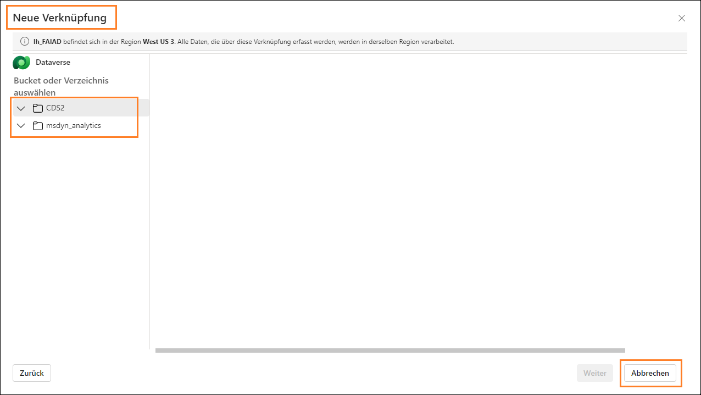

## Aufgabe 10: Eine Verknüpfung zu einem Lakehouse erstellen

1. Wählen Sie im Bereich **Explorer** die **Auslassungspunkte** neben
    **Tables** aus.

2. Wählen Sie **Neue Verknüpfung** aus.

    

3. Das Dialogfeld „Neue Verknüpfung" wird geöffnet. Wählen Sie die
    Option **Microsoft OneLake** unter „Interne Quellen" aus.

    

4. Das Dialogfeld „Datenquellentyp auswählen" wird geöffnet. Beachten
    Sie, dass Sie über zwei Datenquellen verfügen.

    a. lh_FAIAD -- Dies ist das von Ihnen erstellte Lakehouse.

    b. lh_dataverse -- Dies ist das vom Administrator erstellte Lakehouse.

5. Wählen Sie **lh_dataverse** aus.

6. Wählen Sie **Weiter** aus.

    

7. Erweitern Sie im linken Bereich **lh_dataverse -\> Tables**.
    Beachten Sie, dass der IT-Administrator Zugriff auf die Tabelle
    „Customer" gewährt hat.

8. Wählen Sie **Customer** aus.

9. Wählen Sie **Weiter** aus.

    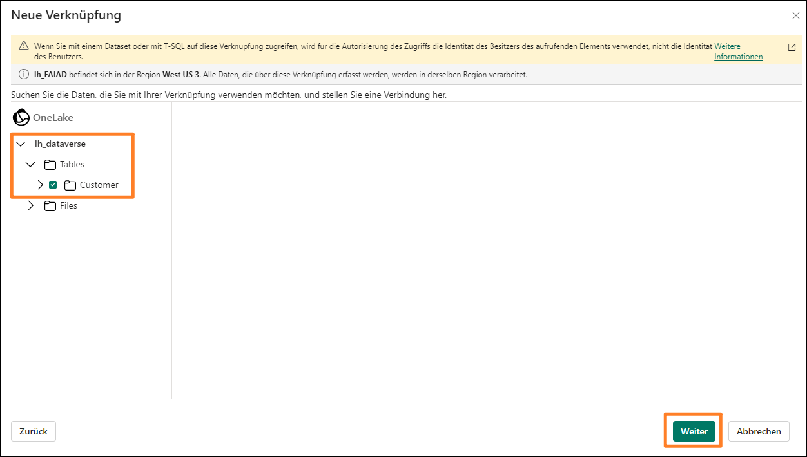

10. Wählen Sie im nächsten Dialogfeld **Erstellen** aus. Sie werden zum
    Lakehouse „lh_FAIAD" weitergeleitet.

    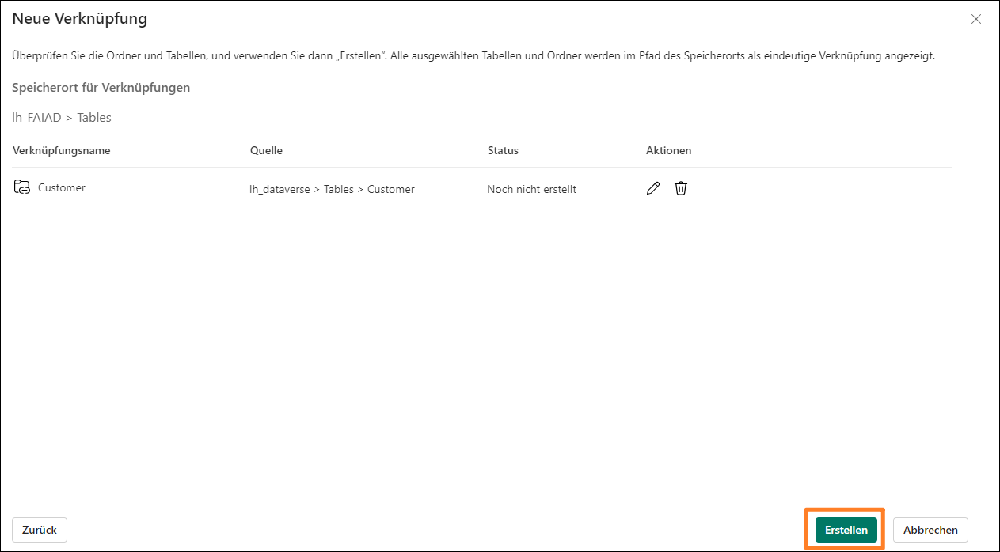

11. Beachten Sie, dass im linken Bereich **Explorer** die neue Tabelle
    **Customer** erstellt wurde.

12. Wählen Sie die Tabelle **Customer** aus, um die Daten im
    Vorschaubereich anzuzeigen.

Wir haben erfolgreich eine Verknüpfung zu einem anderen Lakehouse
erstellt.

Nun sind alle Daten im Lakehouse erfasst. In der nächsten Übung
beschäftigen wir uns mit der Planung von Dataflow-Aktualisierungen.

In der nächsten Übung richten wir geplante Aktualisierungen ein.

# Referenzen

Bei Fabric Analyst in a Day (FAIAD) lernen Sie einige der wichtigsten
Funktionen von Microsoft Fabric kennen. Im Menü des Dienstes finden Sie
in der Hilfe (?) Links zu praktischen Informationen.

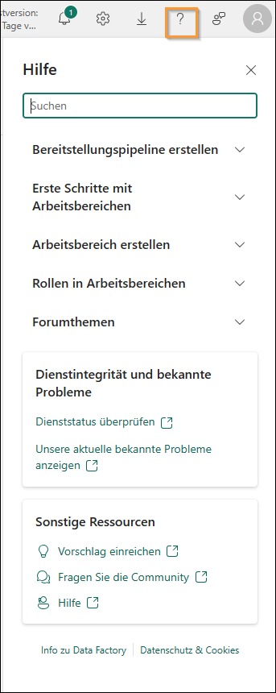

Nachfolgend finden Sie weitere Angebote zur weiteren Arbeit mit
Microsoft Fabric.

- Die vollständige [Ankündigung der allgemeinen Verfügbarkeit von
    Microsoft Fabric](https://aka.ms/Fabric-Hero-Blog-Ignite23) finden
    Sie im Blogbeitrag.

- Fabric bei einer [interaktiven
    Vorstellung](https://aka.ms/Fabric-GuidedTour) kennenlernen

- Zur [kostenlosen Testversion von Microsoft
    Fabric](https://aka.ms/try-fabric) anmelden

- [Website von Microsoft Fabric](https://aka.ms/microsoft-fabric)
    besuchen

- Mit Modulen von [Fabric Learning](https://aka.ms/learn-fabric) neue
    Qualifikationen erwerben

- [Technische Dokumentation zu Fabric](https://aka.ms/fabric-docs)
    lesen

- [Kostenloses E-Book zum Einstieg in
    Fabric](https://aka.ms/fabric-get-started-ebook) lesen

- Mitglied der [Fabric-Community](https://aka.ms/fabric-community)
    werden, um Fragen zu stellen, Feedback zu geben und sich mit anderen
    auszutauschen

Lesen Sie die detaillierteren Blogs zur Ankündigung der Fabric-Umgebung:

- [Blog zum Data Factory-Funktionsbereich in
    Fabric](https://aka.ms/Fabric-Data-Factory-Blog) 

- [Blog zum Data Engineering-Funktionsbereich von Synapse in
    Fabric](https://aka.ms/Fabric-DE-Blog) 

- [Blog zum Data Science-Funktionsbereich von Synapse in
    Fabric](https://aka.ms/Fabric-DS-Blog) 

- [Blog zum Data Warehousing-Funktionsbereich von Synapse in
    Fabric](https://aka.ms/Fabric-DW-Blog) 

- [Blog zum Real-Time Analytics-Funktionsbereich von Synapse in
    Fabric](https://aka.ms/Fabric-RTA-Blog)

- [Blog mit Ankündigungen zu Power BI](https://aka.ms/Fabric-PBI-Blog)

- [Blog zum Data Activator-Funktionsbereich in
    Fabric](https://aka.ms/Fabric-DA-Blog) 

- [Blog zu Verwaltung und Governance in
    Fabric](https://aka.ms/Fabric-Admin-Gov-Blog)

- [Blog zu OneLake in Fabric](https://aka.ms/Fabric-OneLake-Blog)

- [Blog zur Dataverse- und Microsoft
    Fabric-Integration](https://aka.ms/Dataverse-Fabric-Blog)

© 2023 Microsoft Corporation. Alle Rechte vorbehalten.

Durch die Verwendung der vorliegenden Demo/Übung stimmen Sie den
folgenden Bedingungen zu:

Die in dieser Demo/Übung beschriebene Technologie/Funktionalität wird
von der Microsoft Corporation bereitgestellt, um Feedback von Ihnen zu
erhalten und Ihnen Wissen zu vermitteln. Sie dürfen die Demo/Übung nur
verwenden, um derartige Technologiefeatures und Funktionen zu bewerten
und Microsoft Feedback zu geben. Es ist Ihnen nicht erlaubt, sie für
andere Zwecke zu verwenden. Es ist Ihnen nicht gestattet, diese
Demo/Übung oder einen Teil derselben zu ändern, zu kopieren, zu
verbreiten, zu übertragen, anzuzeigen, auszuführen, zu
vervielfältigen, zu veröffentlichen, zu lizenzieren, zu transferieren
oder zu verkaufen oder aus ihr abgeleitete Werke zu erstellen.

DAS KOPIEREN ODER VERVIELFÄLTIGEN DER DEMO/ÜBUNG (ODER EINES TEILS
DERSELBEN) AUF EINEN/EINEM ANDEREN SERVER ODER SPEICHERORT FÜR DIE
WEITERE VERVIELFÄLTIGUNG ODER VERBREITUNG IST AUSDRÜCKLICH UNTERSAGT.

DIESE DEMO/ÜBUNG STELLT BESTIMMTE
SOFTWARE-TECHNOLOGIE-/PRODUKTFEATURES UND FUNKTIONEN, EINSCHLIESSLICH
POTENZIELLER NEUER FEATURES UND KONZEPTE, IN EINER SIMULIERTEN
UMGEBUNG OHNE KOMPLEXE EINRICHTUNG ODER INSTALLATION FÜR DEN OBEN
BESCHRIEBENEN ZWECK BEREIT. DIE TECHNOLOGIE/KONZEPTE IN DIESER
DEMO/ÜBUNG ZEIGEN MÖGLICHERWEISE NICHT DAS VOLLSTÄNDIGE
FUNKTIONSSPEKTRUM UND FUNKTIONIEREN MÖGLICHERWEISE NICHT WIE DIE
ENDGÜLTIGE VERSION. UNTER UMSTÄNDEN VERÖFFENTLICHEN WIR AUCH KEINE
ENDGÜLTIGE VERSION DERARTIGER FEATURES ODER KONZEPTE. IHRE ERFAHRUNG
BEI DER VERWENDUNG DERARTIGER FEATURES UND FUNKTIONEN IN EINER
PHYSISCHEN UMGEBUNG KANN FERNER ABWEICHEND SEIN.

**FEEDBACK**. Wenn Sie Feedback zu den Technologiefeatures, Funktionen
und/oder Konzepten geben, die in dieser Demo/Übung beschrieben werden,
gewähren Sie Microsoft das Recht, Ihr Feedback in jeglicher Weise und
für jeglichen Zweck kostenlos zu verwenden, zu veröffentlichen und
gewerblich zu nutzen. Außerdem treten Sie Dritten kostenlos sämtliche
Patentrechte ab, die erforderlich sind, damit deren Produkte,
Technologien und Dienste bestimmte Teile einer Software oder eines
Dienstes von Microsoft, welche/welcher das Feedback enthält, verwenden
oder eine Verbindung zu dieser/diesem herstellen können. Sie geben
kein Feedback, das einem Lizenzvertrag unterliegt, aufgrund dessen
Microsoft Drittparteien eine Lizenz für seine Software oder
Dokumentation gewähren muss, weil wir Ihr Feedback in diese aufnehmen.
Diese Rechte bestehen nach Ablauf dieser Vereinbarung fort.

DIE MICROSOFT CORPORATION LEHNT HIERMIT JEGLICHE GEWÄHRLEISTUNGEN UND
GARANTIEN IN BEZUG AUF DIE DEMO/ÜBUNG AB, EINSCHLIESSLICH ALLER
AUSDRÜCKLICHEN, KONKLUDENTEN ODER GESETZLICHEN GEWÄHRLEISTUNGEN UND
GARANTIEN DER HANDELSÜBLICHKEIT, DER EIGNUNG FÜR EINEN BESTIMMTEN
ZWECK, DES RECHTSANSPRUCHS UND DER NICHTVERLETZUNG VON RECHTEN
DRITTER. MICROSOFT MACHT KEINERLEI ZUSICHERUNGEN BZW. ERHEBT KEINERLEI
ANSPRÜCHE IM HINBLICK AUF DIE RICHTIGKEIT DER ERGEBNISSE UND DES AUS
DER VERWENDUNG DER DEMO/ÜBUNG RESULTIERENDEN ARBEITSERGEBNISSES BZW.
BEZÜGLICH DER EIGNUNG DER IN DER DEMO/ÜBUNG ENTHALTENEN INFORMATIONEN
FÜR EINEN BESTIMMTEN ZWECK.

**HAFTUNGSAUSSCHLUSS**

Diese Demo/Übung enthält nur einen Teil der neuen Features und
Verbesserungen in Microsoft Power BI. Einige Features können sich
unter Umständen in zukünftigen Versionen des Produkts ändern. In
dieser Demo/Übung erhalten Sie Informationen über einige, aber nicht
über alle neuen Features.
