# Microsoft Fabric - Fabric Analyst in a Day - ラボ 6


# 目次
- 概要
- レイクハウス – データの分析
    - タスク 1: SQL を使用してデータをクエリする
    - タスク 2: T-SQL 結果を視覚化する
- レイクハウス – セマンティック モデリング
    - タスク 3: セマンティック モデルを作成する
    - タスク 4: リレーションシップを作成する
    - タスク 5: メジャーを作成する
    - タスク 6: オプション セクション – リレーションシップを作成する	
    - タスク 7: オプション セクション – メジャーを作成する
- 参考資料

# **概要**

さまざまなソースからのデータがレイクハウスに取り込まれています。このラボでは、セマンティック
モデルを操作します。通常、リレーションシップの作成やメジャーの追加などのモデリング
アクティビティは Power BI Desktop
で実行していました。ここでは、サービス内でこれらのモデリング
アクティビティを実行する方法を学びます。

このラボを終了すると、次のことが学べます。

- SQL 分析エンドポイントでの SQL ビューの使用

- セマンティック モデルの作成方法

# **レイクハウス -- データの分析**

## タスク 1: SQL を使用してデータをクエリする

1. ラボ 2 のタスク 9 で作成した Fabric ワークスペース
    **FAIAD\_\<ユーザー名\>** に戻りましょう。

2. 選択する場合、**タスクフローを最小化して**項目のリスト全体を表示します。

3. レイクハウス、セマンティック モデル、SQL エンドポイントという 3
    種類の lh_FAIAD
    が表示されます。前のラボでは、レイクハウスについて説明し、SQL
    分析エンドポイントを使用してビジュアル
    クエリを作成しました。引き続きこのオプションについて確認するためには、**lh_FAIAD
    SQL 分析エンドポイント** オプションを選択します。エクスプローラーの
    **SQL ビュー**が表示されます。

    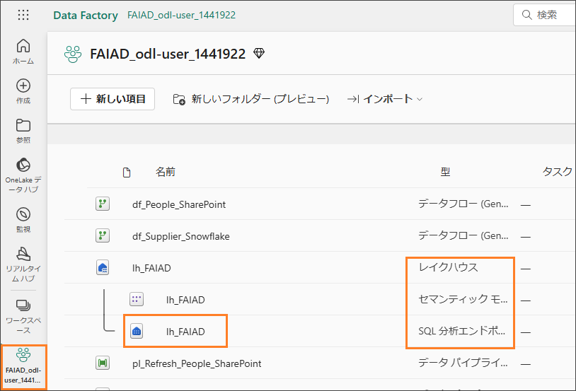

    データ モデルを作成する前にデータを調べたい場合は、SQL
    を使用して行うことができます。SQL を使用するには 2
    つのオプションがあります。オプション 1 は、前のラボで使用したビジュアル
    クエリです。オプション 2 は TSQL
    コードの書き込みです。これは、開発者向けのオプションです。これについて詳しく説明します。

    たとえば、SQL を使用して、サプライヤーが販売した Units
    をすばやく調べたいとします。

    レイクハウス内の SQL 分析エンドポイントで、左側のパネルに \[Tables\]
    が表示されています。\[Tables\]
    を展開すると、テーブルを構成する列を表示できます。また、SQL
    ビュー、関数、ストアド プロシージャを作成するオプションもあります。SQL
    の知識がある場合は、これらのオプションを自由に検討してください。では、簡単な
    SQL クエリを記述してみましょう。

4. **上部メニューで新規 SQL クエリ**を選択するか、画面中央で**新規 SQL
    クエリ**を選択します。SQL クエリ ビューが表示されます。

    

5. **以下の SQL クエリ**を**クエリ
    ウィンドウ**に貼り付けます。このクエリは、サプライヤー名ごとに単位数を返します。Sales
    テーブルを Product テーブルおよび Supplier
    テーブルと結合して、これを実現します。

    ```
    SELECT su.SupplierName, SUM(Quantity) as Units
    FROM dbo.Sales s
    JOIN dbo.Product p on p.StockItemID = s.StockItemID
    JOIN dbo.Supplier su on su.SupplierID = p.SupplierID
    GROUP BY su.SupplierName
    ```

6. 結果を見るには、SQL エディター メニューで **Run** をクリックします。

7. **ビューとして保存**を選択すると、このクエリをビューとして保存できます。

8. **左側のエクスプローラー** パネルの **Queries**
    セクションで、このクエリが**マイ クエリ**の下に **SQL query 1**
    として保存されています。ここで、クエリの名前を変更し、将来使用するために保存することができます。また、**共有クエリ**
    フォルダーを使用して、共有されているクエリを表示することもできます。

    **注記:** 前のラボで作成したビジュアル クエリは、\[マイ クエリ\]
    フォルダでも使用できます。

    

##  タスク 2: T-SQL 結果を視覚化する

1. このクエリの結果を視覚化することもできます。クエリ
    ペインで**クエリを強調表示**します。

2. \[結果\] ペイン メニューで、**このデータを探索する (プレビュー) -\>
    結果の視覚化**を選択します。

    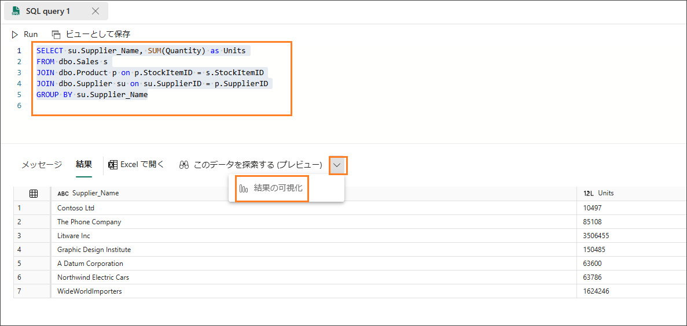

3. **結果の視覚化**ダイアログが開きます。**続行**を選択します。

    **結果の視覚化**ダイアログが開き、Power BI Desktop レポート
    ビューのように見えます。これには、Power BI Desktop レポート
    ビューで使用できるすべての機能があります。ページの書式を設定したり、さまざまなビジュアルを選択したり、フィルタを追加したりなどです。このコースでは、これらのオプションについては触れません。

4. **データ** ペインを展開し、**SQL クエリ 1** を展開します。

5. **Supplier_Name** および **Units**
    **フィールド**を選択します。テーブル ビジュアルが作成されます。

    

6. **視覚化**セクションで、**積み上げ縦棒グラフ**を選択して視覚化タイプを変更します。

7. 画面右下の**レポートとして保存**を選択します。

    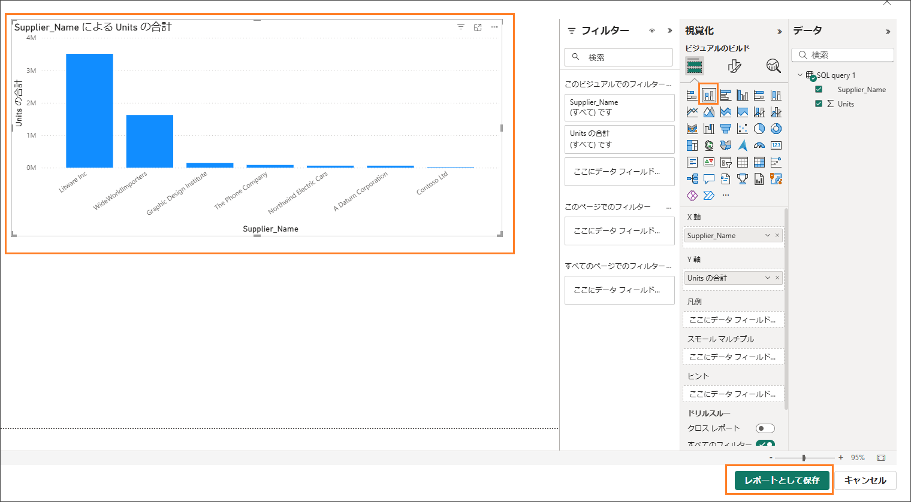

8. \[レポートの保存\] ダイアログが開きます。**Units by Supplier**
    を**レポートの名前を入力テキストボックス**に入力します。

9. 保存先のワークスペースがご自身の Fabric ワークスペース
    **FAIAD\<ユーザー名\>** であることを確認します

10. **保存**を選択します。

    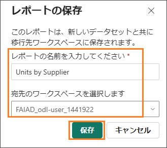

SQL クエリの画面に戻ります。

# **レイクハウス -- セマンティック モデリング**

## タスク 3: セマンティック モデルを作成する

1. レイクハウスから、**SQL 分析エンドポイント**を開きます。

2. エクスプローラー ペインで、下にスクロールして**モデル
    レイアウト**を選択します。中央のペインが、Power BI Desktop
    に表示されるモデル ビューと似ていることがわかります。

    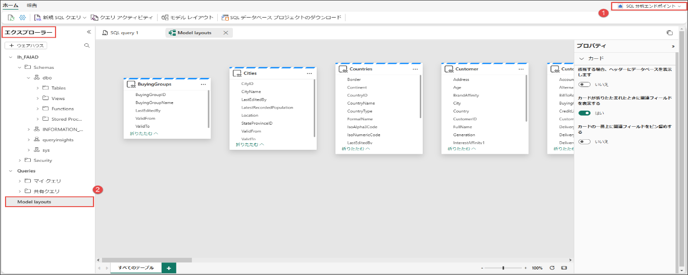

    これは、レイクハウスによって作成されるデフォルト
    モデルです。ただし、デフォルト モデルにはいくつかの制限があります
    (測定の形式を設定する機能など)。また、モデルで必要なのはテーブルのサブセットのみです。そのため、新しいセマンティック
    モデルを作成します。

3. 右上のメニューから**、SQL
    分析エンドポイントの横の矢印を選択**します。

4. **レイクハウス**を選択して、レイクハウス ビューに移動します。

    

5. メニューから、**ホーム -\> 新しいセマンティック
    モデル**を選択します。

6. \[新しいセマンティック モデル\] ダイアログが開きます。Direct Lake
    セマンティック モデル名として **sm_FAIAD** を入力します。

7. 既定でテーブルのサブセットを作成するオプションがあります。前のラボでビューを作成したことを思い出してください。これらのビューをモデルに含めます。**dbo**
    スキーマを展開すると、レイクハウスのすべてのテーブルとビューを確認できます。

    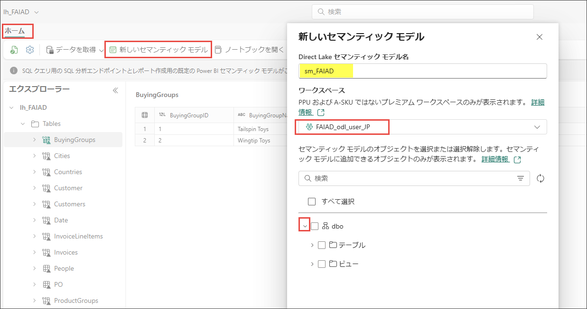

8. 次のテーブル/ビューを**選択**します。

    a. **Date**

    b. **People**

    c. **Customer**

    d. **PO**

    e. **Supplier**

    f. **Geo**

    g. **Reseller**

    h. **Sales**

    i. **Product**

9. **確認**を選択します。

    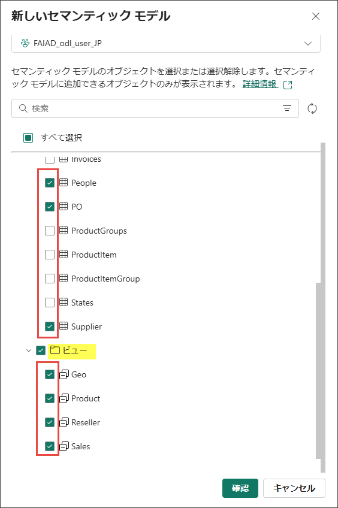

## タスク 4: リレーションシップを作成する

選択したテーブルを使用して、新しいセマンティック
モデルに移動します。必要に応じて、自由にテーブルの**配置を変更**してください。一部のテーブル
(Geo、Reseller、Sales、Product)
では、テーブルの右側に警告記号が付いていることに注意してください。これらがビューだからです。これらのビューのフィールドを使用して作成されたビジュアルは、Direct
Query モードになります。Direct Lake モードではありません。

**注記:** Direct Lake モードの方が Direct Query モードより高速です。

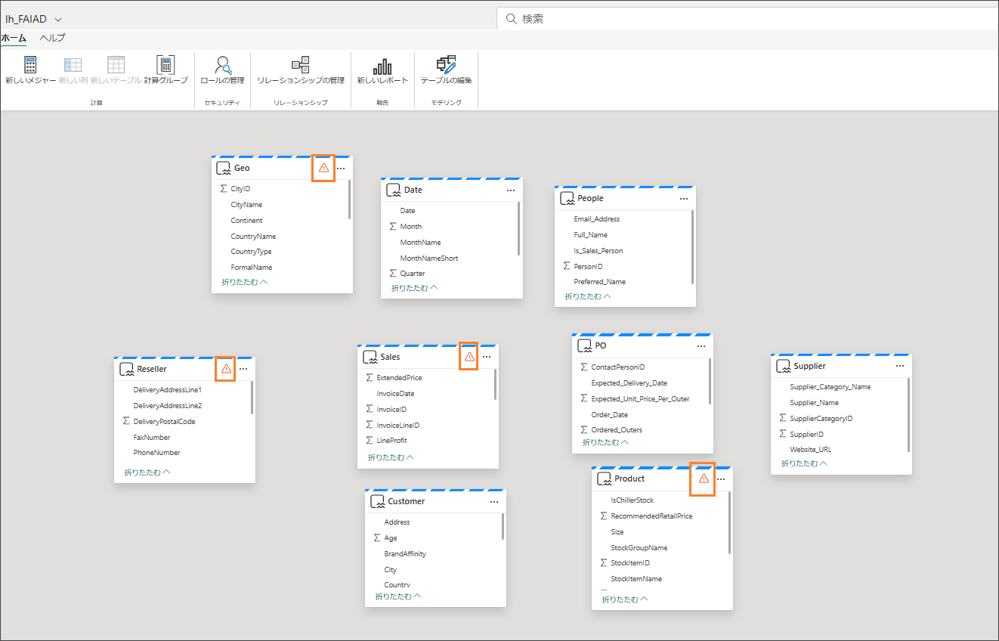

最初の手順では、これらのテーブル間にリレーションシップを作成します。

1. Sales テーブルと Reseller
    テーブルの間にリレーションシップを作成しましょう。**Sales**
    テーブルで **ResellerID** を選択して、**Reseller** テーブルの
    **ResellerID** までドラッグします。

    

2. \[新しいリレーションシップ\]
    ダイアログが開きます。**テーブルから**が **Sales**、**列**が
    **ResellerID** であることを確認します。

3. **テーブル表示**が **Reseller**、**列**が **ResellerID**
    であることを確認します。

4. **カーディナリティ**が**多対一 (\*:1)** であることを確認します。

5. **クロス フィルターの方向**が**単一**であることを確認します。

6. **保存**を選択します。

    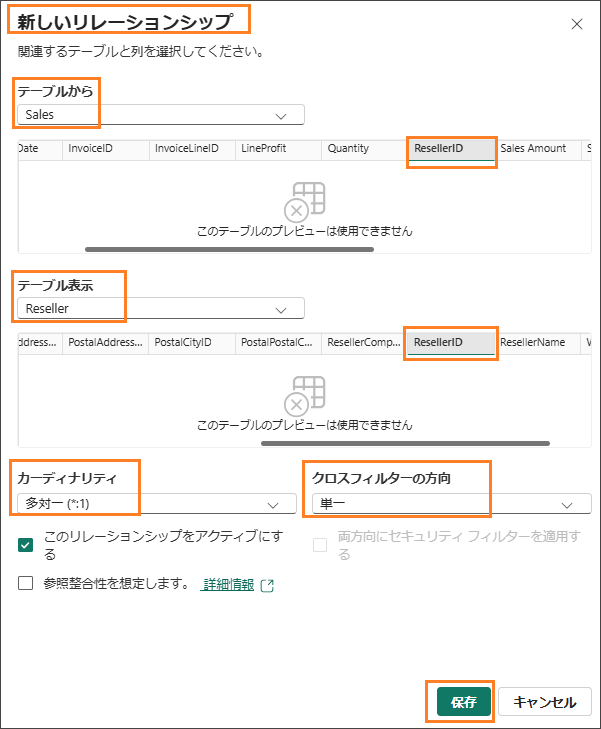

7. 同様に、Sales テーブルと Date
    テーブルの間にリレーションシップを作成しましょう。**Sales**
    テーブルで **InvoiceDate** を選択して、**Date** テーブルの **Date**
    までドラッグします。

8. \[新しいリレーションシップ\]
    ダイアログが開きます。**テーブルから**が **Sales**、**列**が
    **InvoiceDate** であることを確認します。

9. **テーブル表示**が **Date**、**列**が **Date**
    であることを確認します。

10. **カーディナリティ**が**多対一 (\*:1)** であることを確認します。

11. **クロス フィルターの方向**が**単一**であることを確認します。

12. **保存**を選択します。

    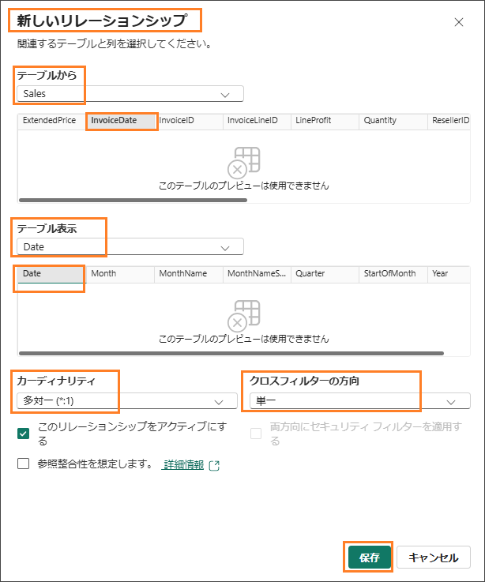

13. 同じようにして、**Sales** テーブルと **Product**
    テーブルの間の**多対一**リレーションシップを作成します。**Sales**
    テーブルの **StockItemID** と **Product** テーブルの **StockItemID**
    を選択します。

    **注記:** 更新はすべて自動的に保存されます。

    **チェックポイント:**
    以下のスクリーンショットに示すように、このモデルには 3
    つのリレーションシップ (Sales と Reseller テーブルの間、Sales と Date
    テーブルの間、Sales と Product テーブルの間) が必要です。

    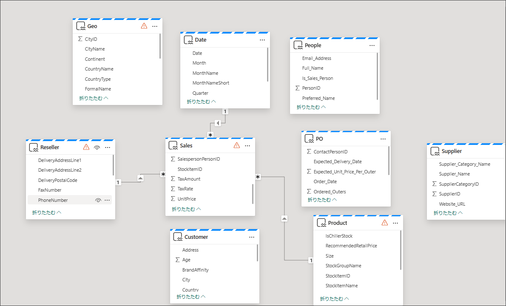

時間の都合上、すべてのリレーションシップの作成は行いません。時間があれば、ラボの最後にあるオプション
セクションを完了してください。オプション
セクションでは、残りのリレーションシップを作成するステップについて説明しています。

## タスク 5: メジャーを作成する

Sales
ダッシュボードを作成するために必要ないくつかのメジャーを追加しましょう。

1. モデル ビューで **Sales テーブル** を選択します。Sales
    テーブルにメジャーを追加するためです。

2. 上部のメニューから、**ホーム -\>
    新しいメジャー**を選択します。数式バーが表示されます。

3. **数式バー**に **Sales = SUM(Sales\[Sales Amount\])** と入力します。

4. 数式バーの左側の**チェック
    マーク**をクリックするか、**入力**ボタンをクリックします。

5. 右側にプロパティ パネルを展開します。

6. **書式設定**セクションを展開します。

7. **書式**ドロップダウンで**通貨**を選択します。

8. 小数点以下表示桁数を **0** に設定します。

    

9. 上部のメニューで **Sales テーブル**を選択した状態で、**ホーム -\>
    新しいメジャー**を選択します。数式バーが表示されます。

10. **数式バー**に **Units = SUM(Sales\[Quantity\])** と入力します。

11. 数式バーの左側の**チェック
    マーク**をクリックするか、**入力**ボタンをクリックします。

12. 右側の \[プロパティ\] パネルで**書式設定**セクションを展開します
    (\[プロパティ\]
    パネルが読み込むまでに少し時間がかかる場合があります)。

13. **書式**ドロップダウンで**整数**を選択します。

14. スライダーを使用して、**桁区切り記号**を**はい**に設定します。

    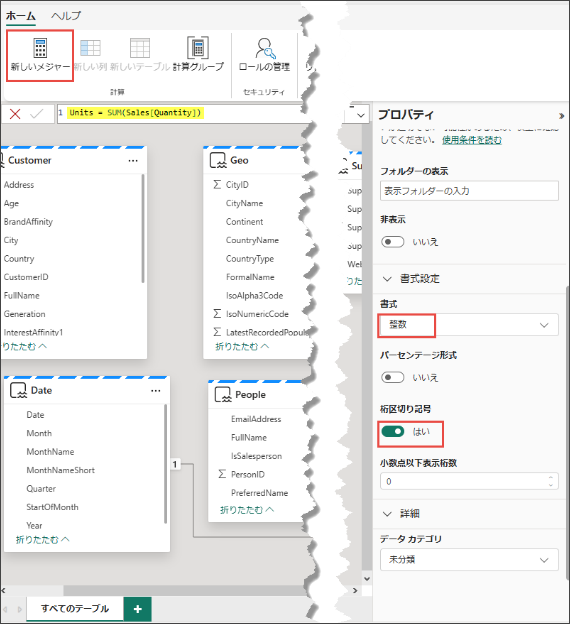

15. 上部のメニューで **Sales テーブル**を選択した状態で、**ホーム -\>
    新しいメジャー**を選択します。数式バーが表示されます。

16. **数式バー**に **Sales Orders = DISTINCTCOUNT(Sales\[InvoiceID\])**
    と入力します。

17. 数式バーの左側の**チェック
    マーク**をクリックするか、**入力**ボタンをクリックします。

18. 右側の \[プロパティ\] パネルで、**書式設定**セクションを展開します。

19. **書式**ドロップダウンで**整数**を選択します。

20. スライダーを使用して、**桁区切り記号**を**はい**に設定します。

    

21. **データ パネル** (右側)
    で、**モデル**を選択します。これにより、セマンティック
    モデルのすべての品目を整理するのに役立つビューが提供されます。

22. 作成したすべてのメジャーを表示するには、**セマンティック モデル -\>
    メジャー**を選択します。

23. また、**個々のテーブルを展開**して、各テーブルの列、階層、メジャーを表示することもできます。

    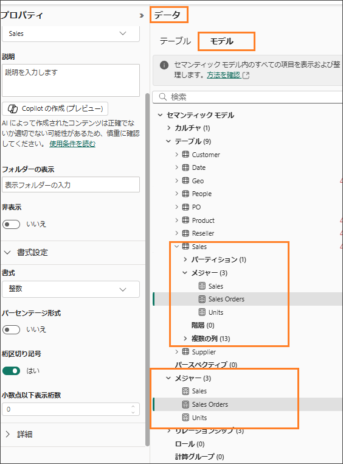

    これについても、時間の都合上、すべてのメジャーの作成は行いません。時間があれば、ラボの最後にあるオプション
    セクションを完了してください。このオプション
    セクションでは、残りのメジャーを作成するステップについて説明しています。

セマンティック
モデルを作成しましたが、次のステップではレポートを作成します。これは次のラボで行います。

## タスク 6: オプション セクション -- リレーションシップを作成する

残りのリレーションシップを追加しましょう。

1. メニューから、\[ホーム\] -\> \[リレーションシップの管理\]
    の順に選択します。

2. \[リレーションシップの管理\]
    ダイアログが開きます。\[新しいリレーションシップ\] を選択します。

    

3. \[新しいリレーションシップ\]
    ダイアログが開きます。**テーブルから**が **Sales**、**列**が
    **SalespersonPersonID** であることを確認します。

4. **テーブル表示**が **People**、**列**が **PersonID**
    であることを確認します。

5. **カーディナリティ**が**多対一 (\*:1)** であることを確認します。

6. **クロス フィルターの方向**が**単一**であることを確認します。

7. **保存**を選択します。\[リレーションシップの管理\] ダイアログ
    ボックスが開き、新しいリレーションシップが追加されます。

    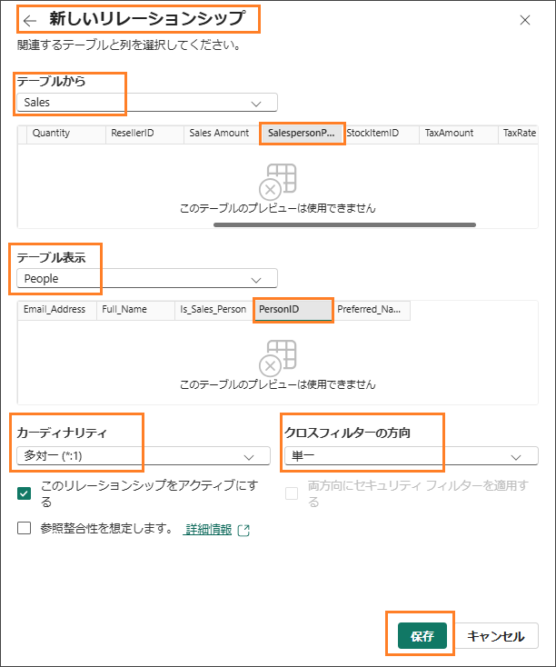

8. 次は、Product と Supplier
    の間にリレーションシップを作成しましょう。**新しいリレーションシップ**を選択します。

9. **テーブルから**が **Product**、**列**が **SupplierID**
    であることを確認します。

10. **テーブル表示**が **Supplier**、**列**が **SupplierID**
    であることを確認します。

11. **カーディナリティ**が**多対一 (\*:1)** であることを確認します。

12. **クロス フィルターの方向**が**双方向**であることを確認します。

13. **保存**を選択します。

    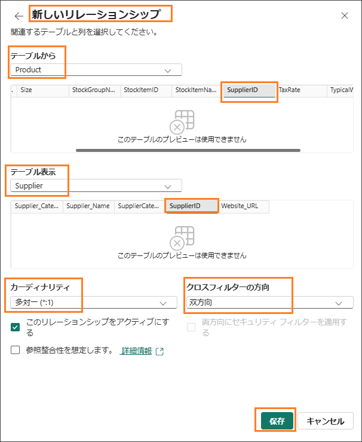

14. 次は、Reseller と Geo
    の間にリレーションシップを作成しましょう。**新しいリレーションシップ**を選択します。

15. \[新しいリレーションシップ\]
    ダイアログが開きます。**テーブルから**が **Reseller**、**列**が
    **PostalCityID** であることを確認します。

16. **テーブル表示**が **Geo**、**列**が **CityID**
    であることを確認します。

17. **カーディナリティ**が**多対一 (\*:1)** であることを確認します。

18. **クロス フィルターの方向**が**双方向**であることを確認します。

19. **保存**を選択します。

    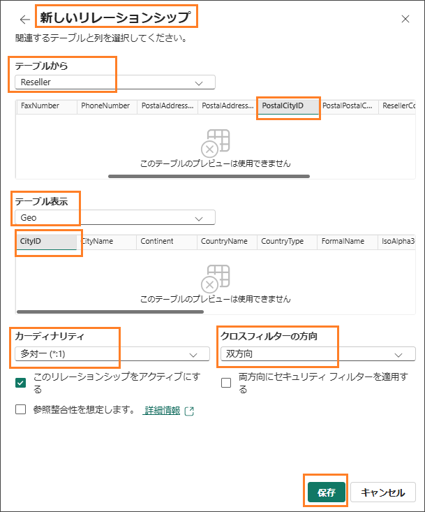

20. 同じように、Customer と Reseller
    の間にリレーションシップを作成しましょう。**新しいリレーションシップ**を選択します。

21. \[新しいリレーションシップ\]
    ダイアログが開きます。**テーブルから**が **Customer**、**列**が
    **ResellerID** であることを確認します。

22. **テーブル表示**が **Reseller**、**列**が **ResellerID**
    であることを確認します。

23. **カーディナリティ**が**多対一 (\*:1)** であることを確認します。

24. **クロス フィルターの方向**が**単一**であることを確認します。

25. **保存**を選択します。

    **チェックポイント:** \[リレーションシップの管理\]
    は下のスクリーンショットのようになっているはずです。

    

26. 同様に、**PO** と **Date**
    の間の**多対一**リレーションシップを作成します。**PO** で
    **Order_Date** を選択し、**Date** で **Date** を選択します。

27. 同様に、**PO** と **Product**
    の間の**多対一**リレーションシップを作成します。**PO** の
    **StockItemID** と **Product** の **StockItemID** を選択します。

28. 同様に、**PO** と **People**
    の間の**多対一**リレーションシップを作成します。**PO** の
    **ContactPersonID** と **People** の **PersonID** を選択します。

29. **閉じる**を選択して \[リレーションシップの管理\]
    ダイアログを閉じます。

    すべてのリレーションシップの作成が完了しました。

    **チェックポイント:**
    モデルは下のスクリーンショットのようになっているはずです。

    

## タスク 7: オプション セクション -- メジャーを作成する

残りのメジャーを追加しましょう。

1. 上部のメニューで **Sales** テーブルを選択し、**ホーム -\>
    新しいメジャー**を選択します。

2. 数式バーに **Avg Order = DIVIDE(\[Sales\], \[Sales Orders\])**
    と入力します。

3. 数式バーの**チェック マーク**をクリックするか、\[入力\]
    ボタンをクリックします。

4. 右側にプロパティ パネルを展開します。

5. **書式設定**セクションを展開します。

6. **書式**ドロップダウンで**通貨**を選択します。

7. 小数点以下表示桁数を 0 に設定します。

    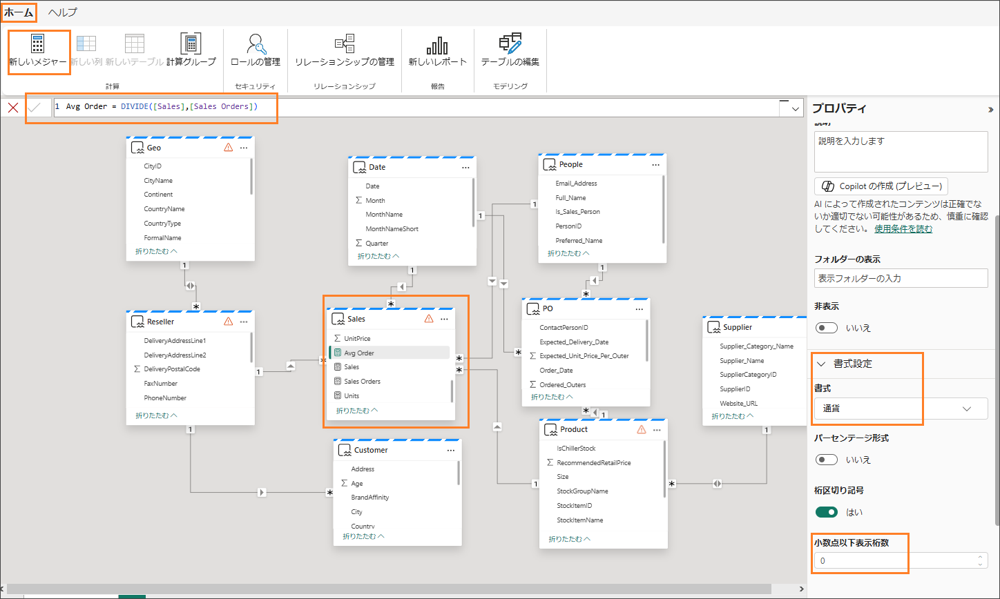

8. 同様のステップを実行して、次のメジャーを追加します。

    a. **Sales** テーブルに **GM = SUM(Sales\[LineProfit\])** (書式設定は**通貨、小数点以下表示桁数 0)。**

    b. **Sales** テーブルに、**GM% = DIVIDE(\[GM\], \[Sales\])** (書式設定は**パーセンテージ、小数点以下表示桁数 0)。**

    c. **Customer** テーブル**に、No of Customers = COUNTROWS(Customer)** (書式設定は**整数、桁区切り記号あり)。**

# **参考資料**

Fabric Analyst in a Day (FAIAD) では、Microsoft Fabric
で使用できる主要な機能の一部をご紹介します。サービスのメニューにあるヘルプ
(?) セクションには、いくつかの優れたリソースへのリンクがあります。


Microsoft Fabric
の次のステップに役立つリソースをいくつか以下に紹介します。

- ブログ記事で [Microsoft Fabric の GA
    に関するお知らせ](https://aka.ms/Fabric-Hero-Blog-Ignite23)の全文を確認する

- [ガイド付きツアー](https://aka.ms/Fabric-GuidedTour)を通じて Fabric
    を探索する

- [Microsoft Fabric
    の無料試用版](https://aka.ms/try-fabric)にサインアップする

- [Microsoft Fabric の Web
    サイト](https://aka.ms/microsoft-fabric)にアクセスする

- [Fabric
    の学習モジュール](https://aka.ms/learn-fabric)で新しいスキルを学ぶ

- [Fabric の技術ドキュメント](https://aka.ms/fabric-docs)を参照する

- [Fabric 入門編の無料の
    e-book](https://aka.ms/fabric-get-started-ebook) を読む

- [Fabric
    コミュニティ](https://aka.ms/fabric-community)に参加し、質問の投稿やフィードバックの共有を行い、他のユーザーから学びを得る

より詳しい Fabric
エクスペリエンスのお知らせに関するブログを参照してください。

- [Fabric の Data Factory
    エクスペリエンスに関するブログ](https://aka.ms/Fabric-Data-Factory-Blog) 

- [Fabric の Synapse Data Engineering
    エクスペリエンスに関するブログ](https://aka.ms/Fabric-DE-Blog) 

- [Fabric の Synapse Data Science
    エクスペリエンスに関するブログ](https://aka.ms/Fabric-DS-Blog) 

- [Fabric の Synapse Data Warehousing
    エクスペリエンスに関するブログ](https://aka.ms/Fabric-DW-Blog) 

- [Fabric の Synapse Real-Time Analytics
    エクスペリエンスに関するブログ](https://aka.ms/Fabric-RTA-Blog)

- [Power BI のお知らせに関するブログ](https://aka.ms/Fabric-PBI-Blog)

- [Fabric の Data Activator
    エクスペリエンスに関するブログ](https://aka.ms/Fabric-DA-Blog) 

- [Fabric
    の管理とガバナンスに関するブログ](https://aka.ms/Fabric-Admin-Gov-Blog)

- [Fabric の OneLake
    に関するブログ](https://aka.ms/Fabric-OneLake-Blog)

- [Dataverse と Microsoft Fabric
    の統合に関するブログ](https://aka.ms/Dataverse-Fabric-Blog)

© 2023 Microsoft Corporation. All rights reserved.

このデモ/ラボを使用すると、次の条件に同意したことになります。

このデモ/ラボで説明するテクノロジまたは機能は、ユーザーのフィードバックを取得し、学習エクスペリエンスを提供するために、Microsoft
Corporation
によって提供されます。ユーザーは、このようなテクノロジおよび機能を評価し、Microsoft
にフィードバックを提供するためにのみデモ/ラボを使用できます。それ以外の目的には使用できません。このデモ/ラボまたはその一部を、変更、コピー、配布、送信、表示、実行、再現、発行、ライセンス、著作物の作成、転送、または販売することはできません。

複製または再頒布のために他のサーバーまたは場所にデモ/ラボ
(またはその一部)
をコピーまたは複製することは明示的に禁止されています。

このデモ/ラボは、前に説明した目的のために複雑なセットアップまたはインストールを必要としないシミュレーション環境で潜在的な新機能や概念などの特定のソフトウェア
テクノロジ/製品の機能を提供します。このデモ/ラボで表されるテクノロジ/概念は、フル機能を表していない可能性があり、最終バージョンと動作が異なることがあります。また、そのような機能や概念の最終版がリリースされない場合があります。物理環境でこのような機能を使用するエクスペリエンスが異なる場合もあります。

**フィードバック**。このデモ/ラボで説明されているテクノロジ、機能、概念に関するフィードバックを
Microsoft
に提供する場合、ユーザーは任意の方法および目的でユーザーのフィードバックを使用、共有、および商品化する権利を無償で
Microsoft
に提供するものとします。また、ユーザーは、フィードバックを含む
Microsoft
のソフトウェアまたはサービスの特定部分を使用したり特定部分とインターフェイスを持ったりする製品、テクノロジ、サービスに必要な特許権を無償でサード
パーティに付与します。ユーザーは、フィードバックを含めるために
Microsoft がサード
パーティにソフトウェアまたはドキュメントをライセンスする必要があるライセンスの対象となるフィードバックを提供しません。これらの権限は、本契約の後も存続します。

Microsoft Corporation
は、明示、黙示、または法律上にかかわらず、商品性のすべての保証および条件、特定の目的、タイトル、非侵害に対する適合性など、デモ/ラボに関するすべての保証および条件を拒否します。Microsoft
は、デモ/ラボから派生する結果、出力の正確さ、任意の目的に対するデモ/ラボに含まれる情報の適合性に関して、いかなる保証または表明もしません。

**免責事項**

このデモ/ラボには、Microsoft Power BI
の新機能と機能強化の一部のみが含まれています。一部の機能は、製品の将来のリリースで変更される可能性があります。このデモ/ラボでは、新機能のすべてではなく一部について学習します。

