# Microsoft Fabric Fabric Analyst in a Day - 랩 4

# 목차 

- 소개	
- 데이터 흐름 2세대	
    - 작업 1: SharePoint 쿼리를 데이터 흐름에 복사	
    - 작업 2: SharePoint 연결 만들기	
    - 작업 3: People 쿼리를 위한 데이터 대상 구성	
    - 작업 4: SharePoint 데이터 흐름 이름 바꾸기 및 게시	
    - 작업 5: Snowflake 쿼리를 데이터 흐름에 복사	
    - 작업 6: Snowflake에 대한 연결 만들기	
    - 작업 7: Supplier 및 PO 쿼리를 위한 데이터 대상 구성	
    - 작업 8: Snowflake 데이터 흐름 이름 바꾸기 및 게시	
- ADLS Gen2 바로 가기	
    - 작업 9: Dataverse 바로 가기 생성 방법	
    - 작업 10: 레이크하우스 바로 가기 생성	
- 참조	23

# 소개 

우리 시나리오에서 공급사 데이터는 Snowflake에 있고 고객 데이터는
Dataverse에 있으며 직원 데이터는 SharePoint에 있습니다. 이들 모든 데이터
원본은 서로 다른 시간에 업데이트됩니다. 데이터 흐름의 데이터 새로 고침
횟수를 최소화하기 위해 Snowflake 및 SharePoint 데이터 원본에 대한 개별
데이터 흐름을 만들겠습니다.

**참고:** 단일 데이터 흐름에서는 복수의 데이터 원본이 지원됩니다.

IT 팀은 이미 Dataverse에 대한 링크를 설정하고 필요한 데이터 변환을
적용하여 Power BI Desktop 파일에 있는 데이터 변환을 미러링했습니다. 이
데이터를 관리자 작업 영역의 레이크하우스에 수집하고 테이블에 대한 액세스
권한을 부여했습니다. 레이크하우스 IT 팀이 만든 바로 가기를 만들려고
합니다.

이 랩을 마치면 다음 사항을 알게 됩니다.

- 데이터 흐름 2세대를 사용하여 SharePoint에 연결하고 레이크하우스에
    데이터를 수집하는 방법

- 데이터 흐름 2세대를 사용하여 Snowflake에 연결하고 레이크하우스로
    데이터를 수집하는 방법

- 공유 레이크하우스에서 데이터를 수집하는 방법

# 데이터 흐름 2세대

## 작업 1: SharePoint 쿼리를 데이터 흐름에 복사

1. 다시 랩 2, 작업 8에서 만든 Fabric 작업 영역,
    **FAIAD\_\<username\**으로 되돌아가 보겠습니다.

2. 화면 왼쪽 하단에서 **Fabric 환경 선택기** **아이콘**을 선택합니다.
    Fabric 환경 대화 상자가 열립니다

3. 대화 상자에서 **Data Factory**를 선택합니다. **Data Factory 홈
    페이지**로 이동됩니다.

    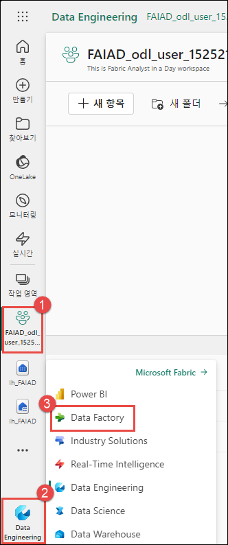

4. 권장 항목에서 **데이터 흐름 2세대**를 선택합니다.

    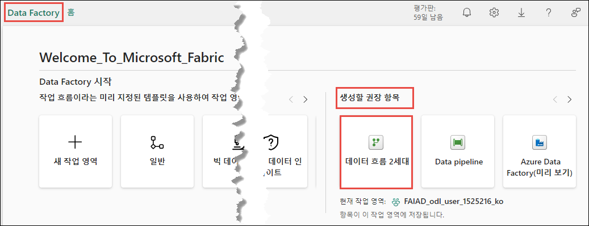

**데이터 흐름 페이지** 로 이동됩니다. Dataflow Gen2 인터페이스는 Power BI
Desktop의 Power Query와 유사합니다. 쿼리를 Power BI Desktop에서 데이터
흐름 2세대로 복사할 수 있습니다. 시도해 보겠습니다.

5. 아직 열지 않았다면, 랩 환경의 바탕 화면에서 **Report** 폴더에 있는
    **FAIAD.pbix** 를 엽니다.

6. 리본 메뉴에서 **홈 -\데이터 변환** 을 선택합니다. Power Query 창이
    열립니다. 이전 랩에서 알아본 것처럼 왼쪽 패널의 쿼리는 데이터
    원본별로 구성됩니다.

7. 왼쪽 패널의 SharepointData 폴더에서 **People** 쿼리를
    **선택** 합니다.

8. **마우스 우클릭** 하고 **복사** 를 선택합니다.

    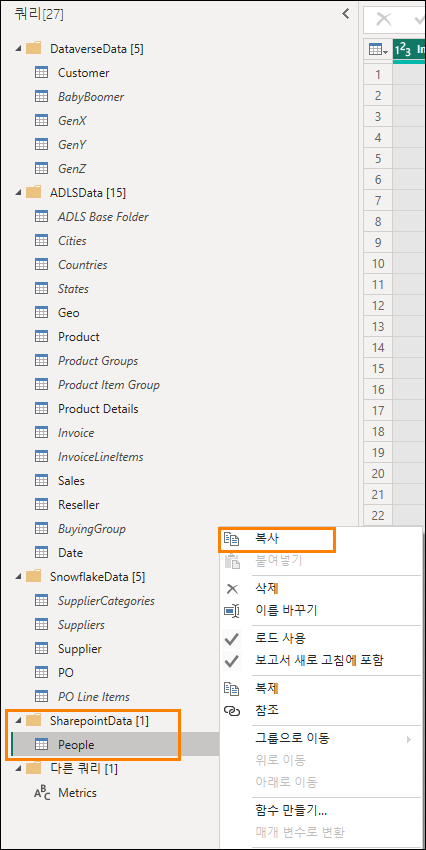

9.  브라우저에서 **데이터 흐름 화면** 으로 다시 이동합니다.

10. **데이터 흐름 창** 에서 **Ctrl+V** 를 입력합니다(현재 마우스 우클릭
    붙여 넣기는 지원되지 않습니다). MAC 디바이스를 사용하는 경우 Cmd+V를
    사용하여 붙여 넣습니다.

**참고**: 랩 환경에서 작업하는 경우 화면 오른쪽 상단에 있는 줄임표를
선택합니다. 슬라이더를 사용하여 **VM 네이티브 클립보드** 를
**활성화** 합니다. 대화 상자에서 확인을 선택합니다. 쿼리 붙여 넣기가
완료되면 이 옵션을 비활성화할 수 있습니다.

붙여 넣은 쿼리가 왼쪽 패널에 있는지 확인합니다. SharePoint에 대해 생성된
연결이 없으므로 연결 구성을 요청하는 경고 메시지가 표시됩니다.

## 작업 2: SharePoint 연결 만들기

1.  **연결 구성** 을 선택합니다.

    

2.  데이터 원본에 연결 대화 상자가 열립니다. **연결** 드롭다운에서 **새
    연결 만들기**가 선택되어 있는지 확인합니다.

3.  **인증 종류** 는 **조직 계정** 이어야 합니다.

4.  **연결** 을 선택합니다.

    **참고:** 자격 증명을 사용하여 로그인됩니다. 아래 스크린샷과 다를 수 있습니다.

    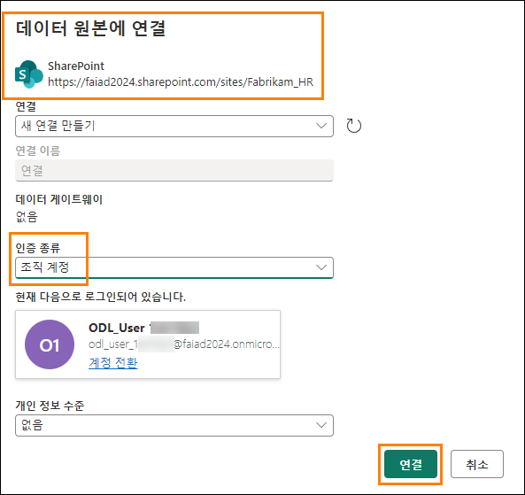

## 작업 3: People 쿼리를 위한 데이터 대상 구성

연결이 설정되었으며 미리 보기 패널에서 데이터를 확인할 수 있습니다.
쿼리의 적용된 단계를 자유롭게 탐색하세요. 이제 People 데이터를
레이크하우스에 수집해야 합니다.

1. **People** 쿼리를 선택합니다.

2. 리본 메뉴에서 **홈 -\데이터 대상 추가 -\Lakehouse** 를 선택합니다.

    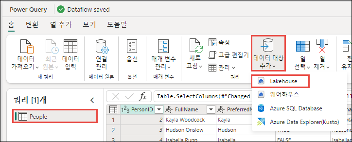

3. 데이터 대상에 연결 대화 상자가 열립니다. 레이크하우스에 대한 새로운 연결을 생성해야 합니다. **연결 드롭다운** 에서 **새 연결 만들기** 를 선택하고 **조직 계정** 을 **인증 종류** 로 설정하여 **다음** 을 선택합니다.

    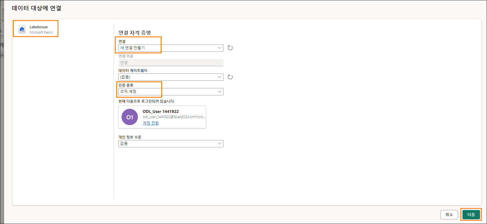

4. 목적지 대상 선택 대화 상자가 열립니다. 새 테이블을 만드는 중이므로 **새 테이블 라디오 버튼** 이 선택되어 있는지 확인합니다.

5. 앞서 만든 레이크하우스에 테이블을 만들고자 합니다. 왼쪽 패널에서 **Lakehouse -\FAIAD\_\<username\** (으)로 이동합니다.

6. **lh_FAIAD** 를 선택합니다.

7. 테이블 이름을 **People** 로 둡니다.

8. **다음**을 선택합니다.

    

9. 대상 설정 선택 대화 상자가 열립니다. \"**자동 설정 사용** \"이 **활성화** 되어 있는지 확인합니다.

    **참고**: 자동 설정을 비활성화하면 업데이트 방법 및 스키마 옵션을 설정할 수 있는 옵션이 표시됩니다. 탐색이 끝나면 \"**자동 설정 사용**\"이 **활성화** 되어 있는지 확인합니다.

10. **설정 저장** 을 선택합니다.

    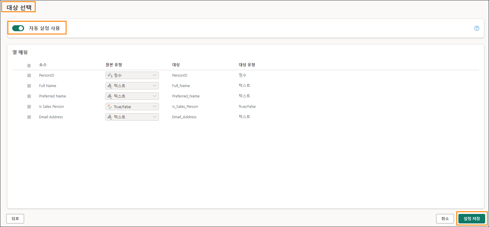

## 작업 4: SharePoint 데이터 흐름 이름 바꾸기 및 게시

1. **Power Query 창** 으로 이동합니다. **오른쪽 하단** 에서 데이터 대상이 **Lakehouse** 로 설정된 것을 확인합니다.

2. 오른쪽 하단에서 **게시** 를 선택합니다.

    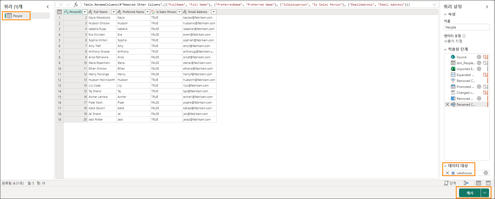

    **참고: FAIAD\_\<username\작업 영역** 으로 되돌아갑니다. 데이터 흐름이 게시되는 데 몇 분 정도 걸릴 수 있습니다.

3. 데이터 흐름 1이 작업 중인 데이터 흐름입니다. 계속하기 전에 이름을 바꿔 보겠습니다. Dataflow 1 옆에 있는 **줄임표(\...)** 를 클릭합니다. **속성** 을 클릭합니다.

    

4. 데이터 흐름 속성 대화 상자가 열립니다. **이름** 을 **df_People_SharePoint** 로 변경합니다.

5. **설명** 텍스트 상자에 **Dataflow to ingest People data from SharePoint to Lakehouse**를 추가합니다.

6. **저장** 을 선택합니다.

    

    **FAIAD\_\<username\작업 영역** 으로 되돌아갑니다.

7. **lh_FAIAD** 를 선택하여 레이크하우스로 이동합니다.

8. SQL 분석 엔드포인트가 아닌 Lakehouse 보기에 있는지 확인하세요.

9. 이제 레이크하우스에 **People** 테이블이 있습니다.

    **참고:** 새로 생성된 테이블이 표시되지 않으면 테이블 옆에 있는 줄임표를 선택하고 새로 고침을 선택하여 테이블을 새로 고칩니다.

## 작업 5: Snowflake 쿼리를 데이터 흐름에 복사

1. Fabric 작업 영역인 **FAIAD\_\<username\** 로 다시 이동해 보겠습니다.

2. 메뉴에서 **새로 만들기 -\데이터 흐름 2세대** 를 선택합니다.

    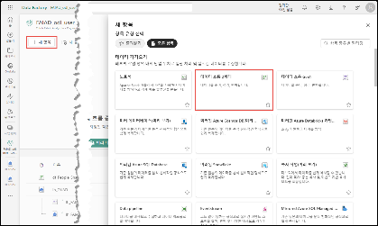

    **데이터 흐름 페이지** 로 이동됩니다. 이제 데이터 흐름에 익숙해졌으므로 Power BI Desktop에서 데이터 흐름으로 쿼리를 복사해 보겠습니다.

3. 아직 열지 않았다면, 랩 환경의 바탕 화면에서 **Report** 폴더에 있는 **FAIAD.pbix** 를 엽니다.

4. 리본 메뉴에서 **홈 -\데이터 변환** 을 선택합니다. Power Query 창이 열립니다. 이전 랩에서 알아본 것처럼 왼쪽 패널의 쿼리는 데이터 원본별로 구성됩니다.

5. 왼쪽 패널의 SnowflakeData 폴더에서 다음 쿼리를 **Ctrl+선택** 또는 Shift+선택합니다.

    a. SupplierCategories

    b. Suppliers

    c. Supplier

    d. PO

    e. PO Line Items

6. **마우스 우클릭**하고 **복사** 를 선택합니다.

    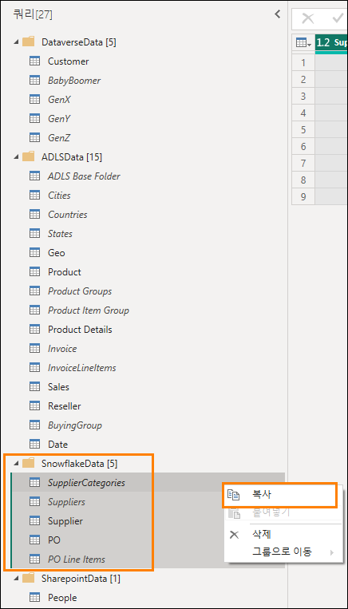

7. **브라우저** 로 돌아갑니다.

8.  **데이터 흐름 창** 에서 **중앙 창** 을 선택하고 **Ctrl+V** 을 입력합니다(현재 마우스 우클릭 붙여 넣기는 지원되지 않습니다). MAC 디바이스를 사용하는 경우 Cmd+V를 사용하여 붙여 넣습니다.

    **참고:** 랩 환경에서 일하는 경우 화면 오른쪽 상단의 **말줄임표 (\...)** 를 선택하시기 바랍니다. 슬라이더를 사용하여 **VM 네이티브 클립보드 **를 **활성화** 합니다. 대화 상자에서 확인을 선택합니다. 쿼리 붙여 넣기가 완료되면 이 옵션을 비활성화할 수 있습니다.

    

## 작업 6: Snowflake에 대한 연결 만들기

5개의 쿼리가 붙여 넣기 되어 있고 이제 왼쪽에 쿼리 패널이 표시됩니다. Snowflake에 대해 생성된 연결이 없으므로 연결 구성을 요청하는 경고 메시지가 표시됩니다.

1. **연결 구성** 을 선택합니다.

    

2.  데이터 원본에 연결 대화 상자가 열립니다. **연결** 드롭다운에서 **새 연결 만들기**가 선택되어 있는지 확인합니다.

3.  **인증 종류** 는 **Snowflake** 여야 합니다.

4.  환경 변수 탭(랩 가이드 옆)에 있는 **Snowflake 사용자 이름 및 암호**를 입력합니다.

5.  **연결** 을 선택합니다.

    

<<<<<<< HEAD
    연결이 설정되고 미리보기 패널에서 데이터를 볼 수 있습니다. 쿼리의 적용된 단계를 자유롭게 탐색하세요. 기본적으로 Suppliers 쿼리는 공급자에 대한 세부 정보를 포함하고 있으며 공급자 카테고리는 이름에서 알 수 있듯 SupplierCategories를 포함하고 있습니다. 이러한 두 테이블은 결합되어 필요한 열과 공급자 차원을 생성합니다. 마찬가지로 PO Line Items을 PO와 병합하여 PO 팩트를 생성합니다. 이제 Supplier 및 PO 데이터를 레이크하우스에 수집해야 합니다.
=======
      >**참고:** 환경 세부 정보의 자격 증명을 사용하여 Snowflake에 연결하는 데 문제가 발생하는 경우 아래에 제공된 자격 증명을 사용하세요.

      - **사용자 이름:** SNOWFLAKE_BACKUP
      - **비밀번호:** 8UpfRpExVDXv2AC1

연결이 설정되고 미리보기 패널에서 데이터를 볼 수 있습니다. 쿼리의 적용된
단계를 자유롭게 탐색하세요. 기본적으로 Suppliers 쿼리는 공급자에 대한
세부 정보를 포함하고 있으며 공급자 카테고리는 이름에서 알 수 있듯
SupplierCategories를 포함하고 있습니다. 이러한 두 테이블은 결합되어
필요한 열과 공급자 차원을 생성합니다. 마찬가지로 PO Line Items을 PO와
병합하여 PO 팩트를 생성합니다. 이제 Supplier 및 PO 데이터를
레이크하우스에 수집해야 합니다.
>>>>>>> 389873425d5e924fc222d551a8d272f40d1b947d

## 작업 7: Supplier 및 PO 쿼리를 위한 데이터 대상 구성

1. **Supplier** 쿼리를 선택합니다.

2. 리본 메뉴에서 **홈 -\데이터 대상 추가 -\Lakehouse** 를 선택합니다.

    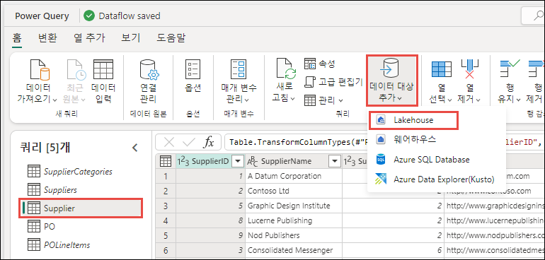

3. 데이터 대상에 연결 대화 상자가 열립니다. **연결 드롭다운** 에서 **Lakehouse(없음)** 를 선택합니다.

4. **다음** 을 선택합니다.

    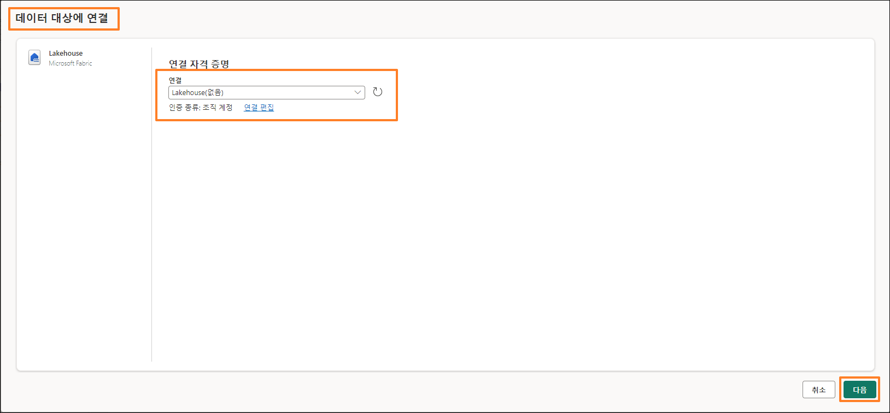

5. 목적지 대상 선택 대화 상자가 열립니다. 새 테이블을 만드는 중이므로 **새 테이블 라디오 버튼** 이 **선택**  있는지 확인합니다.

6. 앞서 만든 레이크하우스에 테이블을 만들고자 합니다. 왼쪽 패널에서
    **Lakehouse -\FAIAD\_\<username\** (으)로 이동합니다.

7. **lh_FAIAD** 를 선택합니다.

8. 테이블 이름을 **Supplier** 로 둡니다.

9. **다음** 을 선택합니다.

    

10. 대상 설정 선택 대화 상자가 열립니다. 데이터의 전체 업데이트가 이루어지므로 자동 설정을 사용할 것입니다. 또한 필요에 따라 열 이름을 바꿉니다. **설정 저장** 을 선택합니다.

    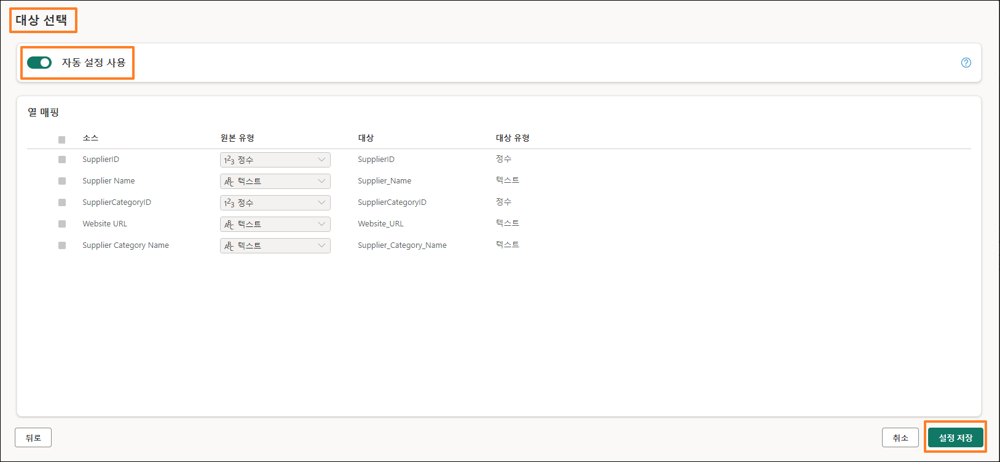

11. **Power Query 창** 으로 이동합니다. **오른쪽 하단** 에서 데이터 대상이 **Lakehouse**로 설정된 것을 확인합니다. 마찬가지로 **PO 쿼리를 위한 데이터 대상을 설정 **합니다. 완료되면 **PO** 쿼리는 아래 스크린샷과 같이 **데이터 대상** 을 **Lakehouse** 로 설정해야 합니다.

    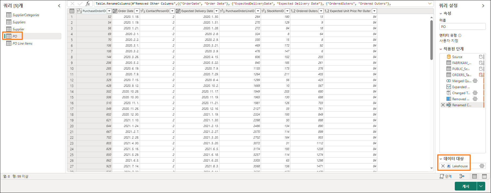

## 작업 8: Snowflake 데이터 흐름 이름 바꾸기 및 게시

1. 화면 상단에서 **데이터 흐름 1 옆에 있는 화살표** 를 선택하여 이름을 바꿉니다.

2. 대화 상자에서 이름을 **df_Supplier_Snowflake** 로 변경합니다.

3. 이름 변경 사항을 저장하려면 **Enter** 를 클릭합니다.

    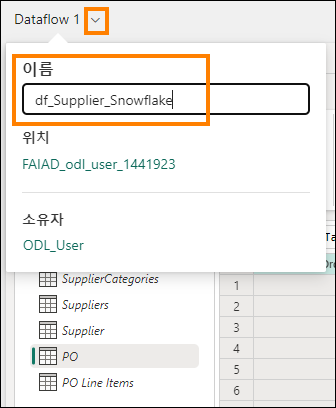

4. 오른쪽 하단에서 **게시** 를 선택합니다.

    

    **FAIAD\_\<username\작업 영역** 으로 되돌아갑니다. 데이터 흐름이
    게시되는 데 몇 분 정도 걸릴 수 있습니다.

5. **lh_FAIAD** 를 선택하여 Lakehouse 로 이동합니다.

6. SQL 분석 엔드포인트가 아닌 Lakehouse 보기에 있는지 확인하세요.

7. 이제 레이크하우스에서 **PO** 및 **Supplier** 테이블을 사용할 수 있습니다.

    **참고:** 새로 생성된 테이블이 표시되지 않으면 테이블 옆에 있는 줄임표를 선택하고 새로 고침을 선택하여 테이블을 새로 고칩니다.

    이제 Dataverse에서 데이터를 가져오는 바로 가기를 만들어 보겠습니다.

# ADLS Gen2 바로 가기

## 작업 9: Dataverse 바로 가기 생성 방법

레이크하우스 **lh_FAIAD** 에 있어야 합니다. SQL 분석 엔드포인트가 아닌 Lakehouse 보기에 있는지 확인하세요.

1. **왼쪽 탐색기** 창에서 **테이블** 옆의 **줄임표** 를 선택합니다.

2.  **새 바로 가기** 를 선택합니다.

    

3. 새 바로 가기 대화 상자가 열립니다. **외부 원본** 에서 **Dataverse** 를 선택합니다.

    **참고**: 이전 랩에서는 유사한 단계에 따라 Azure Data Lake Storage Gen2에 대한 바로 가기를 만들었습니다.

    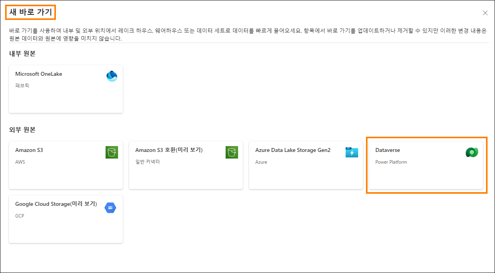

4. 연결 설정 대화 상자가 열립니다. **환경 도메인** 으로 **org6c18814a.crm.dynamics.com** 을 입력합니다.

5. **인증 종류** 를 **조직 계정** 으로 그대로 둡니다.

6. **로그인** 을 선택합니다.

    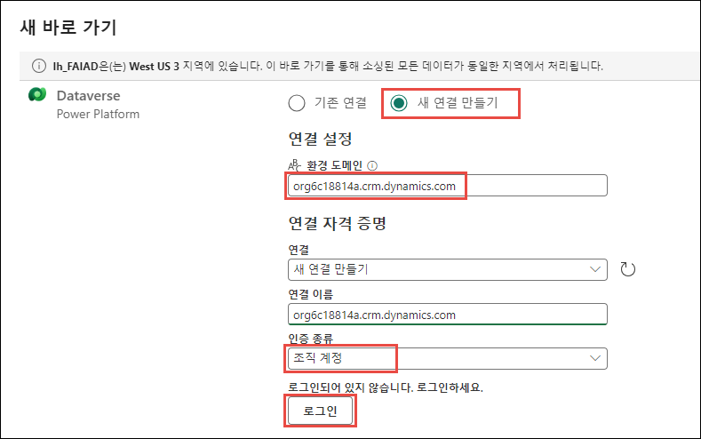

7. 로그인 대화 상자에서 이 랩에 사용하는 **사용자 계정** 을 선택합니다. 계정에 로그인 대화 상자가 열립니다. 로그인할 **계정을 선택** 합니다.

    **참고**: 계정은 아래 스크린샷과 다를 수 있습니다.

    

8.  연결 설정 대화 상자에서 **다음** 을 선택합니다. Dataverse에서 다른 버킷/디렉터리를 선택할 수 있는 대화 상자로
이동합니다. 다양한 버킷을 사용할 수 있습니다. 필요한 버킷을 선택하고 랩 3(시각적 쿼리를 사용하여 데이터 변환 및 보기 만들기)과 같은 프로세스를 따를 수 있습니다. 이 랩의 앞부분에서 사용한 것과 같이 데이터 흐름 2세대를 사용하여 SharePoint에 연결할 수도 있습니다. 그러나 이러한 **버킷/디렉터리** 에 접근할 수는 없습니다.

    이 시나리오에서는 IT 팀은 이미 Dataverse에 대한 링크를 설정하고 필요한 데이터 변환을 적용하여 Power BI Desktop 파일에 있는 데이터 변환을 미러링했습니다. 이 데이터를 관리자 작업 영역의 레이크하우스에 수집하고 테이블에 대한 액세스 권한을 부여했습니다. IT 팀이 모든 작업을 완료했으므로 관리자 작업 영역에 이 레이크하우스로 바로 가기를 만들 수
    있습니다.

9. 새로 만들기 바로 가기 대화 상자에서 **취소** 를 선택하여 레이크하우스로 다시 이동합니다.

    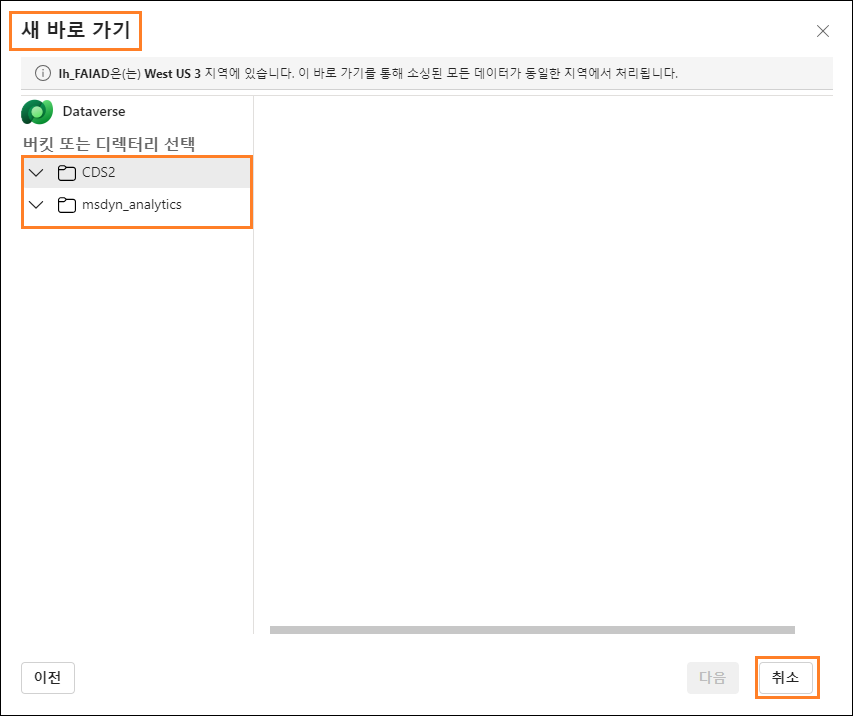

## 작업 10: 레이크하우스 바로 가기 생성

1. **왼쪽 탐색기** 창에서 **테이블** 옆의 **줄임표** 를 선택합니다.

2. **새 바로 가기** 를 선택합니다.

    

3. 새 바로 가기 대화 상자가 열립니다. 내부 원본에서 **Microsoft OneLake** 옵션을 선택합니다.

    

4. 데이터 원본 유형 선택 대화 상자가 열립니다. 두 개의 데이터 원본이 있음을 알 수 있습니다.

    a. lh_FAIAD -- 여러분이 만든 레이크하우스입니다.

    b. lh_dataverse -- 관리자가 만든 레이크하우스입니다.

5. **lh_dataverse** 를 선택합니다.

6. **다음** 을 선택합니다.

    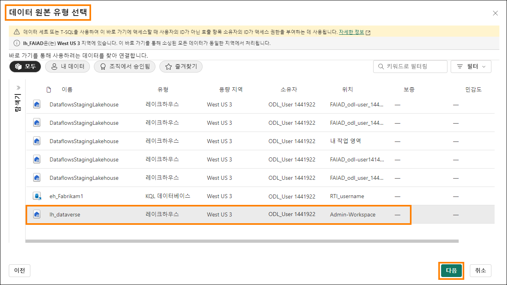

7. 왼쪽 패널에서 **lh_dataverse -\Tables** 를 확장합니다. IT 관리자가 Customer 테이블에 대한 액세스 권한을 제공했습니다.

8. **Customer** 를 선택합니다.

9. **다음** 을 선택합니다.

    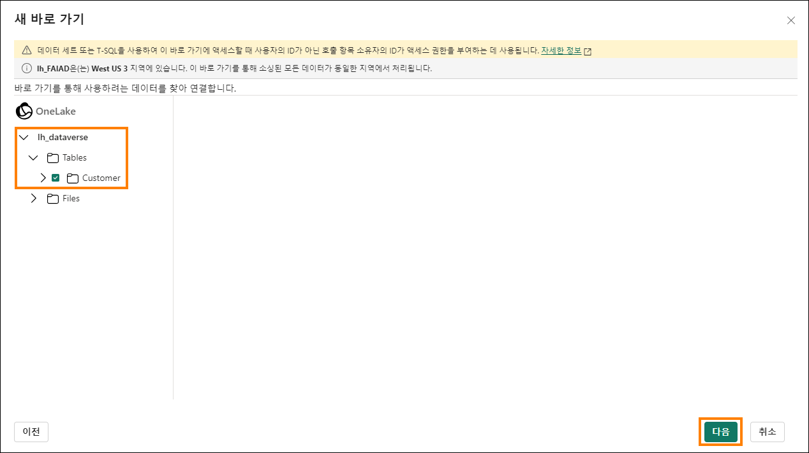

10. 다음 대화 상자에서 **만들기** 를 선택합니다. lh_FAIAD 레이크하우스로 돌아갑니다.

    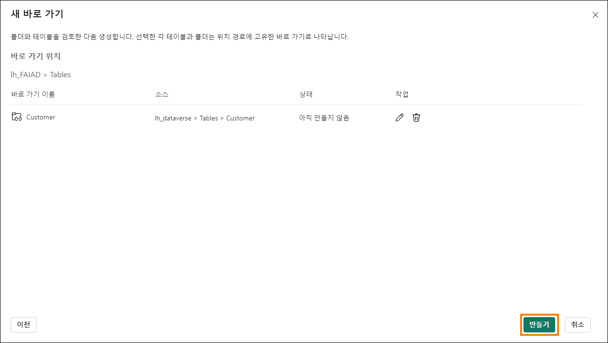

11. 왼쪽의 **탐색기** 패널에서 새 **Customer** 테이블이 생성된 것을 확인할 수 있습니다.

12. **Customer** 테이블을 선택하여 프리뷰 패널에서 데이터를 봅니다. 다른 레이크하우스로 가는 바로 가기를 만들었습니다.

    이제 모든 데이터가 레이크하우스에 수집되었습니다. 다음 랩에서는 데이터흐름 새로 고침을 예약하겠습니다.

    다음 랩에서는 일정 새로 고침을 설정해 보겠습니다.

# 참조

Fabric Analyst in a Day(FAIAD)는 Microsoft Fabric에서 사용할 수 있는 몇 가지 주요 기능을 소개합니다. 서비스의 메뉴에 있는 도움말(?) 섹션에는 유용한 리소스로 연결되는 링크가 있습니다.

아래는 Microsoft Fabric의 다음 단계에 도움이 되는 몇 가지 추가
자료입니다.

- [Microsoft Fabric GA 발표](https://aka.ms/Fabric-Hero-Blog-Ignite23) 전문을 블로그 포스트로 읽기

- [가이드 투어](https://aka.ms/Fabric-GuidedTour)로 Fabric 탐색

- [Microsoft Fabric 무료 평가판](https://aka.ms/try-fabric) 신청

- [Microsoft Fabric 웹사이트](https://aka.ms/microsoft-fabric) 방문

- [Fabric 학습 모듈](https://aka.ms/learn-fabric)을 탐색해서 새로운 기술 익히기

- [Fabric 기술 문서](https://aka.ms/fabric-docs) 검토

- [Fabric 시작하기 무료 e북](https://aka.ms fabric-get-started-ebook) 읽기

- [Fabric 커뮤니티](https://aka.ms/fabric-community)에 가입하여 질문을 게시하고 피드백을 공유하며 다른 사람들로부터 배우기

더 많은 심층 Fabric 환경 발표 블로그 포스트 읽기:

- [Fabric 블로그의 Data Factory 환경](https://aka.ms/Fabric-Data-Factory-Blog) 

- [Fabric 블로그의 Synapse Data Engineering 환경](https://aka.ms/Fabric-DE-Blog) 

- [Fabric 블로그의 Synapse Data Science 환경](https://aka.ms/Fabric-DS-Blog) 

- [Fabric 블로그의 Synapse Data Warehousing 환경](https://aka.ms/Fabric-DW-Blog) 

- [Fabric 블로그의 Synapse Real-Time Analytics 환경](https://aka.ms/Fabric-RTA-Blog)

- [Power BI 발표 블로그](https://aka.ms/Fabric-PBI-Blog)

- [Fabric 블로그의 Data Activator 환경](https://aka.ms/Fabric-DA-Blog) 

- [Fabric 블로그의 관리 및 거버넌스](https://aka.ms/Fabric-Admin-Gov-Blog)

- [Fabric 블로그의 OneLake](https://aka.ms/Fabric-OneLake-Blog)

- [Dataverse 및 Microsoft Fabric 통합 블로그](https://aka.ms/Dataverse-Fabric-Blog)

© 2023 Microsoft Corporation. All rights reserved.

이 데모/랩을 사용하면 다음 조건에 동의하게 됩니다.

이 데모/랩에 설명된 기술/기능은 학습 환경을 제공하고 사용자 의견을
얻기 위해 Microsoft Corporation에서 제공합니다. 데모/랩을 통해서만 이러한 기술적 특성과 기능을 평가하고 사용자 의견을 Microsoft에 제시할 수 있습니다. 다른 용도로는 사용할 수 없습니다. 이 데모/랩 또는 그 일부에 대해 수정, 복사, 배포, 전송, 표시, 수행, 재현, 게시, 라이선스 허여, 파생 작업 생성, 양도 또는 판매할 수 없습니다.

추가 복제 또는 재배포를 위한 다른 서버 또는 위치에 대한 데모/랩(또는 그 일부)의 복사 또는 재현은 명시적으로 금지됩니다.

이 데모/랩은 위에서 명시한 목적을 위해 복잡한 설정 또는 설치가 없는
시뮬레이션된 환경에서 잠재적인 새로운 기능과 개념을 포함하여 특정
소프트웨어 기술/제품의 특성 및 기능을 제공합니다. 이 데모/랩에서
서술된 기술/개념은 전체 기능을 나타내지 않을 수 있으며, 최종 버전이
작동하지 않을 수도 있습니다. 또한 해당 기능 또는 개념의 최종 버전을
릴리스하지 않을 수도 있습니다. 또한 실제 환경에서 이러한 특성과 기능을 사용한 경험이 다를 수도 있습니다.

**피드백**. 이 데모/랩에서 서술된 기술적 특성, 기능 및/또는 개념에
대한 사용자 의견을 Microsoft에 제시하면 Microsoft는 이 사용자 의견을 어떤 방식과 목적으로든 무료로 사용, 공유 및 상용화할 수 있습니다. 또한 제품, 기술 및 서비스에서 사용자 의견이 포함된 Microsoft 소프트웨어 또는 서비스의 특정 부분을 사용하거나 인터페이스하는 데 필요한 모든 특허권을 제3자에게 무료로 제공합니다. Microsoft에서 사용자 의견을 포함하기 때문에 Microsoft에서 해당 소프트웨어 또는 설명서의 사용을 인가해야 하는 라이선스에 종속된 사용자 의견은 제공할 수 없습니다. 이러한 권리는 본 계약에 의거하여 유효합니다.

Microsoft Corporation은 이에 따라 명시적, 묵시적 또는 법적 특정
목적에의 적합성, 권리 및 비침해 여부에 관계없이 모든 보증과 조건을
포함하여 데모/랩과 관련된 모든 보증 및 조건을 부인합니다. Microsoft는 어떤 목적으로든 결과의 정확성, 데모/랩의 사용으로 파생된 출력 또는 데모/랩에 포함된 정보의 적합성과 관련하여 어떠한 보증이나 진술도 하지 않습니다.

**고지 사항**

이 데모/랩에는 Microsoft Power BI의 새로운 기능 및 향상된 기능 중
일부만 포함되어 있습니다. 일부 기능은 제품의 향후 릴리스에서 변경될 수 있습니다. 이 데모/랩에서는 새로운 기능 모두가 아닌 일부에 대해 학습하게 됩니다.
