# Fabric Analyst in a Day Laboratorio 4 

# Contenido 

- Presentación	
- Flujo de datos Gen2	
   - Tarea 1: Copiar consultas de SharePoint al flujo de datos	
   - Tarea 2: Crear una conexión a SharePoint	
   - Tarea 3: Configurar el destino de datos para la consulta People	
   - Tarea 4: Publicar y cambiar el nombre del flujo de datos de SharePoint	
   - Tarea 5: Copiar consultas de Snowflake al flujo de datos	
   - Tarea 6: Crear una conexión a Snowflake	
   - Tarea 7: Configurar el destino de datos para las consultas de Supplier y PO	
   - Tarea 8: Cambiar el nombre y publicar el flujo de datos de Snowflake	
- Acceso directo a ADLS Gen2	
   - Tarea 9: Cómo crear un acceso directo a Dataverse	
   - Tarea 10: Crear un acceso directo a un almacén de lago de datos	
- Referencias	

# Presentación

En nuestro escenario, los datos del proveedor están en Snowflake, los
datos del cliente están en Dataverse y los datos de los empleados están
en SharePoint. Todos estos orígenes de datos se actualizan en diferentes
momentos. Para minimizar la cantidad de actualizaciones de datos de los
flujos de datos, crearemos flujos de datos individuales para los
orígenes de datos de Snowflake y SharePoint.

**Nota:** Se admiten varios orígenes de datos en un único flujo de
datos.

El equipo de TI ya ha establecido un vínculo a Dataverse y aplicado las
transformaciones de datos necesarias, reflejándolas en el archivo de
Power BI Desktop. Han ingerido estos datos al almacén de lago de datos
en el área de trabajo de administración y nos han dado acceso a las
tablas. Vamos a crear un acceso directo para el almacén de lago de datos
que ha creado el equipo de TI.

Al final de este laboratorio, habrá aprendido:

-   Cómo conectarse a SharePoint mediante el flujo de datos Gen2 e
    ingerir datos en el almacén de lago de datos

-   Cómo conectarse a Snowflake mediante el flujo de datos Gen2 e
    ingerir datos en el almacén de lago de datos

-   Cómo ingerir datos desde un almacén de lagos compartido

# Flujo de datos Gen2

### Tarea 1: Copiar consultas de SharePoint al flujo de datos

1. Volvamos al área de trabajo de Fabric, **FAIAD\_\<username\>**, que
    creó en el Laboratorio 2, Tarea 8.

2. Seleccione el **icono** **Selector de experiencia de Fabric** en la
    parte inferior izquierda de su pantalla. Se abre el cuadro de
    diálogo de experiencia de Fabric

3. Seleccione **Data Factory** en el cuadro de diálogo. Navegará a la **página principal de Data Factory.**

    

4. En Artículos recomendados, seleccione **Dataflow Gen2**.

    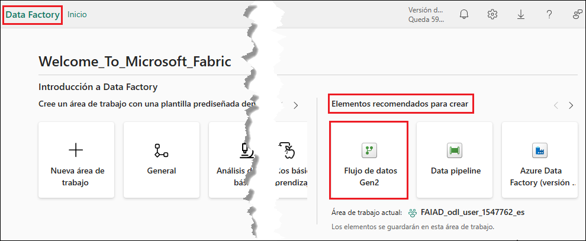

Se le dirigirá de vuelta a la **página de del flujo de datos**. La
interfaz Flujo de datos Gen2 es como Power Query en Power BI Desktop.
Podemos copiar consultas desde el flujo de datos Gen2 de
Power BI Desktop. Vamos a intentarlo.

5. Si todavía no lo ha abierto, abra **FAIAD.pbix** que se encuentra en
    la carpeta **Reports** del escritorio de su entorno de laboratorio.

6. En la cinta de opciones, seleccione **Inicio -\> Transformar datos**. Se abre la ventana de Power Query. Como habrá notado en la práctica de laboratorio anterior, las consultas en el panel izquierdo están organizadas por orígenes de datos.

7. En el panel izquierdo, en la carpeta SharepointData, **seleccione** la consulta **People**.

8. **Haga clic con el botón derecho** y seleccione **Copiar**.

   

9. Vuelva a la **pantalla del flujo de datos** en el explorador.

10. En el **panel del flujo de datos**, introduzca **Ctrl+V** (actualmente, hacer clic con el botón derecho en Pegar no es
    compatible). Si está utilizando un dispositivo MAC, utilice Cmd+V para pegar.

    - **Nota**: Si está trabajando en el entorno de laboratorio, seleccione los puntos suspensivos en la parte superior derecha de la pantalla. Utilice el control deslizante para **habilitar** **Portapapeles nativo de VM**. Seleccione Aceptar en el cuadro de diálogo. Una vez que haya terminado de pegar las consultas, puede desactivar esta opción.

     

Observe la consulta pegada y disponible en el panel izquierdo. Como no tenemos una conexión creada para SharePoint, verá un mensaje de advertencia que le solicitará que configure la conexión.

### Tarea 2: Crear una conexión a SharePoint

1. Seleccione **Configurar conexión**.

   

2. Se abre el cuadro de diálogo del origen de datos. En el menú desplegable **Conexión**, asegúrese de que **Crear nueva conexión** esté seleccionado.

3. **Tipo de autenticación** debería ser **Cuenta de organización**.

4. Seleccione **Conectar**.

   - **Nota:** Iniciará sesión con sus credenciales. Serán diferentes a la
captura de pantalla siguiente.

   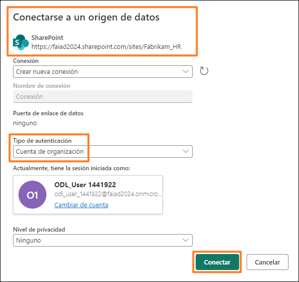

### Tarea 3: Configurar el destino de datos para la consulta People

Se establece la conexión y puede ver los datos en el panel de versión preliminar. Siéntase libre de navegar por los pasos aplicados de las consultas. Ahora necesitamos incorporar los datos de People en el almacén de lago de datos.

1. Seleccione la consulta **People**.

2. En la cinta de opciones, seleccione **Inicio -\> Agregar destino de datos -\> Lakehouse**.

   

3. Se abre el cuadro de diálogo Conectarse al destino de datos.
    Necesitamos crear una nueva conexión con el almacén de lago de
    datos. Con **Crear nueva conexión** seleccionado en el **menú
    desplegable Conexión** y **Tipo de autenticación** configurado en
    **Cuenta de organización**, seleccione **Siguiente**.

   

4. Se abre el cuadro de diálogo de Elegir el objetivo de destino.
    Asegúrese de que el **botón de opción Nueva tabla** esté
    seleccionado, ya que estamos creando una nueva tabla.

5. Queremos crear la tabla en el lakehouse que creamos anteriormente.
    En el panel izquierdo, navegue hasta **Lakehouse -\>
    FAIAD\_\<username\>.**

6. Seleccione **lh_FAIAD**.

7. Deje el nombre de la tabla como **People**

8. Seleccione **Siguiente**.

   

9. Se abre el cuadro de diálogo de Elegir la configuración de destino.
    Asegúrese de que la opción "**Usar configuración automática**" esté
    **habilitada**.

   - **Nota**: Puede deshabilitar la configuración automática y observe que
tiene opciones para establecer las opciones Método de actualización y
Esquema. Cuando haya finalizado la exploración, asegúrese de que la
opción "**Usar configuración automática**" esté **habilitada**.

10. Seleccione **Guardar configuración**.

    

### Tarea 4: Publicar y cambiar el nombre del flujo de datos de SharePoint

1. Volverá a la **ventana de Power Query**. Observe que en la **esquina
    inferior derecha**, el destino de los datos está configurado en el
    **lakehouse**.

2. En la esquina inferior derecha, seleccione **Publicar**.

   

   - **Nota:** Se le dirigirá de vuelta al área de trabajo
**FAIAD\_\<username\>**. Es posible que el flujo de datos tarde unos
minutos en publicarse.

3. Estamos trabajando con Dataflow 1. Cambiémosle el nombre antes de
    continuar. Haga clic en los **puntos suspensivos (...)** junto a
    Dataflow 1. Seleccione **Propiedades**.

   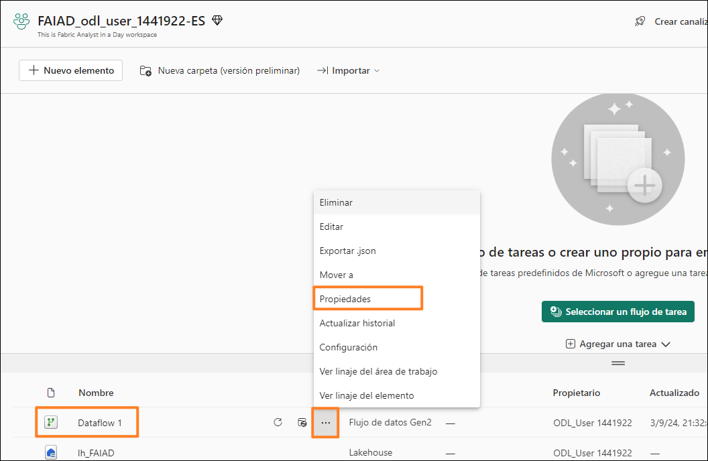

4. Se abre el cuadro de diálogo de propiedades del flujo de datos.
    Cambie el **nombre** a **df_People_SharePoint**.

5. En el cuadro de texto **Descripción**, agregue **Flujo de datos para
    ingerir datos de People desde SharePoint a Almacén de lago de
    datos**.

6. Seleccione **Guardar**.

   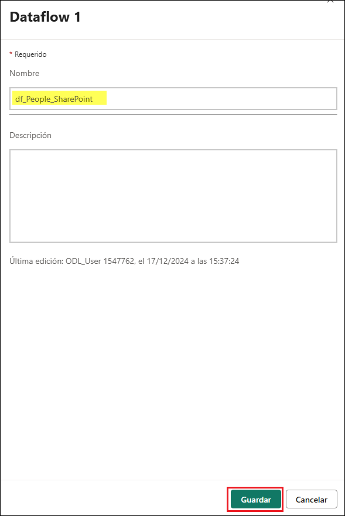

Se le dirigirá de vuelta al **área de trabajo FAIAD\_\<username\>**.

7. Seleccione **lh_FAIAD** para ir al almacén de lago de datos.

8. Asegúrese de estar en la vista del almacén de lago de datos (no en
    el punto de conexión de análisis SQL).

9. Observe que la tabla **People** esté ahora disponible en el almacén
    de lago de datos.

    - **Nota:** Si no ve las tablas recién creadas, seleccione los puntos
suspensivos junto a Tables y seleccionar Actualizar para actualizar las
tablas.

### Tarea 5: Copiar consultas de Snowflake al flujo de datos

1. Volvamos al área de trabajo de Fabric, **FAIAD\_\<username\>**

2. En el menú superior, seleccione **Nuevo -\> Flujo de datos Gen2**.

   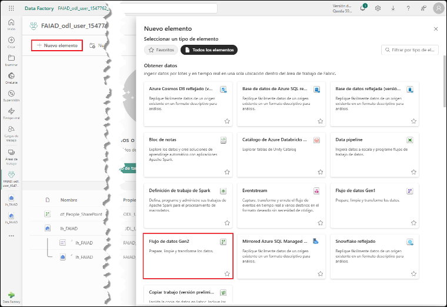

Se le dirigirá de vuelta a la **página de del flujo de datos**. Ahora
que estamos familiarizados con el flujo de datos, sigamos adelante y
copiemos las consultas de Power BI Desktop en el flujo de datos.

3. Si todavía no lo ha abierto, abra **FAIAD.pbix** que se encuentra en
    la carpeta **Reports** del escritorio de su entorno de laboratorio.

4. En la cinta de opciones, seleccione **Inicio -\> Transformar
    datos**. Se abre la ventana de Power Query. Como habrá notado en la
    práctica de laboratorio anterior, las consultas en el panel
    izquierdo están organizadas por orígenes de datos.

5. Desde el panel izquierdo, en la carpeta SnowflakeData
    **Ctrl+Seleccionar** o Mayús+Seleccionar las siguientes consultas:

    a. SupplierCategories

    b. Suppliers

    c. Supplier

    d. PO

    e. PO Line Items

6. **Haga clic con el botón derecho** y seleccione **Copiar**.

   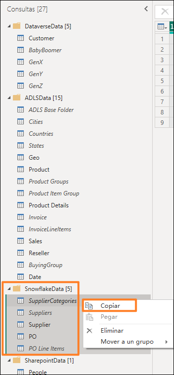

7. Vuelva al **explorador**.

8. En el **panel del flujo de datos**, seleccione el **panel central**,
    introduzca **Ctrl+V** (actualmente, hacer clic con el botón derecho
    en Pegar no es compatible). Si está utilizando un dispositivo MAC,
    utilice Cmd+V para pegar.

   - **Nota:** Si está trabajando en el entorno de laboratorio, seleccione
los **puntos suspensivos (...)** en la parte superior derecha de la
pantalla. Utilice el control deslizante para **habilitar**
**Portapapeles nativo de VM**. Seleccione Aceptar en el cuadro de
diálogo. Una vez que haya terminado de pegar las consultas, puede
desactivar esta opción.

   

### Tarea 6: Crear una conexión a Snowflake

Observe que las cinco consultas están pegadas y ahora tiene el panel
Consultas a la izquierda. Como no tenemos una conexión creada para
Snowflake, verá un mensaje de advertencia que le solicitará que
configure la conexión.

1. Seleccione **Configurar conexión**.

   

2. Se abre el cuadro de diálogo del origen de datos. En el menú
    desplegable **Conexión**, asegúrese de que **Crear nueva conexión**
    esté seleccionado.

3. **El tipo de autenticación** debe ser **Snowflake**.

4. Introduzca el **Nombre de usuario y contraseña de Snowflake**
    disponibles en la pestaña Variables de entorno (al lado de la
    pestaña Guía de laboratorio).

5. Seleccione **Conectar**.

   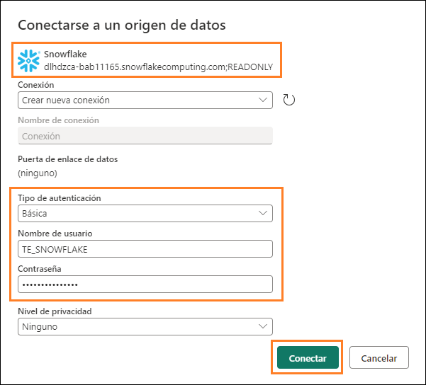

Se establece la conexión y puede ver los datos en el panel de versión
preliminar. Siéntase libre de navegar por los pasos aplicados de las
consultas. Básicamente, la consulta Suppliers tiene los detalles de los
proveedores y SupplierCategories, como su nombre indica, tiene
categorías de proveedores. Estas dos tablas se unen para crear la
dimensión Supplier, con las columnas que necesitamos. De manera similar,
tenemos PO Line Items combinada con pedidos de compra para crear el dato
de PO. Ahora necesitamos incorporar los datos de Supplier y de PO en el
almacén de lago de datos.

### Tarea 7: Configurar el destino de datos para las consultas de Supplier y PO

1. Seleccione la consulta de **Supplier**.

2. En la cinta de opciones, seleccione **Inicio -\> Agregar destino de
    datos -\> Lakehouse**.

   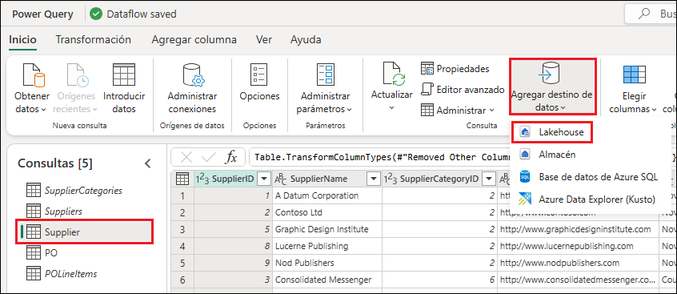

3. Se abre el cuadro de diálogo Conectarse al destino de datos. Desde
    el **menú desplegable Conexión**, seleccione **Lakehouse
    (ninguno)**.

4. Seleccione **Siguiente**.

   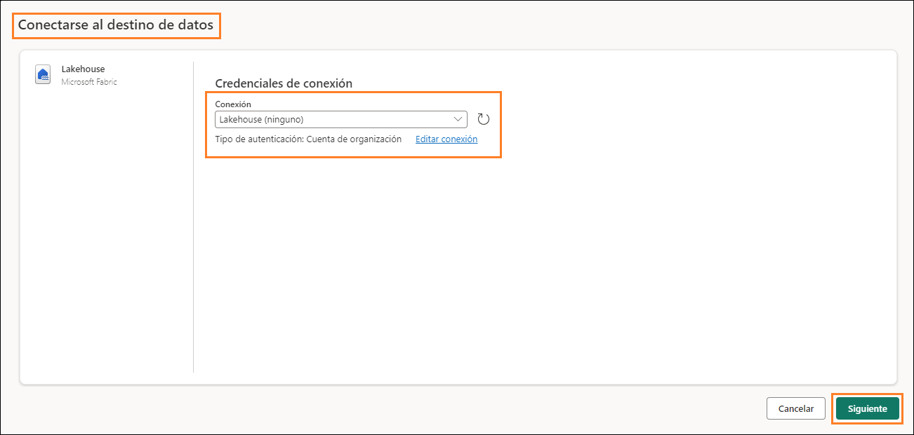

5. Se abre el cuadro de diálogo de Elegir el objetivo de destino.
    Asegúrese de que el botón de opción **Nueva tabla** esté
    **seleccionado**, ya que estamos creando una nueva tabla.

6. Queremos crear la tabla en el lakehouse que creamos anteriormente.
    En el panel izquierdo, navegue hasta **Lakehouse -\>
    FAIAD\_\<username\>.**

7. Seleccione **lh_FAIAD**.

8. Deje el nombre de la tabla como **Supplier**

9. Seleccione **Siguiente**.

   

10. Se abre el cuadro de diálogo de Elegir la configuración de destino.
    Usaremos la configuración automática, ya que esto realizará una
    actualización completa de los datos. Además, cambiará el nombre de
    las columnas según sea necesario. Seleccione **Guardar
    configuración**.

    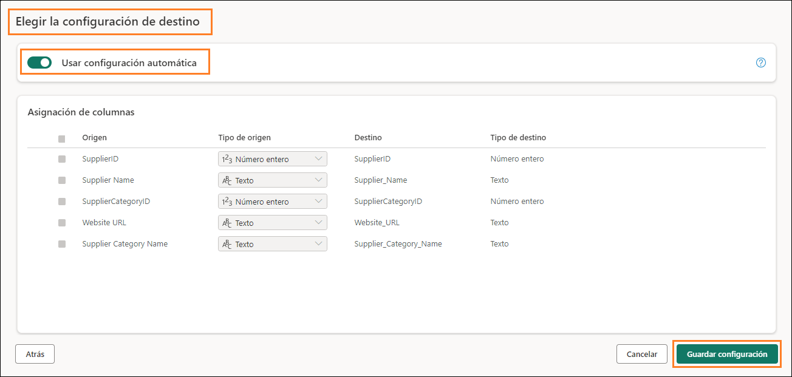

11. Volverá a la **ventana de Power Query**. Observe que en la **esquina
    inferior derecha, el destino de los datos** está configurado en el
    **lakehouse**. De manera similar, **configure el destino de datos
    para la consulta de PO**. Una vez hecho esto, su consulta de **PO**
    debe tener **Destino de datos** establecido en **Almacén de lago de
    datos** como se muestra en la siguiente captura de pantalla.

    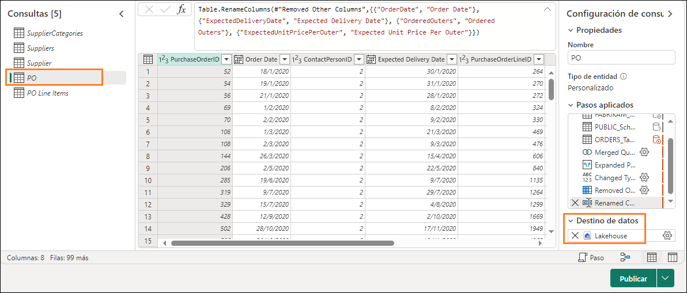

### Tarea 8: Cambiar el nombre y publicar el flujo de datos de Snowflake

1. En la parte superior de la pantalla, seleccione la **flecha junto a
    Dataflow 1** para cambiar el nombre.

2. En el cuadro de diálogo, cambie el nombre a
    **df_Supplier_Snowflake**.

3. Haga clic en **Introducir** para guardar el cambio de nombre.

   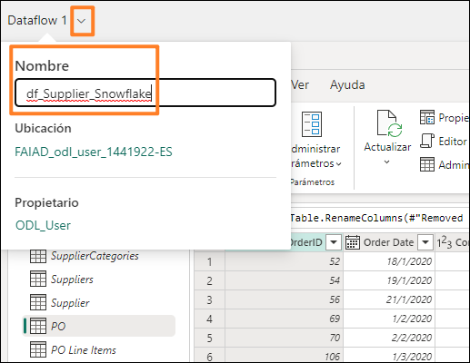

4. En la esquina inferior derecha, seleccione **Publicar**.

   

Se le dirigirá de vuelta al **área de trabajo FAIAD\_\<username\>**. Es
posible que el flujo de datos tarde unos minutos en publicarse.

5. Seleccione **lh_FAIAD** para ir al almacén de lago de datos.

6. Asegúrese de estar en la vista del almacén de lago de datos (no en
    el punto de conexión de análisis SQL).

7. Observe que la tabla **PO** y **Supplier** ahora está disponible en
    el almacén de lago de datos.

   - **Nota:** Si no ve las tablas recién creadas, seleccione los puntos
suspensivos junto a Tables y seleccionar Actualizar para actualizar las
tablas.

Ahora creemos un acceso directo para traer datos de Dataverse.

# Acceso directo a ADLS Gen2

### Tarea 9: Cómo crear un acceso directo a Dataverse

Debe estar en el almacén de lago de datos **lh_FAIAD**. Asegúrese de
estar en la vista del almacén de lago de datos (no en el punto de
conexión de análisis SQL).

   

1. En el panel del **Explorador** de la izquierda, seleccione los
    **puntos suspensivos** al lado de **Tables**.

2. Seleccione **Nuevo acceso directo**.

   

3. Se abre el cuadro de diálogo Nuevo acceso directo. En **Orígenes
    externos**, seleccione **Dataverse**.

  - **Nota**: En la práctica de laboratorio anterior, seguimos pasos similares para crear un acceso directo a Azure Data Lake Storage Gen2.

   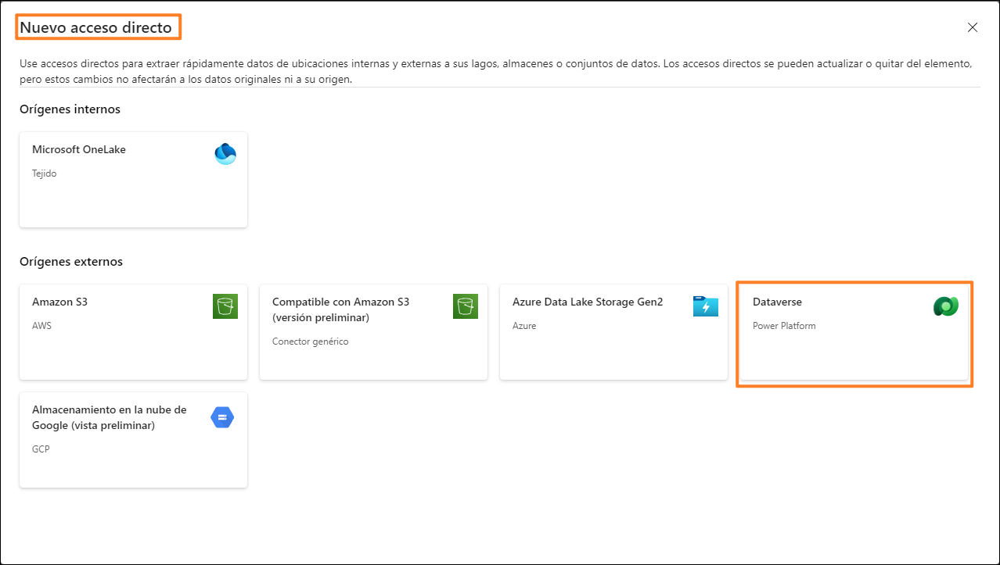

4. Se abre el cuadro de diálogo Configuración de conexión. Introduzca

    **org6c18814a.crm.dynamics.com** como **dominio del entorno.**

5. Deje **Tipo de autenticación** como **Cuenta de organización**.

6. Seleccione **Iniciar sesión**.

   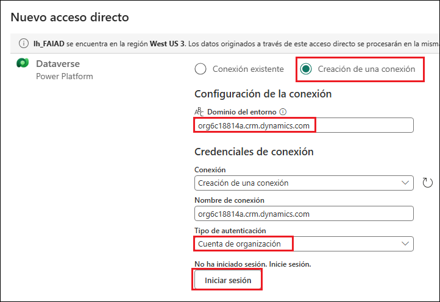

7. En el cuadro de diálogo de inicio de sesión, seleccione la **cuenta
    de usuario** que ha estado usando para estos laboratorios.

**Nota**: Su cuenta será diferente de la captura de pantalla siguiente.

   

8. Seleccione **Siguiente** en el cuadro de diálogo Configuración de
    conexión.

Se le dirigirá a un cuadro de diálogo de donde puede elegir el
cubo/directorio diferente de Dataverse. Observe que hay una gran
cantidad de cubos disponibles. Podríamos elegir los cubos que
necesitamos y seguir el proceso del laboratorio 3 (usar la consulta
visual para transformar datos y crear vistas). También podríamos usar el
flujo de datos Gen2 como lo usamos anteriormente en este laboratorio
para conectar SharePoint. Sin embargo, no tenemos acceso a estos
**cubos/directorios**.

En nuestro escenario, el equipo de TI ya ha establecido un vínculo a
Dataverse y aplicado las transformaciones de datos necesarias,
reflejándolas en el archivo de Power BI Desktop. Han ingerido estos
datos al almacén de lago de datos en el área de trabajo de
administración y nos han dado acceso a las tablas. Puesto que nuestro
equipo informático ha hecho todo el trabajo duro, podemos crear un
acceso directo a este almacén de lago de datos en el área de trabajo de
administrador.

9. Seleccione **Cancelar** en el cuadro de diálogo Nuevo acceso directo
    para volver al almacén de lago de datos.

   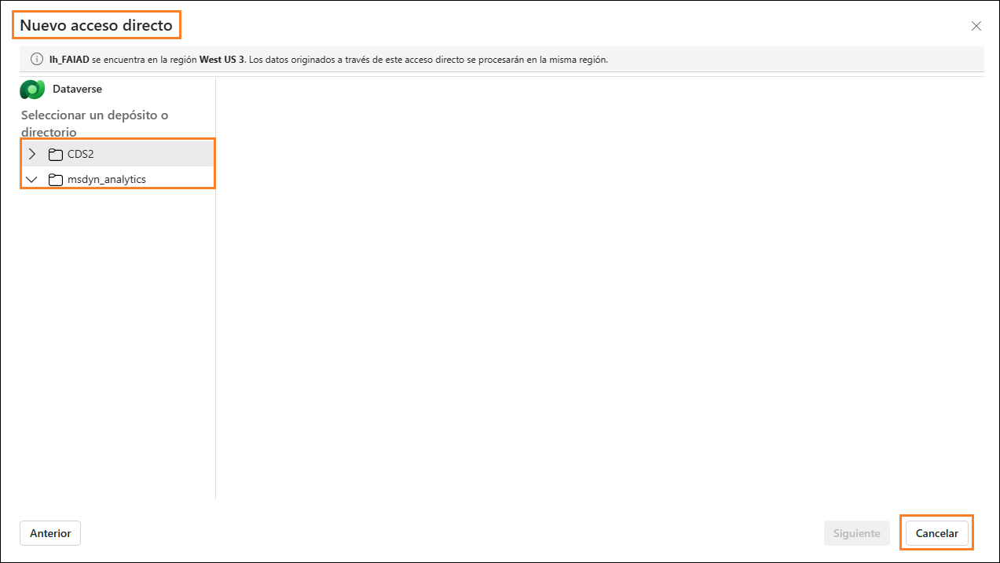

### Tarea 10: Crear un acceso directo a un almacén de lago de datos

1. En el panel del **explorador** de la izquierda, seleccione los
    **puntos suspensivos** al lado de **Tables**.

2. Seleccione **Nuevo acceso directo**.

   

3. Se abre el cuadro de diálogo Nuevo acceso directo. Seleccione la
    opción **Microsoft OneLake** en orígenes internos.

   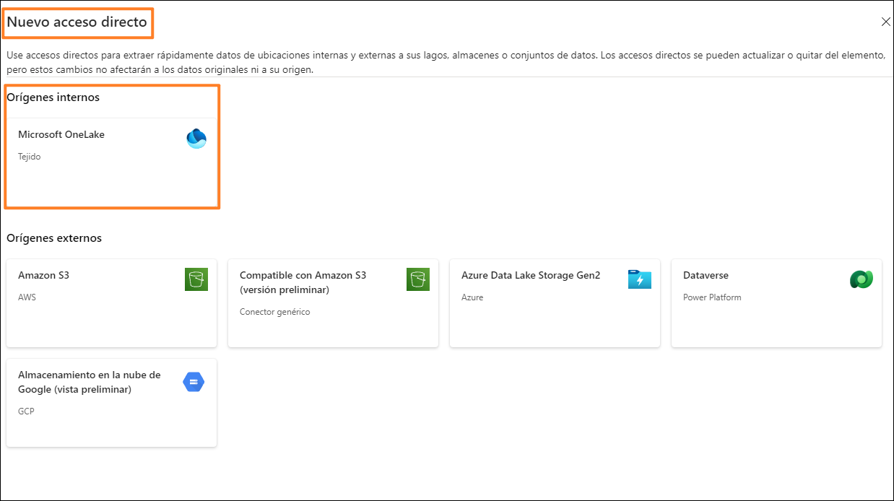

4. Se abrirá el cuadro de diálogo Seleccionar un tipo de origen de
    datos. Observe que tiene dos orígenes de datos.

    a. lh_FAIAD: este es el almacén de lago de datos que ha creado.

    b. lh_dataverse: este es el almacén de lago de datos que ha creado
        el administrador.

5. Seleccione **lh_dataverse**.

6. Seleccione **Siguiente**.

   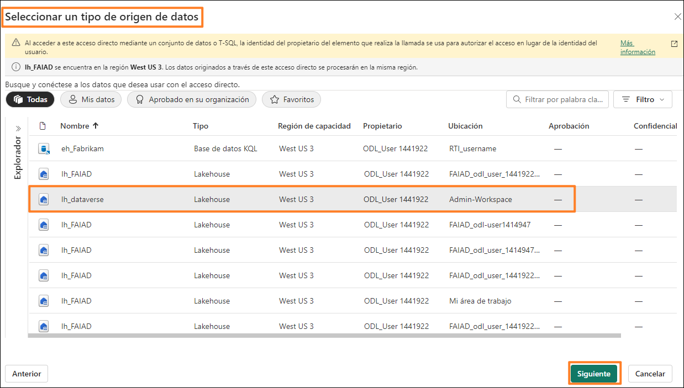

7. En el panel izquierdo, expanda **lh_dataverse -\> Tables**. Observe
    que el administrador de TI ha proporcionado acceso a la tabla
    Cliente.

8. Seleccione **Cliente**.

9. Seleccione **Siguiente**.

   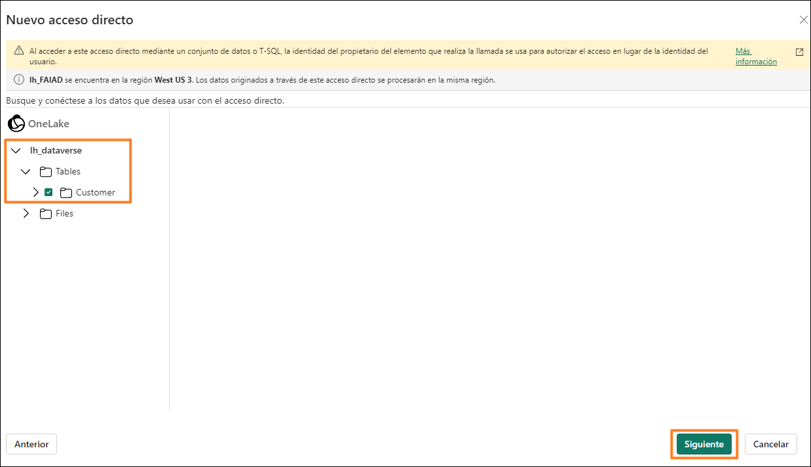

10. Seleccione **Crear** en el siguiente cuadro de diálogo. Se le
    dirigirá de vuelta al almacén de lago de datos lh_FAIAD.

   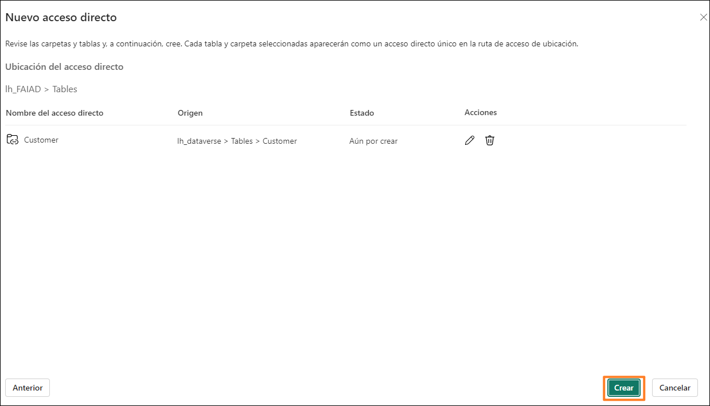

11. En el panel **Explorador** de la izquierda, observe que se ha creado
    la nueva tabla **Cliente**.

12. Seleccione la tabla **Cliente** para ver los datos en el panel de
    versión preliminar.

Hemos creado correctamente un acceso directo a otro almacén de lago de
datos.

Ahora hemos ingerido todos los datos en el almacén de lago de datos. En
la próxima práctica de laboratorio, programaremos la actualización del
flujo de datos.

En la próxima práctica de laboratorio, configuraremos actualizaciones de
programaciones.

# Referencias

Fabric Analyst in a Day (FAIAD) le presenta algunas funciones clave
disponibles en Microsoft Fabric. En el menú del servicio, la sección
Ayuda (?) tiene vínculos a algunos recursos excelentes.

   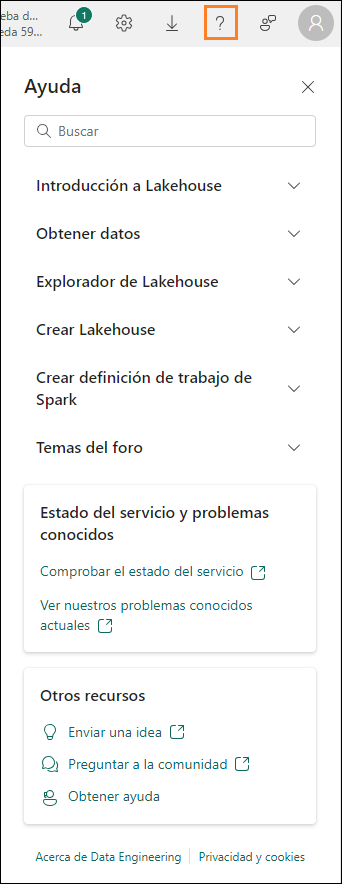

Estos son algunos recursos más que podrán ayudarle a seguir avanzando
con Microsoft Fabric.

-   Vea la publicación del blog para leer el [anuncio de disponibilidad
    general de Microsoft
    Fabric](https://aka.ms/Fabric-Hero-Blog-Ignite23) completo.

-   Explore Fabric a través de la [Visita
    guiada](https://aka.ms/Fabric-GuidedTour)

-   Regístrese en la [prueba gratuita de Microsoft
    Fabric](https://aka.ms/try-fabric)

-   Visite el [sitio web de Microsoft
    Fabric](https://aka.ms/microsoft-fabric)

-   Adquiera nuevas capacidades mediante la exploración de los [módulos
    de aprendizaje de Fabric](https://aka.ms/learn-fabric)

-   Explore la [documentación técnica de
    Fabric](https://aka.ms/fabric-docs)

-   Lea el [libro electrónico gratuito sobre cómo empezar a usar
    Fabric](https://aka.ms/fabric-get-started-ebook)

-   Únase a la [comunidad de Fabric](https://aka.ms/fabric-community)
    para publicar sus preguntas, compartir sus comentarios y aprender de
    otros.

Obtenga más información en los blogs de anuncios de la experiencia
Fabric:

-   [Experiencia de Data Factory en el blog de
    Fabric](https://aka.ms/Fabric-Data-Factory-Blog) 

-   [Experiencia de Synapse Data Engineering en el blog de
    Fabric](https://aka.ms/Fabric-DE-Blog) 

-   [Experiencia de Synapse Data Science en el blog de
    Fabric](https://aka.ms/Fabric-DS-Blog) 

-   [Experiencia de Synapse Data Warehousing en el blog de
    Fabric](https://aka.ms/Fabric-DW-Blog) 

-   [Experiencia de Synapse Real-Time Analytics en el blog de
    Fabric](https://aka.ms/Fabric-RTA-Blog)

-   [Blog de anuncios de Power BI](https://aka.ms/Fabric-PBI-Blog)

-   [Experiencia de Data Activator en el blog de
    Fabric](https://aka.ms/Fabric-DA-Blog) 

-   [Administración y gobernanza en el blog de
    Fabric](https://aka.ms/Fabric-Admin-Gov-Blog)

-   [OneLake en el blog de Fabric](https://aka.ms/Fabric-OneLake-Blog)

-   [Blog de integración de Dataverse y Microsoft
    Fabric](https://aka.ms/Dataverse-Fabric-Blog)

© 2023 Microsoft Corporation. Todos los derechos reservados.

Al participar en esta demostración o laboratorio práctico, acepta las siguientes condiciones:
Microsoft Corporation pone a su disposición la tecnología o funcionalidad descrita en esta demostración/laboratorio práctico con el fin de obtener comentarios por su parte y de facilitarle una experiencia de aprendizaje. Esta demostración/laboratorio práctico solo se puede usar para evaluar las características de tal tecnología o funcionalidad y para proporcionar comentarios a Microsoft. No se puede usar para ningún otro propósito. Ninguna parte de esta demostración/laboratorio práctico se puede modificar, copiar, distribuir, transmitir, mostrar, realizar, reproducir, publicar, licenciar, transferir ni vender, ni tampoco crear trabajos derivados de ella.

LA COPIA O REPRODUCCIÓN DE ESTA DEMOSTRACIÓN/LABORATORIO PRÁCTICO (O
PARTE DE ELLA) EN CUALQUIER OTRO SERVIDOR O UBICACIÓN PARA SU
REPRODUCCIÓN O DISTRIBUCIÓN POSTERIOR QUEDA EXPRESAMENTE PROHIBIDA.

ESTA DEMOSTRACIÓN/LABORATORIO PRÁCTICO PROPORCIONA CIERTAS FUNCIONES Y
CARACTERÍSTICAS DE PRODUCTOS O TECNOLOGÍAS DE SOFTWARE (INCLUIDOS
POSIBLES NUEVOS CONCEPTOS Y CARACTERÍSTICAS) EN UN ENTORNO SIMULADO
SIN INSTALACIÓN O CONFIGURACIÓN COMPLEJA PARA EL PROPÓSITO ARRIBA
DESCRITO. LA TECNOLOGÍA/CONCEPTOS DESCRITOS EN ESTA
DEMOSTRACIÓN/LABORATORIO PRÁCTICO NO REPRESENTAN LA FUNCIONALIDAD
COMPLETA DE LAS CARACTERÍSTICAS Y, EN ESTE SENTIDO, ES POSIBLE QUE NO
FUNCIONEN DEL MODO EN QUE LO HARÁN EN UNA VERSIÓN FINAL. ASIMISMO,
PUEDE QUE NO SE PUBLIQUE UNA VERSIÓN FINAL DE TALES CARACTERÍSTICAS O
CONCEPTOS. DE IGUAL MODO, SU EXPERIENCIA CON EL USO DE ESTAS
CARACTERÍSTICAS Y FUNCIONALIDADES EN UN ENTORNO FÍSICO PUEDE SER
DIFERENTE.

**COMENTARIOS**. Si envía comentarios a Microsoft sobre las
características, funcionalidades o conceptos de tecnología descritos
en esta demostración/laboratorio práctico, acepta otorgar a Microsoft,
sin cargo alguno, el derecho a usar, compartir y comercializar sus
comentarios de cualquier modo y para cualquier fin. También concederá
a terceros, sin cargo alguno, los derechos de patente necesarios para
que sus productos, tecnologías y servicios usen o interactúen con
cualquier parte específica de un software o servicio de Microsoft que
incluya los comentarios. No enviará comentarios que estén sujetos a
una licencia que obligue a Microsoft a conceder su software o
documentación bajo licencia a terceras partes porque incluyamos sus
comentarios en ellos. Estos derechos seguirán vigentes después del
vencimiento de este acuerdo.

MICROSOFT CORPORATION RENUNCIA POR LA PRESENTE A TODAS LAS GARANTÍAS Y
CONDICIONES RELATIVAS A LA DEMOSTRACIÓN/LABORATORIO PRÁCTICO, INCLUIDA
CUALQUIER GARANTÍA Y CONDICIÓN DE COMERCIABILIDAD (YA SEA EXPRESA,
IMPLÍCITA O ESTATUTARIA), DE IDONEIDAD PARA UN FIN DETERMINADO, DE
TITULARIDAD Y DE AUSENCIA DE INFRACCIÓN. MICROSOFT NO DECLARA NI
GARANTIZA LA EXACTITUD DE LOS RESULTADOS, EL RESULTADO DERIVADO DE LA
REALIZACIÓN DE LA DEMOSTRACIÓN/LABORATORIO PRÁCTICO NI LA IDONEIDAD DE
LA INFORMACIÓN CONTENIDA EN ELLA CON NINGÚN PROPÓSITO.

 **DECLINACIÓN DE RESPONSABILIDADES**

 Esta demostración/laboratorio práctico contiene solo una parte de las
 nuevas características y mejoras realizadas en Microsoft Power BI.
 Puede que algunas de las características cambien en versiones futuras
 del producto. En esta demostración/laboratorio práctico, conocerá
 algunas de estas nuevas características, pero no todas.
