# Microsoft Fabric - Fabric Analyst in a Day - Laboratório 1

# Sumário 
- Estrutura do documento
- Cenário/Declaração do problema
- Visão geral do relatório do Power BI desktop 
    - Tarefa 1: Configurar o Power BI Desktop no ambiente de laboratório
    - Tarefa 2: Analisar relatório do Power BI Desktop 
    - Tarefa 3: Revisar Power Queries 
- Referências.

# Estrutura do documento

O laboratório inclui etapas a serem seguidas pelo usuário juntamente com
as capturas de tela associadas que fornecem auxílio visual. Em cada
captura de tela, as seções estão destacadas com caixas laranjas para
indicar as áreas nas quais o usuário deve se concentrar.

**Observação**: Algumas capturas de tela podem estar desatualizadas
devido às atualizações contínuas do produto.

# Cenário/Declaração do problema

A Fabrikam, Inc. é distribuidora atacadista de produtos inovadores. Como
atacadista, os clientes da Fabrikam são principalmente empresas que
revendem para pessoas físicas. A Fabrikam vende para clientes de varejo
nos Estados Unidos, incluindo lojas especializadas, supermercados, lojas
de informática e lojas de atrações turísticas. A Fabrikam também vende
para outros atacadistas por meio de uma rede de agentes que promovem os
produtos em nome da Fabrikam. Embora todos os clientes da Fabrikam
estejam atualmente nos Estados Unidos, a empresa pretende impulsionar
a expansão para outros países/regiões.

Você é um Analista de Dados na equipe de Vendas. Você coleta, limpa e
interpreta conjuntos de dados para resolver problemas de negócios. Você
também reúne visualizações, como tabelas e gráficos, escreve relatórios
e os apresenta aos tomadores de decisão na organização.

Para obter insights valiosos dos dados, você extrai dados de vários
sistemas, limpa-os e combina-os. Você extrai dados das seguintes fontes:

- **Dados de Venda:** são obtidos do sistema ERP e armazenados em um
    banco de dados ADLS Gen2. Eles são atualizados ao meio-dia/12h,
    todos os dias.

- **Dados do Fornecedor:** são obtidos de diferentes fornecedores e
    armazenados em um banco de dados Snowflake. São atualizados à
    meia-noite/24h, todos os dias.

- **Dados do Cliente:** são obtidos do Customer Insights e armazenados
    no Dataverse. Os dados estão sempre atualizados.

- **Dados do Funcionário:** são obtidos do sistema de RH e armazenados como um arquivo de exportação em 0uma pasta do SharePoint. São atualizados todas as manhãs, às 9h.

    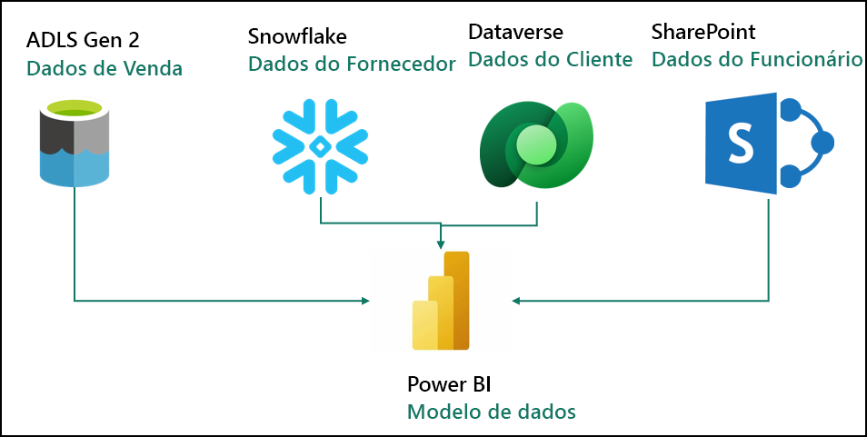

    No momento, você está criando um conjunto de dados no Power BI Premium
    que extrai os dados dos sistemas de origem acima para gerar relatórios e
    fornecer aos usuários finais o recurso de autoatendimento. Você usa o
    Power Query para atualizar seu modelo.

**Você está enfrentando os seguintes desafios:**

- Você precisa atualizar seu conjunto de dados pelo menos três vezes
    por dia para acomodar os diferentes horários de atualização para as
    diferentes fontes de dados.

- As atualizações podem demorar, pois é sempre necessário fazer uma
    atualização completa para capturar tudo o que foi atualizado nos
    sistemas de origem.

- Os erros detectados em qualquer uma das fontes das quais você está
    extraindo dados resultarão na interrupção da atualização do conjunto
    de dados. Muitas vezes o arquivo do funcionário não é carregado no
    prazo, resultando na interrupção da atualização do conjunto de
    dados.

- As alterações no modelo de dados demoram muito tempo, pois o Power
    Query leva tempo para atualizar as versões preliminares devido aos
    tamanhos de dados grandes e às transformações complexas.

- Você precisa de um computador com Windows para usar o Power BI
    Desktop mesmo que o padrão corporativo seja Mac.

Você ouviu falar do Microsoft Fabric e decidiu tentar ver se ele
resolverá seus desafios.

# Visão geral do relatório do Power BI Desktop

Antes de começarmos com o Fabric, vamos dar uma olhada no Relatório
atual no Power BI Desktop para entender as transformações e o modelo.

### Tarefa 1: Configurar o Power BI Desktop no ambiente de laboratório

1. Abra o arquivo **FAIAD.pbix** que está na pasta **Reports** na
    **área de trabalho** do seu ambiente de laboratório. O arquivo será
    aberto no Power BI Desktop.

    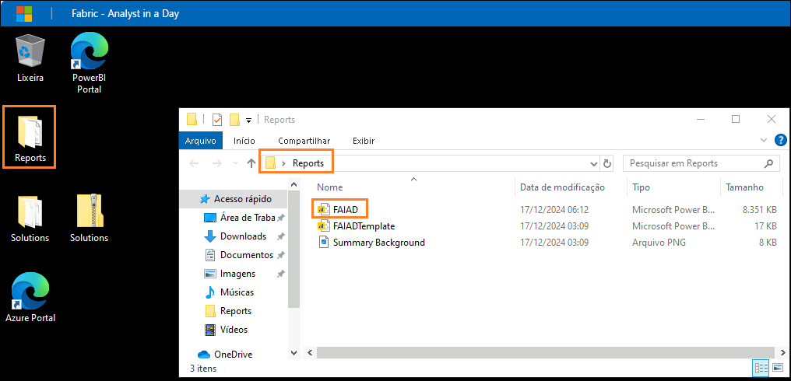

2. Insira seu endereço de email na caixa de diálogo aberta. Navegue até
    a guia **Detalhes do Ambiente** no painel direito do ambiente de
    laboratório.

3. Copie os dados de **Nome de Usuário** e cole na caixa de texto
    **Email** da caixa de diálogo.

4. Selecione **Continuar**.

    

5. A caixa de diálogo Sign in é aberta. Insira novamente os dados de
    **Nome de Usuário** copiando-os da guia **Detalhes do Ambiente**.

6. Selecione **Avançar**.

7. Na próxima caixa de diálogo, insira os dados de **Credenciais de
    senha** copiando-os da guia **Detalhes do Ambiente**.

8. Selecione **Entrar**.

    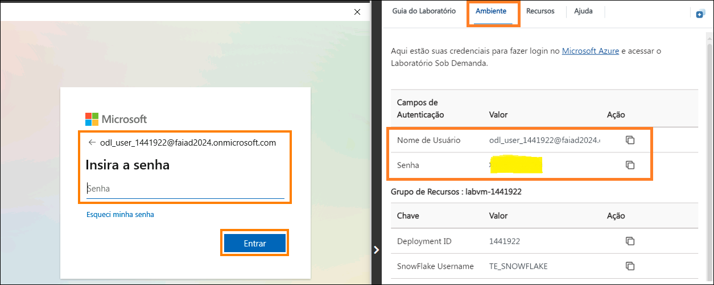

9. A caixa de diálogo **Continuar conectado a todos os aplicativos** é
    aberta. Selecione **OK**.

    

10. A caixa de diálogo **Tudo pronto!** é aberta. Selecione
    **Concluído**.

O Power BI Desktop será aberto

### Tarefa 2: Analisar relatório do Power BI Desktop

O relatório abaixo analisa as Sales da Fabrikam. Os KPIs estão listados
no canto superior esquerdo da página. Os visuais restantes destacam as
Sales over time, por Territory, Product Group e Reseller Company.

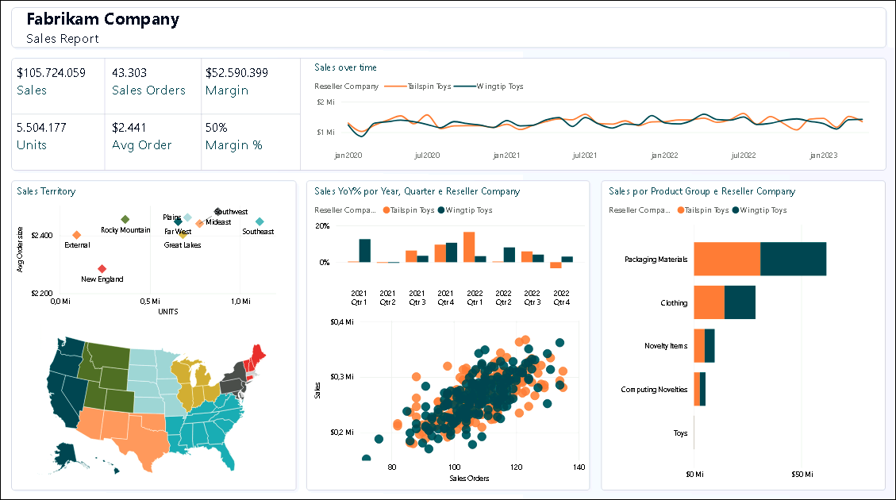

**Observação:** Neste treinamento, estamos nos concentrando na
aquisição, transformação e modelagem de dados usando as ferramentas
disponíveis no Fabric. Não nos concentraremos no desenvolvimento ou na
navegação de relatórios. Vamos reservar alguns minutos para entender
o relatório e passar para as próximas etapas.

1. Vamos analisar os dados por Sales Territory. Selecione o visual
    **New England from the Sales Territory** (gráfico de dispersão).
    Observe que em Sales over time, Reseller Tailspin Toys tem mais
    vendas em comparação com Wingtip Toys em New England. Se você olhar
    o gráfico de colunas Sales YoY%, notará que o crescimento das vendas
    da Wingtip Toys foi baixo e diminuiu trimestre após trimestre
    durante o ano passado. Depois de uma pequena recuperação no terceiro
    trimestre, caiu novamente no quarto.

    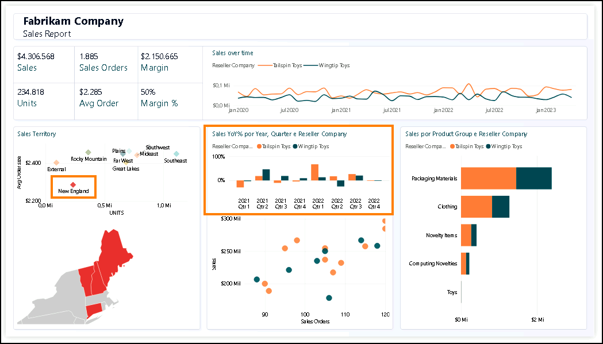

2. Vamos comparar isso com a região Rocky Mountain. Selecione o visual
    **Rocky Mountain from Sales Territory** (gráfico de dispersão).
    Observe no gráfico de colunas Sales YoY% que as vendas da Wingtip
    Toys aumentaram drasticamente no quarto trimestre de 2023, depois de
    terem sido baixas nos dois trimestres anteriores.

    

3. Selecione o visual **Rocky Mountain from Sales Territory** para
    remover o filtro.

4. No visual Gráfico de dispersão, na parte inferior central da tela
    (Sales Orders), selecione a exceção no canto superior direito (4º
    quadrante). Observe que a margem percentual é de 52%, estando acima
    da média de 50%. Além disso, o Sales YoY% aumentou últimos dois
    trimestres de 2023.

    

5. Selecione a exceção Reseller no visual Gráfico de dispersão para
    **remover o filtro**.

6. Vamos obter os detalhes de Product por Product Group e Reseller. No
    visual do gráfico de barras Sales por Product Group e Reseller
    Company, **clique com o botão direito na barra Packaging Materials
    para Tailspin Toys** e, na caixa de diálogo, selecione **Drill
    through -\> Product Detail**.

    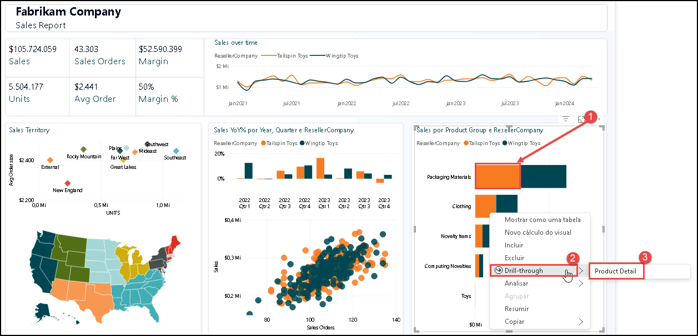

    Você será direcionado para a página que fornece os Product Details.
    Observe que também existem algumas ordens futuras em andamento.

7. Quando terminar de revisar esta página, selecione **Ctrl+seta para
    voltar** na parte superior direita da página para \"voltar ao Sales
    Report.

    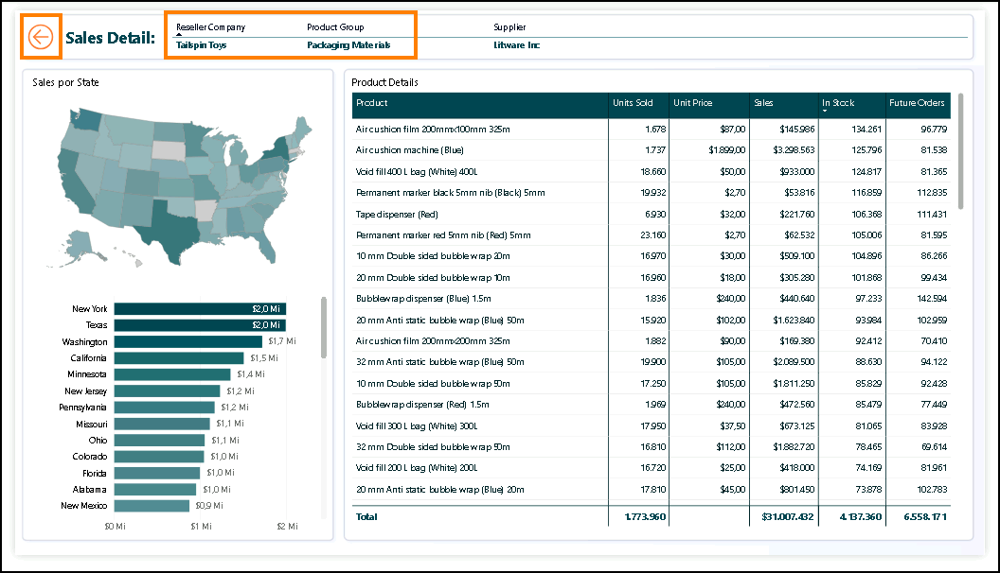

8. Fique à vontade para analisar o relatório posteriormente. Quando
    estiver pronto, vamos dar uma olhada na exibição do modelo. No
    painel esquerdo, selecione o **Ícone de exibição do modelo**.
    Observe que existem duas tabelas de fatos, Sales e PO.

    a. A granularidade dos dados de Sales é por Date, Reseller, Product e People. Date, Reseller, Product e People conectam-se a Sales.

    b. A granularidade dos dados de PO é por Date, Product e People. Date, Product e People conectam-se a PO.

    c. Temos dados de Supplier por Product. Supplier conecta-se a Product.

    d. Temos os dados de localização de Reseller por Geo. Geo conecta-se a Reseller.

    e. Temos informações de Customer por Reseller. Customer conecta-se a Reseller.

### Tarefa 3: Revisar Power Queries

1. Vamos analisar o Power Query para entender as fontes de dados. Na
    faixa de opções, selecione **Página Inicial -\> Transformar dados.**

    

2. A janela do Power Query é aberta. Na faixa de opções, selecione
    **Página Inicial -\> Configuração da fonte de dados**. A caixa de
    diálogo Configuração da fonte de dados é aberta. Ao percorrer a
    lista, você notará que existem quatro fontes de dados, conforme
    mencionado na declaração do problema:

    a. Snowflake

    b. SharePoint

    c. ADLS Gen2

    d. Dataverse

3. Selecione **Fechar** para fechar a caixa de diálogo Configuração da
    fonte de dados.

    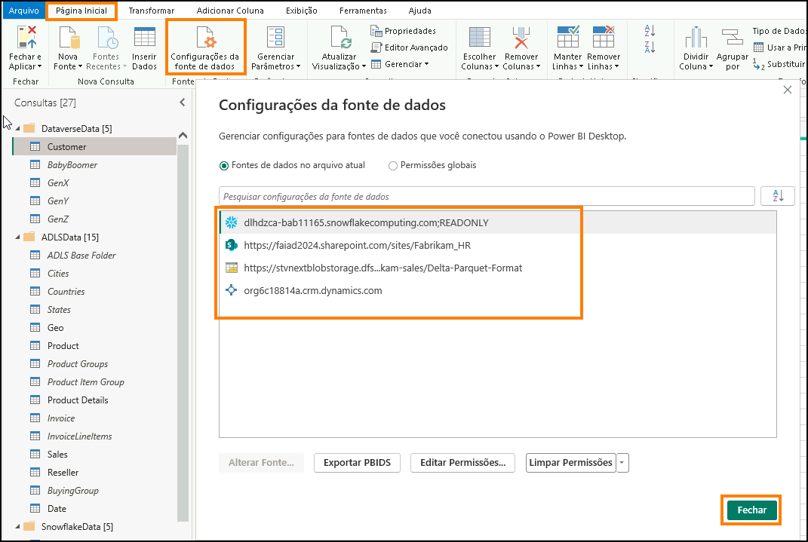

4. No painel esquerdo Consultas, observe que as consultas estão
    agrupadas por fonte de dados.

5. Observe que a pasta **DataverseData** tem os dados de Customer
    disponíveis em quatro consultas diferentes: BabyBoomer, GenX, GenY e
    GenZ. Essas quatro consultas são acrescentadas para criar a consulta
    Customer.

6. Clique em Consulta do cliente na janela Consultas. Para selecionar
    essa consulta, você deverá inserir novamente as credenciais do
    Dataverse. Clique em Editar Credenciais.

    

7. Você pode inserir as credenciais para a fonte de dados Dataverse
    inserindo o **Nome de Usuário** e a **Senha** disponíveis na guia
    **Variáveis de ambiente** (ao lado do Guia do Laboratório).

    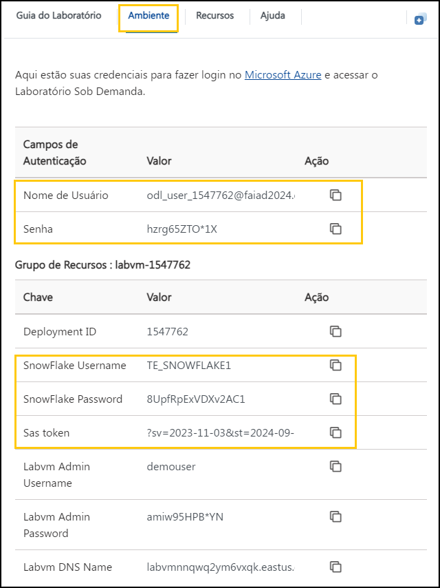

8. Para a fonte de dados ADLS, use a opção **Assinatura de Acesso
    Compartilhado (SAS)** e insira o **token SAS** que está disponível
    na guia **Ambiente** (ao lado do Guia do Laboratório).

9. Observe que a pasta **ADLSData** tem múltiplas dimensões: Geo,
    Product, Reseller e Date. Também tem o fato Sales.

    a. A **dimensão Geo** é criada mesclando dados da consulta Cities, Countries e States.

    b. A **dimensão Product** é criada mesclando dados da consulta Product Groups e Product Item Group.

    c. A **dimensão Reseller** é filtrada usando a consulta BuyingGroup.

    d. O **fato Sales** é criado mesclando InvoiceLineItems com a consulta Invoice.

10. Para a fonte de dados Snowflake, use o **SnowFlake Username** e a
    **SnowFlake Password** que estão disponíveis na guia **Environment
    Variables** (ao lado do Guia de Laboratório).

11. Observe que a pasta **SnowflakeData** tem a dimensão Supplier e o
    fato PO (Oder/Spend).

    a. A **dimensão Supplier** é criada mesclando a consulta Suppliers com a consulta SupplierCategories.

    b. O **fato PO** é criado mesclando PO com a consulta PO Line Items.

12. Para a fonte de dados SharePoint, insira o **Username** e a
    **Password** disponíveis na guia **Environment Variables** (ao lado
    do Guia de Laboratório). Selecione a opção Conta Microsoft.

13. Observe que a pasta **SharepointData** tem a dimensão People.

    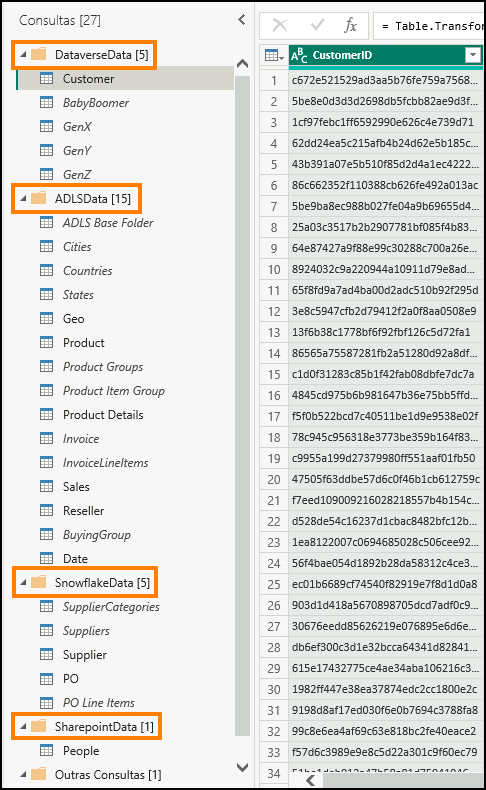

    Agora sabemos com o que estamos lidando. Nos laboratórios a seguir,
    criaremos um Power Query semelhante usando o Fluxo de Dados Gen2 e um
    modelo usando Lakehouse.

# Referências

O Fabric Analyst in a Day (FAIAD) apresenta algumas das principais
funções disponíveis no Microsoft Fabric. No menu do serviço, a seção
Ajuda (?) tem links para ótimos recursos.

   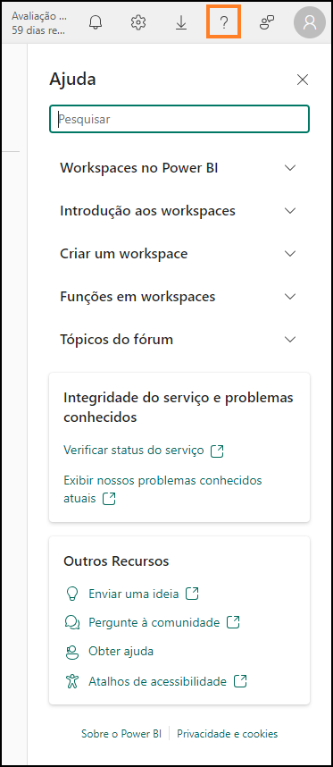

Veja aqui mais alguns recursos que ajudarão você com as próximas etapas do Microsoft Fabric.

- Veja a postagem do blog para ler o [anúncio completo de GA do Microsof t Fabric](https://www.microsoft.com/en-us/microsoft-fabric/blog/2023/11/15/prepare-your-data-for-ai-innovation-with-microsoft-fabric-now-generally-available/)
- Explore o Fabric por meio do [Tour Guiado](https://guidedtour.microsoft.com/en-us/guidedtour/microsoft-fabric/microsoft-fabric/1/1)
- Inscreva-se para a [avaliação gratuita do Microsof t Fabric](https://www.microsoft.com/en-us/microsoft-fabric/getting-started)
- Visite o [site do Microsof t Fabric](https://www.microsoft.com/en-in/microsoft-fabric)
- Aprenda novas habilidades explorando os [módulos de Aprendizagem do Fabric](https://learn.microsoft.com/en-us/training/browse/?products=fabric&resource_type=module)
- Explore a [documentação técnica do Fabric](https://learn.microsoft.com/en-us/fabric/)
- Leia o [livro eletrônico gratuito sobre como começar a usar o Fabric](https://info.microsoft.com/ww-landing-unlocking-transformative-data-value-with-microsoft-fabric.html)
- Participe da [comunidade do Fabric](https://community.fabric.microsoft.com/) para postar suas 
perguntas, compartilhar seus comentários e aprender com outras pessoas

Leia os blogs de comunicados de experiências do Fabric em mais detalhes:

- [Experiência do Data Factory no blog do Fabric](https://blog.fabric.microsoft.com/en-us/blog/introducing-data-factory-in-microsoft-fabric/)
- [Experiência do Synapse Data Engineering no blog do Fabric](https://blog.fabric.microsoft.com/en-us/blog/introducing-synapse-data-engineering-in-microsoft-fabric/)
- [Experiência do Synapse Data Science no blog do Fabric](https://blog.fabric.microsoft.com/en-us/blog/introducing-synapse-data-science-in-microsoft-fabric/)
- [Experiência do Synapse Data Warehousing no blog do Fabric](https://blog.fabric.microsoft.com/en-us/blog/introducing-synapse-data-warehouse-in-microsoft-fabric/)
- [Experiência do Synapse Real-Time Analytics no blog do Fabric](https://blog.fabric.microsoft.com/en-us/blog/sense-analyze-and-generate-insights-with-synapse-real-time-analytics-in-microsoft-fabric/)
- [Blog de comunicado do Power BI](https://powerbi.microsoft.com/en-us/blog/empower-power-bi-users-with-microsoft-fabric-and-copilot/)
- [Experiência do Data Activator no blog do Fabric](https://blog.fabric.microsoft.com/en-us/blog/driving-actions-from-your-data-with-data-activator/)
- [Administração e governança no blog do Fabric](https://blog.fabric.microsoft.com/en-us/blog/administration-security-and-governance-in-microsoft-fabric/)
- [OneLake no blog do Fabric](https://blog.fabric.microsoft.com/en-us/blog/microsoft-onelake-in-fabric-the-onedrive-for-data/)
- [Blog de integração do Dataverse e Microsof t Fabric](https://www.microsoft.com/en-us/dynamics-365/blog/it-professional/2023/05/24/new-dataverse-enhancements-and-ai-powered-productivity-with-microsoft-365-copilot/)

© 2023 Microsoft Corporation. Todos os direitos reservados.

Ao usar esta demonstração/este laboratório, você concorda com os seguintes termos:

A tecnologia/funcionalidade descrita nesta demonstração/neste laboratório é fornecida pela Microsoft Corporation para obter seus comentários e oferecer uma experiência de aprendizado. Você pode usar a demonstração/o laboratório somente para avaliar tais funcionalidades e recursos de tecnologia e fornecer comentários à Microsoft. Você não pode usá-los para nenhuma outra finalidade. Você não pode modificar, copiar, distribuir, transmitir, exibir, executar,
reproduzir, publicar, licenciar, criar obras derivadas, transferir nem vender esta demonstração/este laboratório ou qualquer parte deles.

A CÓPIA OU A REPRODUÇÃO DA DEMONSTRAÇÃO/DO LABORATÓRIO (OU DE QUALQUER PARTE DELES) EM QUALQUER OUTRO SERVIDOR OU LOCAL PARA REPRODUÇÃO OU REDISTRIBUIÇÃO ADICIONAL É EXPRESSAMENTE PROIBIDA.

ESTA DEMONSTRAÇÃO/ESTE LABORATÓRIO FORNECE DETERMINADOS RECURSOS E FUNCIONALIDADES DE PRODUTO/TECNOLOGIA DE SOFTWARE, INCLUINDO NOVOS RECURSOS E CONCEITOS POTENCIAIS, EM UM AMBIENTE SIMULADO SEM CONFIGURAÇÃO NEM INSTALAÇÃO COMPLEXA PARA A FINALIDADE DESCRITA ACIMA. A TECNOLOGIA/OS CONCEITOS REPRESENTADOS NESTA DEMONSTRAÇÃO/NESTE LABORATÓRIO PODEM NÃO REPRESENTAR A FUNCIONALIDADE COMPLETA DOS RECURSOS E PODEM NÃO FUNCIONAR DA MESMA MANEIRA QUE UMA VERSÃO FINAL. ALÉM DISSO, PODEMOS NÃO LANÇAR UMA VERSÃO FINAL DE TAIS RECURSOS OU CONCEITOS. SUA EXPERIÊNCIA COM O USO DE TAIS RECURSOS E FUNCIONALIDADES EM UM AMBIENTE FÍSICO TAMBÉM PODE SER DIFERENTE.

**COMENTÁRIOS**. Caso você forneça comentários sobre os recursos de tecnologia, as funcionalidades e/ou os conceitos descritos nesta demonstração/neste laboratório à Microsoft, você concederá à Microsoft, sem encargos, o direito de usar, compartilhar e comercializar seus comentários de qualquer forma e para qualquer finalidade. Você também concede a terceiros, sem encargos, quaisquer direitos de patente necessários para que seus produtos, suas
tecnologias e seus serviços usem ou interajam com partes específicas de um software ou um serviço da Microsoft que inclua os comentários. Você não fornecerá comentários que estejam sujeitos a uma licença que exija que a Microsoft licencie seu software ou sua documentação para terceiros em virtude da inclusão de seus comentários neles. Esses direitos continuarão em vigor após o término do contrato.

POR MEIO DESTE, A MICROSOFT CORPORATION SE ISENTA DE TODAS AS GARANTIAS E CONDIÇÕES REFERENTES À DEMONSTRAÇÃO/AO LABORATÓRIO, INCLUINDO TODAS AS GARANTIAS E CONDIÇÕES DE COMERCIALIZAÇÃO, SEJAM ELAS EXPRESSAS, IMPLÍCITAS OU ESTATUTÁRIAS, E DE ADEQUAÇÃO A UMA FINALIDADE ESPECÍFICA, TÍTULO E NÃO VIOLAÇÃO. A MICROSOFT NÃO DECLARA NEM GARANTE A PRECISÃO DOS RESULTADOS DERIVADOS DO USO DA DEMONSTRAÇÃO/DO LABORATÓRIO NEM A ADEQUAÇÃO DAS INFORMAÇÕES CONTIDAS NA DEMONSTRAÇÃO/NO LABORATÓRIO A QUALQUER FINALIDADE.
 
**AVISO DE ISENÇÃO DE RESPONSABILIDADE**
Esta demonstração/este laboratório contém apenas uma parte dos novos recursos e aprimoramentos do Microsoft Power BI. Alguns dos recursos podem ser alterados em versões futuras do produto. Nesta demonstração/neste laboratório, você aprenderá sobre alguns dos novos recursos, mas não todos.