# Introdução 

Temos dados de diversas fontes ingeridos no Lakehouse. Neste
laboratório, você trabalhará com o modelo semântico. Geralmente,
realizamos atividades de modelagem, como criar relacionamentos,
adicionar medidas, etc. no Power BI Desktop. Aqui aprenderemos como
realizar essas atividades de modelagem no serviço.

Ao final deste laboratório, você terá aprendido:

- Usando a exibição SQL no ponto de extremidade da análise SQL

- Como criar um modelo semântico

# Lakehouse - Analisar dados

### Tarefa 1: Consultar dados usando SQL

1. Vamos voltar ao workspace do Fabric, **FAIAD\_\<nome de usuário\>**,
    que você criou no Laboratório 2, Tarefa 9.

2. Você pode escolher **Minimizar o fluxo de tarefas** para exibir toda
    a lista de itens.

3. Você verá três tipos de lh_FAIAD: Lakehouse, Modelo semântico e
    Ponto de extremidade de SQL. Exploramos o lakehouse e criamos
    consultas visuais usando o ponto de extremidade da análise SQL em um
    laboratório anterior. Selecione a opção **lh_FAIAD -\> Ponto de
    extremidade de análise de SQL** para continuar a explorar esta
    opção. Você será direcionado à **exibição de SQL** do explorador.

    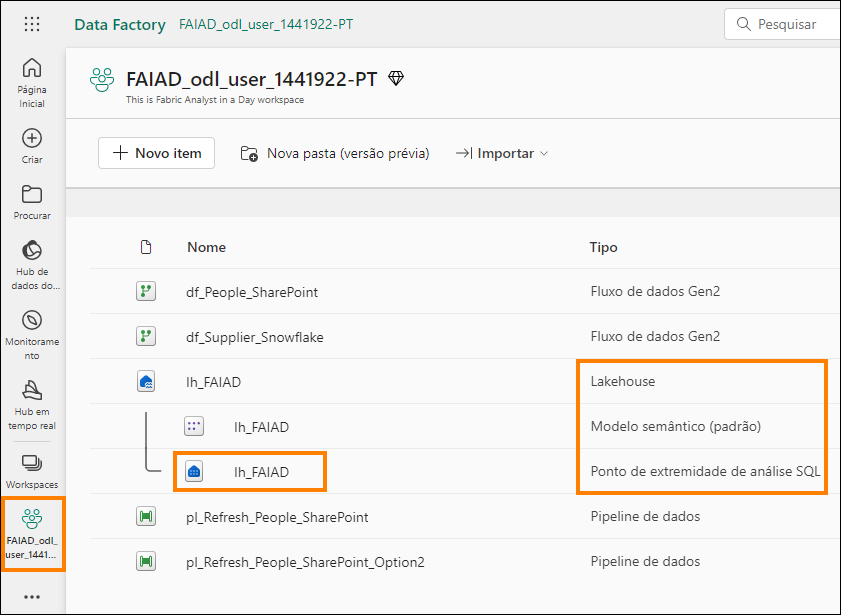

    Se desejar explorar os dados antes de criar um modelo de dados, você
    poderá usar SQL para fazer isso. Há duas opções para usar o SQL. A
    primeira opção é a consulta visual, que usamos no laboratório anterior.
    A opção 2 é escrever código TSQL. É uma opção conveniente para
    desenvolvedores. Vamos explorar isso.

    Vamos supor que você queira descobrir rapidamente as Units vendidas por
    Fornecedor usando SQL.

    No lakehouse, ponto de extremidade da análise SQL, observe que no painel
    esquerdo você pode exibir as Tabelas. Se você expandir as tabelas,
    poderá visualizar as Colunas que compõem a tabela. Além disso, existem
    opções para criar Visualizações, Funções e Procedimentos Armazenados de
    SQL. Se você tiver experiência em SQL, fique à vontade para explorar
    essas opções. Vamos tentar escrever uma consulta SQL simples.

4. No **menu superior,** selecione **Nova consulta SQL**ou no centro da
    tela, clique em **Nova consulta SQL.** Você será direcionado à
    visualização da consulta SQL.

    

5. Cole a **consulta SQL abaixo** na **janela de consultas**. Essa
    consulta retornará as unidades por Nome do Fornecedor. Para
    conseguir isso, una tabela Sales com as tabelas Product e Supplier.

    [SELECT su.SupplierName, SUM(Quantity) as Units]{.mark}

    [FROM dbo.Sales s]{.mark}

    [JOIN dbo.Product p on p.StockItemID = s.StockItemID]{.mark}

    [JOIN dbo.Supplier su on su.SupplierID = p.SupplierID]{.mark}

    [GROUP BY su.SupplierName]{.mark}

6. Clique em **Executar** no menu do editor SQL para exibir os
    resultados.

7. Há uma opção para salvar essa consulta como uma Visualização
    selecionando **Salvar como visualização**.

8. No painel **esquerdo** **Explorador**, na seção **Consultas**,
    observe que esta consulta é salva em **Minhas consultas** como
    **Consulta SQL 1**. Isso fornece uma opção para renomear a consulta
    e salvá-la para uso futuro. Também há uma opção para visualizar
    consultas compartilhadas com você usando a pasta **Consultas
    compartilhadas**.

    **Observação:** as consultas visuais que você criou em laboratórios
    anteriores também estão disponíveis na pasta My queries.

    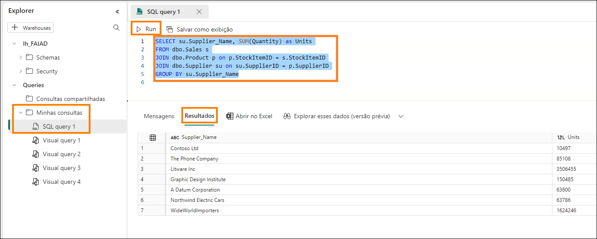

###  Tarefa 2: Visualizar resultado de T-SQL

1. Também podemos visualizar o resultado desta consulta. **Realce a
    consulta** no painel de consultas

2. No menu do painel Resultados, selecione **Explorar estes dados
    (versão preliminar) -\> Visualizar resultados**.

    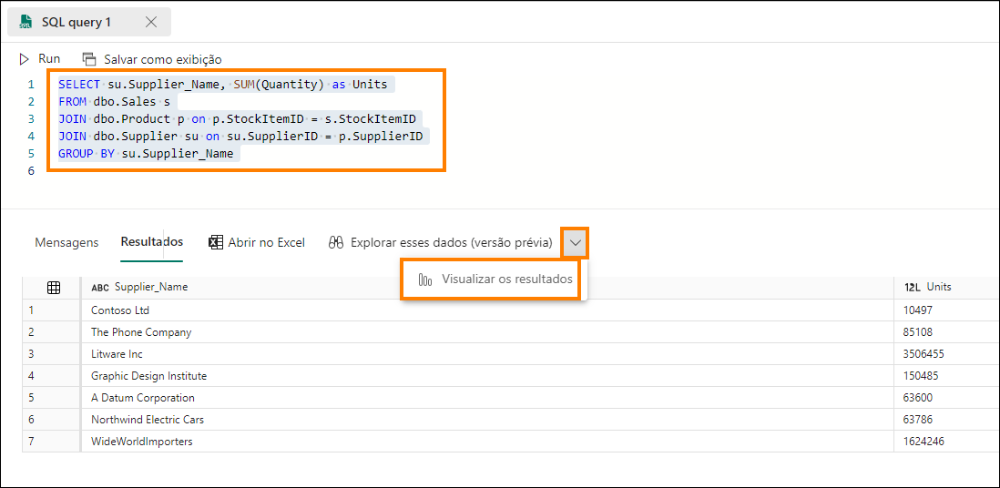

3. A caixa de diálogo **Visualizar resultados** é aberta. Selecione
    **Continuar**.

    **A caixa de diálogo** Visualizar resultados é aberta e se parece com a
    exibição de relatório do Power BI Desktop. Ela tem todos os recursos
    disponíveis na exibição de relatório do Power BI Desktop. Você pode
    formatar a página, selecionar diferentes visuais, formatar visuais,
    adicionar filtros etc. Não vamos explorar essas opções neste curso.

4. Expanda o painel **Dados** e expanda **Consulta SQL 1**.

5. Selecione os **campos** **Supplier_Name** e **Units**. Um visual de
    tabela é criado.

    

6. Na seção **Visualizações**, altere o tipo de visual selecionando o
    **Gráfico de colunas empilhadas**.

7. Selecione **Salvar como relatório** no canto inferior direito da
    tela.

    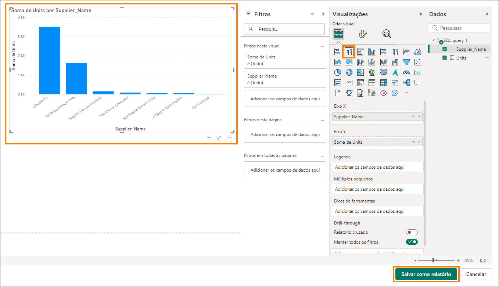

8. A caixa de diálogo Salvar seu relatório é aberta. Digite **Units por
    Fornecedor** na caixa de texto **Inserir um nome para o relatório**.

9. Certifique-se de que o espaço de trabalho de destino seja seu espaço
    de trabalho do Fabric, **FAIAD\<nome de usuário\>**.

10. Selecione **Salvar**.

    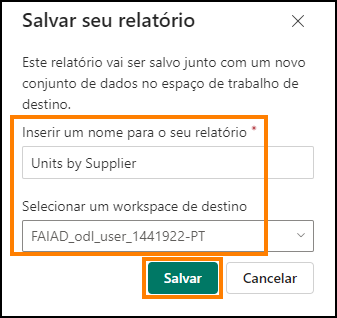

    Você será direcionado de volta à tela da consulta SQL.

# Lakehouse -- Modelagem semântica

### Tarefa 3: Criar um modelo semântico

1. Abra o **ponto de extremidade de análise SQL** no seu lakehouse.

2. No painel do Explorer, role para baixo e selecione **Layouts de
    modelo**. Você observará que o painel central se parece com a
    visualização de modelo que vemos no Power BI Desktop.

    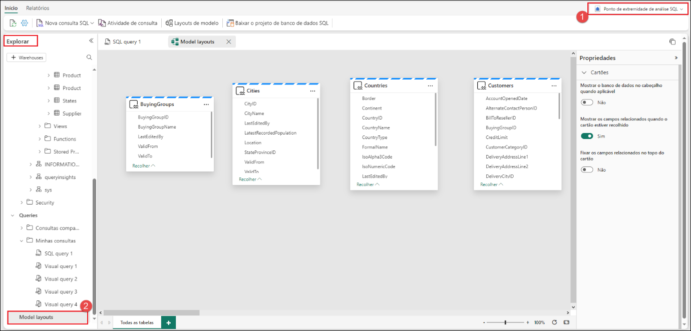

    Esse é o modelo padrão que o lakehouse cria. No entanto, há algumas
    limitações com o modelo padrão (como capacidade de formatar medidas
    etc). Além disso, precisamos apenas de um subconjunto das tabelas em
    nosso modelo. Então vamos criar um novo modelo semântico.

3. No menu**,** no canto superior direito, **selecione a seta ao lado
    do ponto de extremidade da análise SQL**.

4. Selecione **Lakehouse** para acessar a exibição Lakehouse.

    

5. No menu, selecione **Página Inicial -\> Novo modelo semântico.**

6. A caixa de diálogo Novo modelo semântico é aberta. Insira
    **sm_FAIAD** como o nome do modelo semântico Direct Lake.

7. Temos a opção de selecionar um subconjunto de tabelas por padrão.
    Lembre-se de que criamos exibições no laboratório anterior. Queremos
    incluir essas exibições no modelo. Expanda o esquema **dbo**. Aqui
    você pode ver todas as tabelas e visualizações em seu lakehouse.

    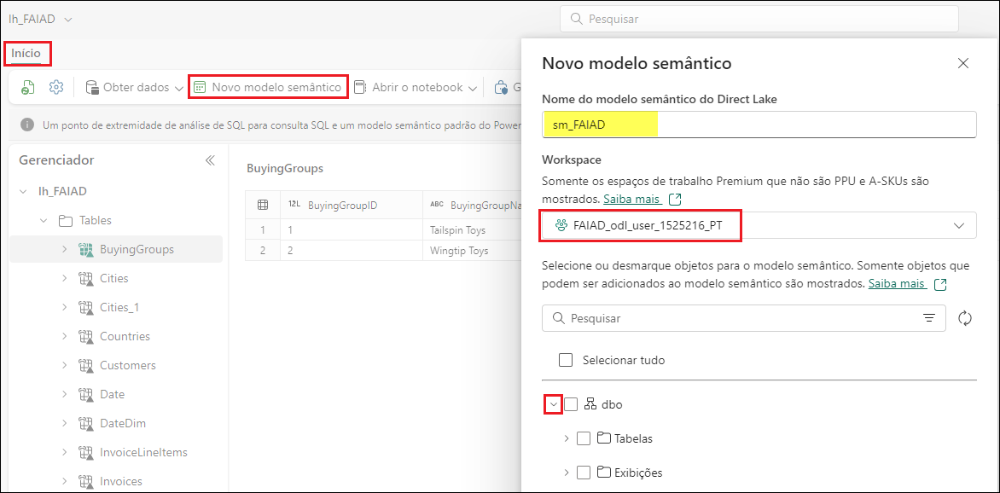

8. **Selecione** as seguintes tabelas/exibições:

    a. **Date**

    b. **People**

    c. **Customer**

    d. **PO**

    e. **Supplier**

    f. **Geo**

    g. **Reseller**

    h. **Sales**

    i. **Product**

9. Selecione **Confirmar.**

    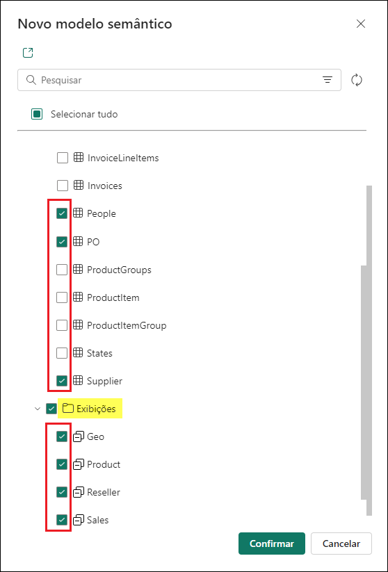

### Tarefa 4: Criar relacionamentos

Você navegará até o novo modelo semântico com as tabelas selecionadas.
Você pode **reorganizar** as tabelas conforme necessário. Observe que
algumas tabelas (Geo, Reseller, Sales e Product) têm um sinal de aviso
no canto superior direito da tabela. Isso porque são exibições. Todos os
elementos visuais criados com campos dessas exibições estarão no modo
Direct Query e não no modo Direct Lake.

**Observação:** o modo Direct Lake é mais rápido do que o modo Direct
Query.

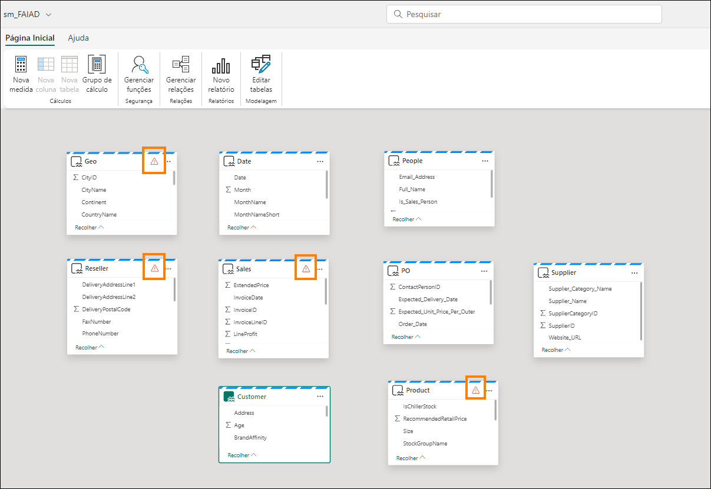

A primeira etapa é criar relacionamentos entre essas tabelas.

1. Vamos criar um relacionamento entre as tabelas Sales e Reseller.
    Selecione **ResellerID** na tabela **Sales** e arraste-o para
    **ResellerID** na tabela **Reseller**.

    

2. A caixa de diálogo Novo relacionamento é aberta. Verifique se a
    tabela **From** é **Sales** e **Coluna** é **ResellerID**.

3. Verifique se a tabela **To** é **Reseller** e **Coluna** é
    **ResellerID**.

4. Verifique se **Cardinalidade** é **Muitos para um (\*:1)**.

5. Verifique se **Direção de filtro cruzada** é **Única**.

6. Selecione **Salvar**.

    

7. Da mesma forma, crie um relacionamento entre as tabelas Sales e
    Date. Selecione **InvoiceDate** na tabela **Sales** e arraste-o para
    **Date** na tabela **Date**.

8. A caixa de diálogo Novo relacionamento é aberta. Verifique se a
    tabela **From** é **Sales** e **Coluna** é **InvoiceDate**.

9.  Verifique se a tabela **To** é **Date** e **Coluna** é **Date**.

10. Verifique se **Cardinalidade** é **Muitos para um (\*:1)**.

11. Verifique se **Direção de filtro cruzada** é **Única**.

12. Selecione **Salvar**.

    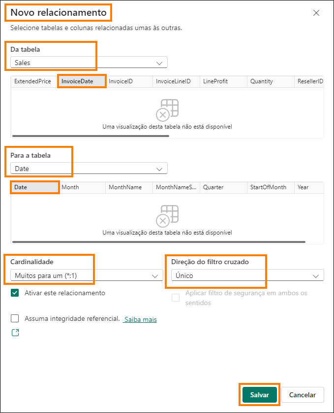

13. De maneira similar, crie um relacionamento **muitos para um** entre
    as tabelas **Sales** e **Product**. Selecione **StockItemID** na
    tabela **Sales** e **StockItemID** na tabela **Product**.

    **Observação:** todas as nossas atualizações são salvas automaticamente.

    **Ponto de verificação:** seu modelo deve ter os três relacionamentos
    entre as tabelas Sales e Reseller, Sales e Date e Sales e Product,
    conforme mostrado na captura de tela abaixo:

    

    Por uma questão de tempo, não criaremos todos os relacionamentos. Se o
    tempo permitir, você poderá concluir a seção opcional no fim do
    laboratório. A seção opcional percorre as etapas para criar os
    relacionamentos restantes.

### Tarefa 5: Criar medidas

Vamos adicionar algumas medidas necessárias para criar o dashboard
Sales.

1. Selecione a tabela **Sales** na visualização do modelo. Queremos
    adicionar as medidas à tabela Sales.

2. No menu superior, selecione **Página Inicial -\> Nova medida**.
    Observe que a barra de fórmulas é exibida.

3. Digite **Sales = SUM(Sales\[Sales Amount\])** na **barra de
    fórmula**.

4. Clique na **marca de seleção** à esquerda da barra de fórmulas ou
    clique no botão **Enter**.

5. Expanda o painel Propriedades à direita.

6. Expanda a seção **Formatação**.

7. Na lista suspensa **Formato**, selecione **Moeda**.

8. Defina Casas decimais como **0**.

    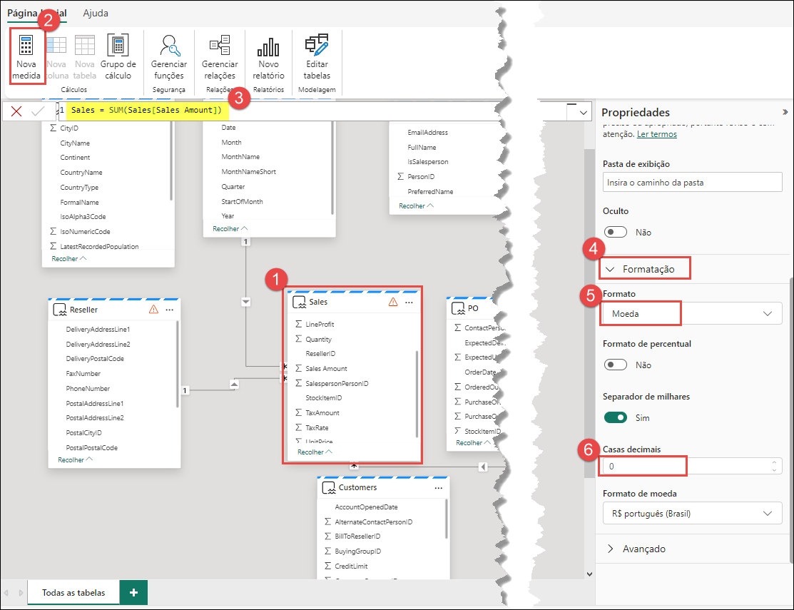

9. Com a tabela **Sales** selecionada no menu superior, selecione
    **Página Inicial -\> Nova medida**. Observe que a barra de fórmulas
    é exibida.

10. Insira **Units = SUM(Sales\[Quantity\])** na **barra de fórmulas.**

11. Clique na **marca de seleção** à esquerda da barra de fórmulas ou
    clique no botão **Enter**.

12. No painel Propriedades à direita, expanda a seção **Formatação**
    (pode levar alguns instantes para o painel Propriedades carregar).

13. Na lista suspensa **Formato**, selecione **Número inteiro**.

14. Use o controle deslizante para definir **Separador de milhares**
    como **Sim**.

    

15. Com a tabela **Sales** selecionada no menu superior, selecione
    **Página Inicial -\> Nova medida**. Observe que a barra de fórmulas
    é exibida.

16. Insira **Sales Orders = DISTINCTCOUNT(Sales\[InvoiceID\])** na
    **barra de fórmulas**.

17. Clique na **marca de seleção** à esquerda da barra de fórmulas ou
    clique no botão **Enter**.

18. No painel Propriedades, à direita, expanda a seção **Formatação**.

19. Na lista suspensa **Formato**, selecione **Número inteiro**.

20. Use o controle deslizante para definir **Separador de milhares**
    como **Sim**.

    

21. No **painel Dados** (à direita), selecione **Modelo**. Observe que
    isso fornece uma exibição que ajudará a organizar todos os itens no
    modelo semântico.

22. Expanda **Modelo semântico -\> Medidas** para exibir todas as
    medidas que você acabou de criar.

23. Você também pode **expandir Tabelas individuais** para exibir
    Colunas, Hierarquias e Medidas em cada uma delas.

    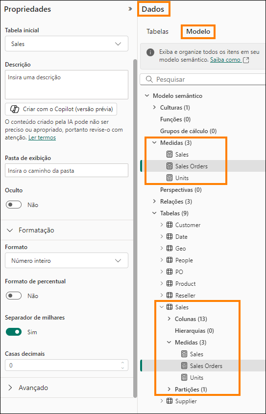

    Novamente, por uma questão de tempo, não criaremos todas as medidas. Se
    o tempo permitir, você poderá concluir a seção opcional no fim do
    laboratório. A seção opcional percorre as etapas para criar as medidas
    restantes.

    Criamos um modelo semântico. A próxima etapa é criar um relatório.
    Faremos isso no próximo laboratório.

### Tarefa 6: Seção Opcional -- Criar relacionamentos

Vamos adicionar os relacionamentos restantes.

1. No menu, selecione Página Inicial -\> Gerenciar relacionamentos.

2. A caixa de diálogo Gerenciar relacionamentos será aberta. Selecione
    Novo relacionamento.

    

3. A caixa de diálogo Novo relacionamento é aberta. Verifique se a
    tabela **From** é **Sales** e **Coluna** é **SalespersonPersonID**.

4. Verifique se a tabela **To** é **People** e **Coluna** é
    **PersonID**.

5. Verifique se **Cardinalidade** é **Muitos para um (\*:1)**.

6.  Verifique se **Direção do filtro cruzado** é **Única**.

7. Selecione **Salvar**. A caixa de diálogo Gerenciar relacionamentos é
    aberta com o novo relacionamento adicionado.

    

8. Agora, vamos criar um relacionamento entre Product e Supplier.
    Selecione **Novo relacionamento**.

9. Verifique se a tabela **From** é **Product** e **Coluna** é
    **SupplierID**.

10. Verifique se a tabela **To** é **Supplier** e **Coluna** é
    **SupplierID**.

11. Verifique se **Cardinalidade** é **Muitos para um (\*:1)**.

12. Verifique se **Direção do filtro cruzado** é **Ambas**.

13. Selecione **Salvar**.

    

14. Agora, vamos criar um relacionamento entre Reseller e Geo. Selecione
    **Novo relacionamento**.

15. A caixa de diálogo Novo relacionamento é aberta. Verifique se a
    tabela **From** é **Reseller** e **Coluna** é **PostalCityID**.

16. Verifique se a tabela **To** é **Geo** e **Coluna** é **CityID**.

17. Verifique se **Cardinalidade** é **Muitos para um (\*:1)**.

18. Verifique se **Direção do filtro cruzado** é **Ambas**.

19. Selecione **Salvar**.

    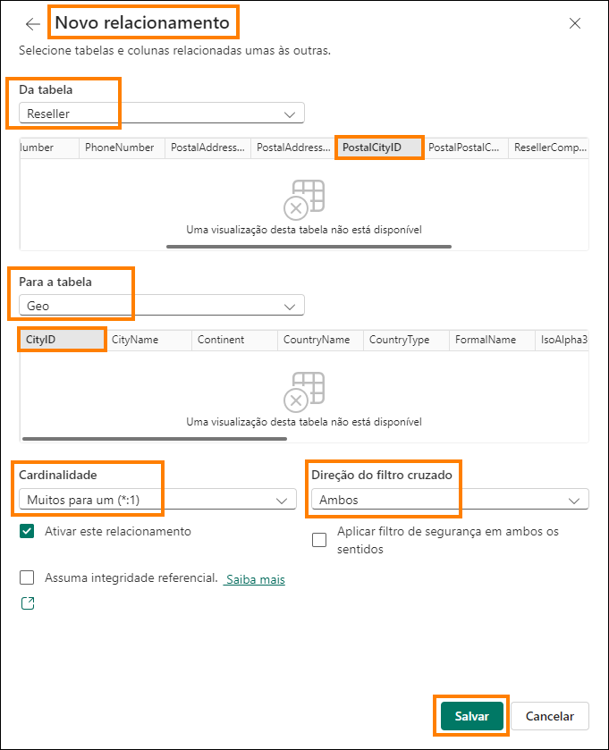

20. Da mesma forma, crie um relacionamento entre Customer e Reseller.
    Selecione **Novo relacionamento**.

21. A caixa de diálogo Novo relacionamento é aberta. Verifique se a
    tabela **From** é **Customer** e **Coluna** é **ResellerID**.

22. Verifique se a tabela **To** é **Reseller** e **Coluna** é
    **ResellerID**.

23. Verifique se **Cardinalidade** é **Muitos para um (\*:1)**.

24. Verifique se **Direção do filtro cruzado** é **Única**.

25. Selecione **Salvar**.

    **Ponto de verificação:** Gerenciar relacionamentos deve ser semelhante
    à captura de tela abaixo.

    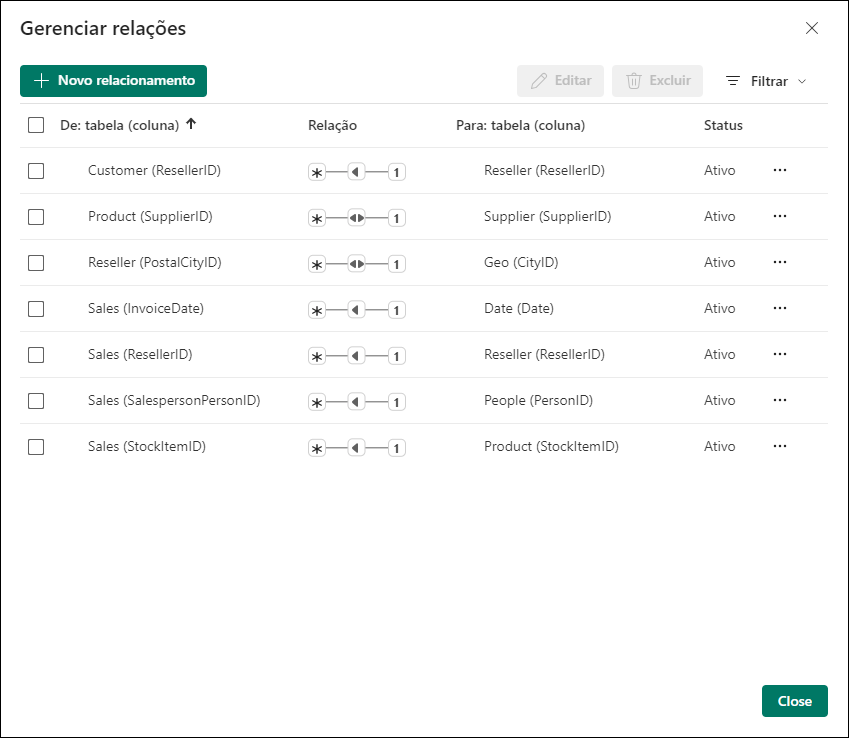

26. De maneira similar, crie um relacionamento **muitos para um** entre
    as tabelas **PO** e **Date**. Selecione **Order_Date** de **PO** e
    **Date** de **Date**.

27. De maneira similar, crie um relacionamento **muitos para um** entre
    as tabelas **PO** e **Product**. Selecione **StockItemID** em **PO**
    e **StockItemID** em **Product**.

28. De maneira similar, crie um relacionamento **muitos para um** entre
    as tabelas **PO** e **People**. Selecione **ContactPersonID** em
    **PO** e **PersonID** em **People**.

29. Selecione **Fechar** para fechar a caixa de diálogo Gerenciar
    relacionamentos.

    Terminamos de criar todos os relacionamentos.

    **Ponto de verificação:** Seu modelo deve ser semelhante à captura de
    tela abaixo.

    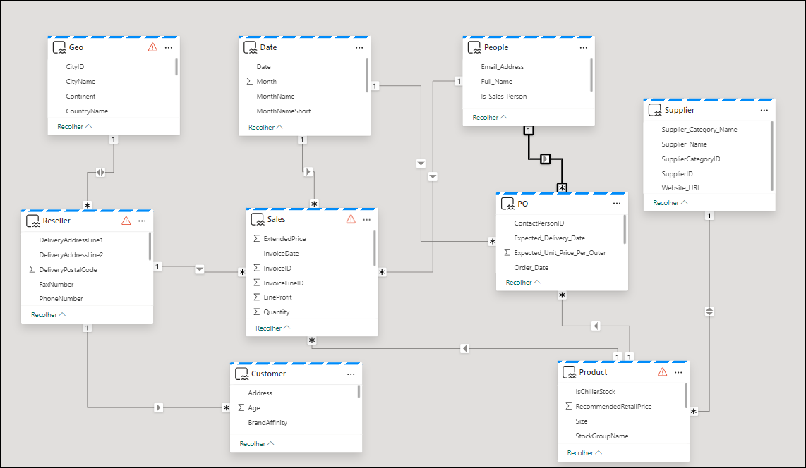  

### Tarefa 7: Seção Opcional -- Criar medidas

Vamos adicionar as medidas restantes.

1. Selecione a tabela **Sales** e, no menu superior, selecione **Página
    Inicial -\> Nova medida**.

2. Insira **Avg Order** = **DIVIDE(\[Sales\], \[Sales Orders\])** na
    barra de fórmulas.

3.  Clique na **marca de seleção** na barra de fórmulas ou clique no
    botão Enter.

4. Expanda o painel Propriedades à direita.

5. Expanda a seção **Formatação**.

6. Na lista suspensa **Formato**, selecione **Moeda**.

7. Defina Casas decimais como 0.

    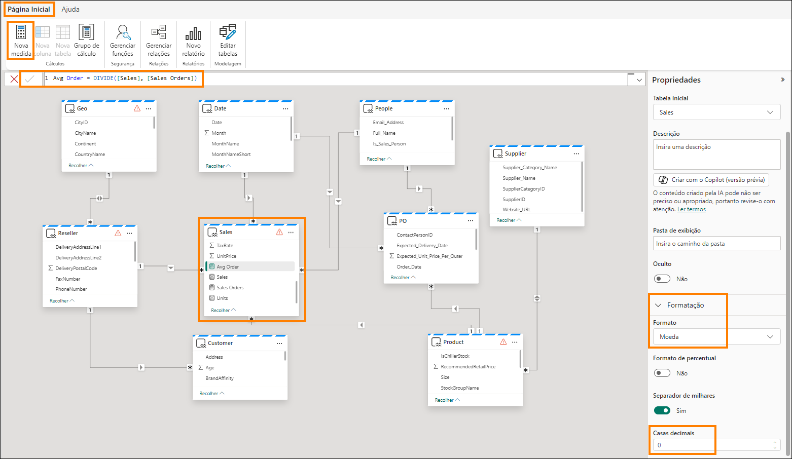

8. Siga as etapas semelhantes para adicionar as seguintes medidas:

    a. Na tabela **Sales** , **GM = SUM(Sales\[LineProfit\])** está
        formatada como **Moeda com 0 casas decimais.**

    b. Na tabela **Sales** , **GM% = DIVIDE(\[GM\], \[Sales\])** está
        formatada como **Porcentagem com 0 casas decimais.**

    c. Na tabela **Customer , No of Customers = COUNTROWS(Customer)**
        formatado como **Número Inteiro com separador de milhares
        habilitado.**

# Referências

O Fabric Analyst in a Day (FAIAD) apresenta algumas das principais
funções disponíveis no Microsoft Fabric. No menu do serviço, a seção
Ajuda (?) tem links para ótimos recursos.

   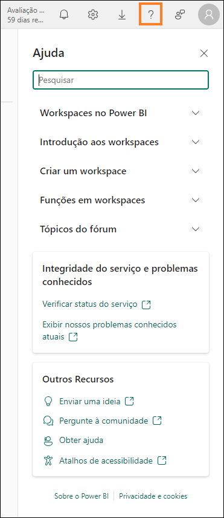

Veja aqui mais alguns recursos que ajudarão você com as próximas etapas
do Microsoft Fabric.

- Veja a postagem do blog para ler o [anúncio completo de GA do
    Microsoft Fabric](https://aka.ms/Fabric-Hero-Blog-Ignite23)

- Explore o Fabric por meio do [Tour
    Guiado](https://aka.ms/Fabric-GuidedTour)

- Inscreva-se para a [avaliação gratuita do Microsoft
    Fabric](https://aka.ms/try-fabric)

- Visite o [site do Microsoft Fabric](https://aka.ms/microsoft-fabric)

- Aprenda novas habilidades explorando os [módulos de Aprendizagem do
    Fabric](https://aka.ms/learn-fabric)

- Explore a [documentação técnica do
    Fabric](https://aka.ms/fabric-docs)

- Leia o [livro eletrônico gratuito sobre como começar a usar o
    Fabric](https://aka.ms/fabric-get-started-ebook)

- Participe da [comunidade do Fabric](https://aka.ms/fabric-community)
    para postar suas perguntas, compartilhar seus comentários e aprender
    com outras pessoas

Leia os blogs de comunicados de experiências do Fabric em mais detalhes:

- [Experiência do Data Factory no blog do
    Fabric](https://aka.ms/Fabric-Data-Factory-Blog) 

- [Experiência do Synapse Data Engineering no blog do
    Fabric](https://aka.ms/Fabric-DE-Blog) 

- [Experiência do Synapse Data Science no blog do
    Fabric](https://aka.ms/Fabric-DS-Blog) 

- [Experiência do Synapse Data Warehousing no blog do
    Fabric](https://aka.ms/Fabric-DW-Blog) 

- [Experiência do Synapse Real-Time Analytics no blog do
    Fabric](https://aka.ms/Fabric-RTA-Blog)

- [Blog de comunicado do Power BI](https://aka.ms/Fabric-PBI-Blog)

- [Experiência do Data Activator no blog do
    Fabric](https://aka.ms/Fabric-DA-Blog) 

- [Administração e governança no blog do
    Fabric](https://aka.ms/Fabric-Admin-Gov-Blog)

- [OneLake no blog do Fabric](https://aka.ms/Fabric-OneLake-Blog)

- [Blog de integração do Dataverse e Microsoft
    Fabric](https://aka.ms/Dataverse-Fabric-Blog)

> © 2023 Microsoft Corporation. Todos os direitos reservados.
>
> Ao usar esta demonstração/este laboratório, você concorda com os
> seguintes termos:
>
> A tecnologia/funcionalidade descrita nesta demonstração/neste
> laboratório é fornecida pela Microsoft Corporation para obter seus
> comentários e oferecer uma experiência de aprendizado. Você pode usar
> a demonstração/o laboratório somente para avaliar tais funcionalidades
> e recursos de tecnologia e fornecer comentários à Microsoft. Você não
> pode usá-los para nenhuma outra finalidade. Você não pode modificar,
> copiar, distribuir, transmitir, exibir, executar, reproduzir,
> publicar, licenciar, criar obras derivadas, transferir nem vender esta
> demonstração/este laboratório ou qualquer parte deles.
>
> A CÓPIA OU A REPRODUÇÃO DA DEMONSTRAÇÃO/DO LABORATÓRIO (OU DE QUALQUER
> PARTE DELES) EM QUALQUER OUTRO SERVIDOR OU LOCAL PARA REPRODUÇÃO OU
> REDISTRIBUIÇÃO ADICIONAL É EXPRESSAMENTE PROIBIDA.
>
> ESTA DEMONSTRAÇÃO/ESTE LABORATÓRIO FORNECE DETERMINADOS RECURSOS E
> FUNCIONALIDADES DE PRODUTO/TECNOLOGIA DE SOFTWARE, INCLUINDO NOVOS
> RECURSOS E CONCEITOS POTENCIAIS, EM UM AMBIENTE SIMULADO SEM
> CONFIGURAÇÃO NEM INSTALAÇÃO COMPLEXA PARA A FINALIDADE DESCRITA ACIMA.
> A TECNOLOGIA/OS CONCEITOS REPRESENTADOS NESTA DEMONSTRAÇÃO/NESTE
> LABORATÓRIO PODEM NÃO REPRESENTAR A FUNCIONALIDADE COMPLETA DOS
> RECURSOS E PODEM NÃO FUNCIONAR DA MESMA MANEIRA QUE UMA VERSÃO FINAL.
> ALÉM DISSO, PODEMOS NÃO LANÇAR UMA VERSÃO FINAL DE TAIS RECURSOS OU
> CONCEITOS. SUA EXPERIÊNCIA COM O USO DE TAIS RECURSOS E
> FUNCIONALIDADES EM UM AMBIENTE FÍSICO TAMBÉM PODE SER DIFERENTE.
>
> **COMENTÁRIOS**. Caso você forneça comentários sobre os recursos de
> tecnologia, as funcionalidades e/ou os conceitos descritos nesta
> demonstração/neste laboratório à Microsoft, você concederá à
> Microsoft, sem encargos, o direito de usar, compartilhar e
> comercializar seus comentários de qualquer forma e para qualquer
> finalidade. Você também concede a terceiros, sem encargos, quaisquer
> direitos de patente necessários para que seus produtos, suas
> tecnologias e seus serviços usem ou interajam com partes específicas
> de um software ou um serviço da Microsoft que inclua os comentários.
> Você não fornecerá comentários que estejam sujeitos a uma licença que
> exija que a Microsoft licencie seu software ou sua documentação para
> terceiros em virtude da inclusão de seus comentários neles. Esses
> direitos continuarão em vigor após o término do contrato.
>
> POR MEIO DESTE, A MICROSOFT CORPORATION SE ISENTA DE TODAS AS
> GARANTIAS E CONDIÇÕES REFERENTES À DEMONSTRAÇÃO/AO LABORATÓRIO,
> INCLUINDO TODAS AS GARANTIAS E CONDIÇÕES DE COMERCIALIZAÇÃO, SEJAM
> ELAS EXPRESSAS, IMPLÍCITAS OU ESTATUTÁRIAS, E DE ADEQUAÇÃO A UMA
> FINALIDADE ESPECÍFICA, TÍTULO E NÃO VIOLAÇÃO. A MICROSOFT NÃO DECLARA
> NEM GARANTE A PRECISÃO DOS RESULTADOS DERIVADOS DO USO DA
> DEMONSTRAÇÃO/DO LABORATÓRIO NEM A ADEQUAÇÃO DAS INFORMAÇÕES CONTIDAS
> NA DEMONSTRAÇÃO/NO LABORATÓRIO A QUALQUER FINALIDADE.
>
> **AVISO DE ISENÇÃO DE RESPONSABILIDADE**
>
> Esta demonstração/este laboratório contém apenas uma parte dos novos
> recursos e aprimoramentos do Microsoft Power BI. Alguns dos recursos
> podem ser alterados em versões futuras do produto. Nesta
> demonstração/neste laboratório, você aprenderá sobre alguns dos novos
> recursos, mas não todos.
